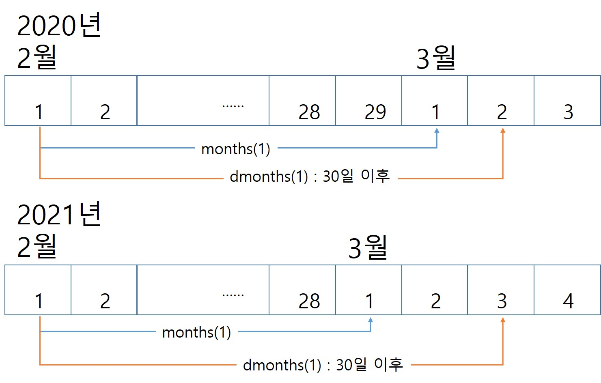
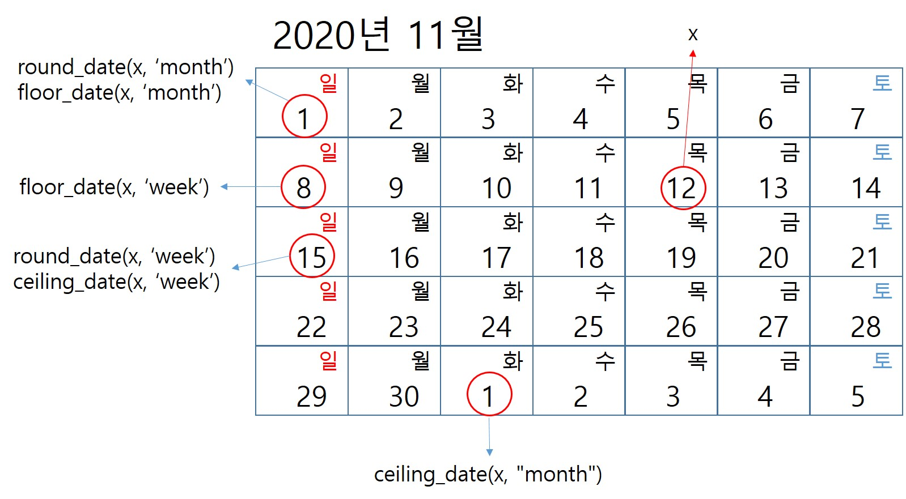
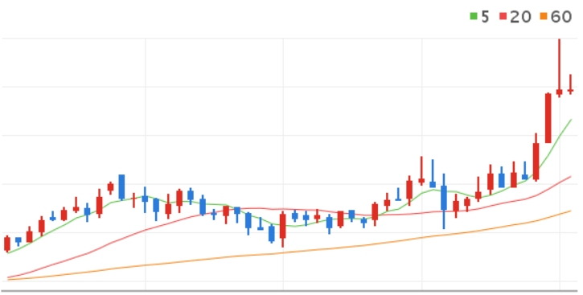
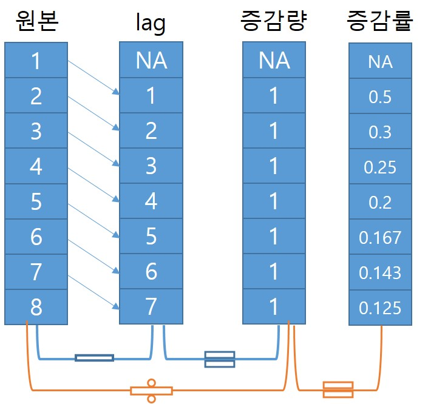
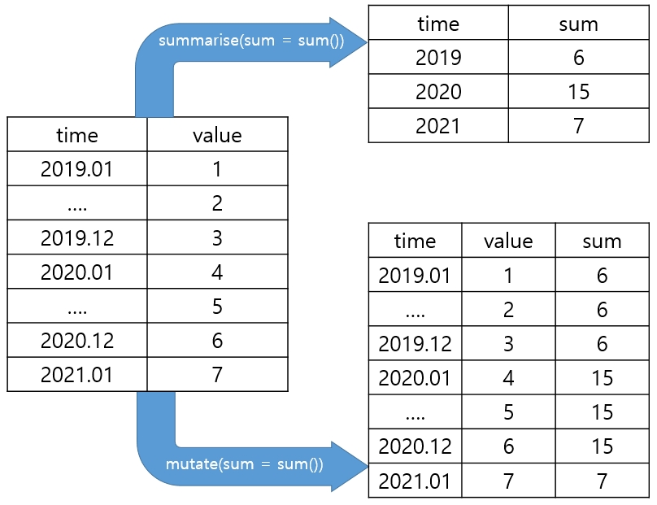

```{r message=FALSE, warning=FALSE, include=FALSE}
library(dplyr)
library(xts)
library(tsibble)
library(readxl)
students.all <- read_excel("./students.xlsx", skip = 16, na = '-', sheet = 1, col_types = c('text', 'text', 'numeric', 'numeric', 'numeric', 'numeric', 'numeric', 'numeric', 'numeric', 'numeric', 'numeric', 'numeric', 'numeric', 'numeric', 'numeric', 'numeric', 'numeric', 'numeric'))
students <- students.all %>% 
  filter(지역규모 == '계') %>% select(-지역규모)
students$연도 <- as.Date(paste0(students$연도, '-01-01'))
students.ts <- ts(students, frequency = 1, start = 1999)
students.xts <- as.xts(students[,-1], order.by = students$연도)
students.tsibble <- as_tsibble(students, index = 연도)


employees <- read.csv('./산업별_취업자_20210206234505.csv', header = TRUE, na = '-', strip.white = TRUE, stringsAsFactors = TRUE)
colnames(employees) <- c('time', 'total', 'employees.edu')
employees$time <- as.Date(paste0(employees$time, '. 01'), format = '%Y. %m. %d')
employees.ts <- ts(employees, start = c(2013, 01), frequency = 12)
employees.xts <- xts(employees[,2:3], order.by = employees[,1])
employees.tsibble <- as_tsibble(employees, index = time)


covid19 <- read.csv('./covid19.csv', header = TRUE, na = '-', strip.white = TRUE, stringsAsFactors = TRUE)
colnames(covid19) <- c('category', 'status', 'date', 'value')
covid19 <- covid19[, c(3, 1, 2, 4)]
covid19$date <- as.Date(covid19$date, "%Y. %m. %d")
covid19 <- covid19 %>% 
  filter(grepl('세', category)) %>% 
  filter(category != '세종')
covid19$value <- ifelse(is.na(covid19$value), 0, covid19$value)
covid19 <- tidyr::spread(covid19, category, value)
covid19.ts <- ts(covid19[, 2:10], frequency = 365)
covid19.xts <- as.xts(covid19[, 3:10], order.by = covid19$date)
covid19.tsibble <- as_tsibble(covid19, index = date)
knitr::opts_chunk$set(class.source = "watch-out", comment='')
```

# 시계열 데이터 처리

우리는 시간 단위로 기록된 데이터를 항상 다루어 왔다. 데이터의 월 평균, 데이터의 전월 대비 증감 등을 산출하기 위해서는 데이터를 월 단위로 구분하여 평균을 구하거나 전월 데이터를 산출하여 당월 데이터와의 차이를 구하는 등의 작업을 해야한다.

R에서 주로 사용하는 데이터프레임에서는 행렬 인덱스나 조건을 `[]`를 이용하여 전달함으로써 데이터를 검색하고 일부 데이터를 부분 집합화(subsetting)하거나 `dplyr` 패키지에서 제공하는 `select`, `filter`, `group_by`, `arrange`, `mutate` 등의 함수를 많이 사용하여 작업을 수행할 수 있다. 물론 데이터프레임에 저장된 시계열 데이터는 `dplyr`에서 제공하는 함수를 사용할 수 있지만 `ts`나 `xts`의 시계열 class의 객체에 대해서는 적용이 되지 않는다. 또한 시계열 데이터는 타 데이터에는 없는 시간적 특성(예를 들어 1분은 60초, 국가마다 년, 월을 표현하는 방식의 차이, Time Zone)이 있기 때문에 이를 잘 활용하기 위해서는 시계열 데이터의 핸들링 방법을 익혀둘 필요가 있다.

이 장에서는 시계열 데이터를 시간 인덱스 단위로 다루는 방법을 설명할 것이다. 데이터가 저장된 형태에 따라 데이터프레임 객체에 저장된 경우의 처리방법과 `xts` 객체에 저장된 경우의 처리 방법을 구분하여 설명한다.

시간을 주로 다루기 위해서 R에서 가장 많이 활용되는 패키지는 `lubridate` 패키지이다. 이 패키지는 시간을 다루기 위한 다양한 함수를 제공하는데 시계열 데이터를 잘 활용하기 위해 `lubridate` 패키지를 위주로 시간 인덱스를 다루는 방법에 대해 설명하고자 한다.

## 오늘 몇일이야? : 시간 정보 추출

시계열 데이터는 년, 월, 일, 시, 분, 초, 타임존 등의 여러 데이터가 결합되어 생성된 시간 인덱스를 사용하는 데이터이다. 그래서 시계열 데이터를 잘 활용하기 위해서는 시간 인덱스에 포함된 요소들을 목적에 맞게 적절히 추출해내야 활용이 가능해진다.

아래의 함수들은 `lubridate` 패키지에서 제공하는 시간 정보를 추출하는 함수들이다. 이 함수들을 적절히 사용하면 시간을 다루기가 매우 쉬워진다.

| 함수명  | 설명      | 함수명   | 설명                  | 함수명               | 설명                            |
|---------|-----------|----------|-----------------------|----------------------|---------------------------------|
| year()  | 연도 추출 | hour()   | 시간 추출             | week()               | 1월1일으로부터의 주수           |
| month() | 월 추출   | minute() | 분 추출               | quater(), semester() | 1월1일으로부터의 분기수, 반기수 |
| day()   | 일 추출   | second() | 초 추출               | am(), pm()           | 오전, 오후의 논리값             |
| wday()  | 요일 추출 | yday()   | 1월1일으로부터의 날수 | leap_year()          | 윤년 여부의 논리값              |

```{r message=FALSE, collapse=TRUE}
# lubridate 패키지 로딩
library(lubridate)
# 현재 시간을 now.date에 저장(date 클래스)
(now.date <- Sys.time())  
# 현재 시간을 now.char에 저장(character 클래스)
(now.char <- as.character(Sys.time()))  
# year(), month(), day()를 시용하여 날짜를 표기하는 문자열 생성
paste0('오늘은 ', year(now.date), '년 ', month(now.char), '월 ', day(now.date), '일 입니다')
# yday()를 사용하여 1월 1일부터 오늘까지의 날짜수 계산
paste0('1월 1일부터 오늘까지 ', yday(now.date), '일 지났습니다')
# qday()를 사용하여 분기시작일로부터 오늘까지의 날짜수 계산
paste0('이번 분기 시작일부터 오늘까지 ', qday(now.date), '일 지났습니다')
# wday()를 사용하여 오늘의 요일 표기
paste0('오늘은 ', wday(now.date, label = T, abbr = T), '요일입니다')
# hour(), minute(), second()를 사용하여 시간을 표시
paste0('지금은 ', hour(now.date), '시 ', minute(now.char), '분 ',  second(now.date), '초 입니다')
# week()를 사용하여 올해 몇번째 주인지 계산
paste0('이번주는 올해의 ', week(now.date), '번째 주입니다')
```

## 몇일 지났어? : 시간 기간 연산

시간의 연산은 일반적으로 오늘로부터 며칠 후, 언제로부터 몇 개 월전 등과 같은 연산을 말한다. `lubridate` 패키지는 시간 연산에서 사용되는 유용한 함수들을 많이 제공한다.

-   시간 더하기/빼기

`lubridate` 패키지에서는 시간의 더하기나 빼기 연산을 지원한다. 일반적인 정수의 연산과 같이 더하거나 빼면 기준일로부터 과거나 미래의 시간을 구할 수 있고 앞에서 설명한 `lubridate`의 `years()`, `months()`, `days()` 등의 함수를 이용하면 년 단위, 월 단위, 일 단위의 연산도 가능하다.

```{r collapse=TRUE, tidy=TRUE}
 # 1980년 1월 1일부터 2021년 1월 1일까지의 날짜 수
as.Date('2021-01-01') - as.Date('1980-01-01') 
# 오늘 날짜를 today에 저장
today <- today()  
# 오늘부터 100일 후
today + 100   
# 오늘부터 2개월 전 
today - months(2) 
# 오늘부터 1년전
today - years(1)   
```

-   경과 기간 구하기

앞선 예에서 1980년 1월 1일부터 2021년 1월 1일까지는 14,976일로 계산되었다. 그러나 우리는 보통 몇 년 몇 월 몇 일로 표현하여 사용한다. `lubridate`패키지는 이렇게 몇 년 몇 월 몇 일로 변환하는 것을 위해 `interval()`를 제공한다. 하지만 바로 계산되는 것은 아니다. `interval()`에 의해 반환되는 값은`interval` 클래스의 데이터값으로 시작점으로부터의 초를 기록한다. 이렇게 변환된 `interval` 객체를 우리가 보기 편하게 년, 월, 일 등으로 표시하기 위해서는 `interva`l 객체를 `as.period()` 나 `as.duration()`으로 `period`나 `duration` 클래스 객체로 변환하여야 한다.

`interval()`는 `%–%` 연산자로 사용할 수도 있다.

```{r collapse=TRUE}
# 1980.1.1부터 2021.12.31까지의 interval 클래스를 int에 저장
# 결과값을 보면 우리가 생각하는 형태가 아님
(int <- lubridate::interval(as.Date('1980-01-01'), as.Date('2021-12-31')))
# 년월일 형태로 interval 출력
lubridate::as.period(int)
# 경과 초 형태로 interval 출력
lubridate::as.duration(int)  
# 1980.1.1부터 2021.12.31까지의 interval 클래스를 int1에 저장
(int1 <- '1980-01-01' %--% '2021-12-31')
# 년월일 형태로 interval 출력
lubridate::as.period(int1)   
```

위의 예제와 같이 `internal`은 시간 범위(time span)를 표현하는데 `lubridate`패키지에서는 `period`와 `duration`의 두가지 시간 범위(time span) 클래스를 제공한다.

`lubridate` 패키지에서 제공하는 `period`함수는 복수 형태(`years()`,`months()` 등)로 표현된 함수를 사용하고 `duration` 함수는 함수의 접두어를 'd'를 사용하여 표현한다.

두 가지 형태의 `internal`을 제공하는 이유는 시간 경과의 표현과 기간 경과의 표현이 다르기 때문이다. `duration`은 항상 수학적으로 동일한 시간 경과의 결과를 제공한다. 하지만 `period`는 우리가 흔히 연월일로 생각하는 기간 경과의 결과를 제공한다. 예를 들어 `duration`의 1년 후는 시작일로부터 365일 후가 되는 날짜를 반환하지만 `period`의 1년 후는 연도가 1이 더해진 날짜를 반환한다. 두 가지의 결과가 동일할 것이라고 생각되지만 윤년이 낀 경우는 `duration`의 결과는 `period`의 결과와 달라진다. 또 `duration` 함수에 정수 시퀀스를 넣어주면 해당 연산에 의한 vector값이 얻어진다. [^data_handling-1]

[^data_handling-1]: <https://cran.r-project.org/web/packages/lubridate/vignettes/lubridate.html>

```{r collapse=TRUE}
# 2020년은 윤년
leap_year(2020)   
# 2020-01-01부터 기간상 1년 후(period)는 우리의 상식대로 2021-01-01
as.Date('2020-01-01') + years(1)  
# 2020-01-01부터 시간상 1년 후(duration)는 2020년은 윤년이므로 2020년은 366일임. 그래서 365일 후인 2020-12-31이 표기됨
as.Date('2020-01-01') + dyears(1)  
# 2020-02-01부터 한달후(period)는 21년 3월 1일
as.Date('2020-02-01') + months(1)  
# 2020-02-01부터 한달후(duration)는 30일 후 인 20년 3월 2일
as.Date('2020-02-01') + dmonths(1)  
# 2021-02-01부터 한달후(period)는 21년 3월 1일
as.Date('2021-02-01') + months(1)  
# 2020-01-01부터 한달 후(duration)는 30일 후 인 3월 2일
as.Date('2021-02-01') + dmonths(1)  
```



## 이번주 마지막날은 몇일이야? : 시간 반올림

시간의 계산에서도 숫자의 계산과 같이 올림, 내림, 반올림 등이 가능하다. 숫자의 계산에서는 소수점 셋째 자리, 천 단위 반올림, 올림 등과 같이 반올림될 단위를 지정해야 하는데 시간의 올림, 반올림 연산에도 월에서 반올림을 할 것인지 일에서 반올림을 할 것인지와 같은 단위를 지정해야 한다. [^data_handling-2]

[^data_handling-2]: <https://rdrr.io/cran/lubridate/man/round_date.html>

`lubridate` 패키지에서는 시간 데이터의 반올림을 위해 `round_date()`, 내림을 위해 `floor_date()`, 올림을 위해 `ceiling_date()` 함수를 제공한다. 매개변수로 'day', 'week', 'month', 'halfyear', 'year' 등을 설정하여 반올림, 올림, 내림의 기본 단위를 지정할 수 있다.

```{r collapse=TRUE}
(x <- as.Date("2020-11-12 13:45:40"))
# 주단위로 반올림
round_date(x, "week")        
# 주단위로 내림
floor_date(x, "week")        
# 주단위로 올림
ceiling_date(x, "week")      
# 월단위로 반올림
round_date(x, "month")       
# 월단위로 내림
floor_date(x, "month")       
# 월단위로 올림
ceiling_date(x, "month")     
# 년단위로 반올림
round_date(x, "year") 
# 년단위로 내림
floor_date(x, "year") 
# 년단위로 올림
ceiling_date(x, "year")      
# 말일을 구하는 코드
days_in_month(as.Date('2012-2', format = '%Y-%d'))  
```



## 주간, 월간 데이터 합계, 평균은? : 시간 Grouping

시계열 데이터를 사용할 때 많이 사용하는 계산은 월별 평균, 주별 합계 등 일정 단위별로 그룹핑한 후 그룹 함수를 적용하여 산출하는 작업이다.

아쉽게도 앞서 사용한 `lubridate` 패키지에서는 시계열 데이터를 주 단위, 월 단위, 년 단위 등으로 그룹핑하는 함수를 제공하지 않는다. 따라서 `lubridate` 함수를 이용하여 그룹화하기 위해서는 `dplyr`에서 제공하는 파이프 연산자인 `%>%`와 앞에 설명한 시간 정보 추출 함수를 같이 사용하여 산출할 수 있다.

하지만 앞장에서 소개한 `timetk` 패키지에서는 그룹핑하여 평균을 내거나 합계를 내는 함수를 제공하기 때문에 이를 사용할 수도 있다.

이번 절에서는 `lubridate`와 `dplyr`를 사용하는 방법과 `timetk`를 사용하는 방법으로 분리해서 설명하겠다.

-   데이터프레임 : `lubridate`, `dplyr` 패키지

데이터프레임으로 저장된 시계열 데이터의 그룹핑을 위해서는 먼저 그룹핑 주기를 설정해야 한다. `lubridate` 패키지의 `year()`, `month()`, `week()` 등의 함수를 사용하여 그룹핑 주기를 설정할 수 있는데 이 결과를 `mutate()`를 사용하여 열로 만들어 준 다음, `group_by()` 를 사용하여 데이터를 그룹핑하고 `summarise()`를 통해 `sum()`, `mean()` 등의 그룹 함수를 사용하여 원하는 값을 산출한다

```{r group1, message=FALSE, warning=FALSE, class.output = "text-danger"}
library(dplyr)
library(ggplot2)
#  월별 취업자수를 연별 취업자수로 그룹핑
(employees.by.year <- employees %>%
  mutate(year = year(time)) %>%   
  group_by(year) %>%
  summarise(total.year = sum(total),
            employees.edu = sum(employees.edu)))
```

::: {.comment}
-   코드 설명

    -   employees 데이터프레임에서 `mutate()`를 사용하여 time에서 뽑은 연도(`year()`)를 year 열에 저장

    -   `group_by()`로 year 열로 그룹핑 한 후 `summarise()`를 사용하여 전체 취업자수의 합계를 total.year, 교육서비스업의 합계 employees.edu 열을 생성

    -   최종 결과를 employees.by.year에 저장
:::

```{r group2}
employees.by.year %>% 
  ggplot(aes(as.factor(year), total.year)) + 
  geom_line(aes(group = 1)) +
  geom_text(aes(label = scales::number(total.year, big.mark = ',')), size = 3, vjust = 1.5) + 
  labs(title = '연도별 취업자수', x = '연도', y = '취업자수') + 
  scale_y_continuous(labels = scales::number_format(big.mark = ','))
```

```{r message=FALSE, warning=FALSE}
#  일별 평균 확진자수를 산출
(mean.covid19.by.age <- covid19 %>%
  mutate(yearmon = yearmonth(date)) %>%
  group_by(yearmon) %>%
  summarise(`01대` = mean(`0-9세`), 
            `10대` = mean(`10-19세`), 
            `20대` = mean(`20-29세`), 
            `30대` = mean(`30-39세`), 
            `40대` = mean(`40-49세`), 
            `50대` = mean(`50-59세`), 
            `60대` = mean(`60-69세`), 
            `70대` = mean(`70-79세`), 
            `80대` = mean(`80세 이상`)))
```

::: {.comment}
-   코드 설명

    -   covid19 데이터프레임을 `%>%`로 `mutate()`에 전달

    -   `mutate()`를 사용하여 date에서 뽑은 연도, 월(`yearmonth()`)를 yearmon 열에 저장

    -   `group_by()`로 yearmon 열로 그룹핑한후 `summarise()`를 사용하여 연령대별 평균을 각각의 열로 저장
:::

```{r group3, message=FALSE, warning=FALSE}
mean.covid19.by.age %>%
  tidyr::gather(category, value, 2:10) %>%
  ggplot(aes(x = yearmon, y = value)) + 
  geom_line(aes(group = category, color = category)) + 
  labs(title = '월간 평균 코로나 확진자수', x = '시간', y = '평균확진자', color = '세대')
```

데이터프레임 시계열 데이터 그룹핑의 또 하나의 방법은 `tibbletime` 패키지에서 제공하는 `collapse_by()` 함수를 사용하는 방법이다. 이 방법을 사용하기 위해서는 `tibbletime` 패키지를 설치, 로딩해야 하며 데이터프레임을 `tbl_time` 클래스 객체로 변환해야 한다. 변환된 `tbl_time` 객체에 적용된 `collapse_by()`는 시간 인덱스열을 직접 컨트롤하여 매개변수로 전달된 기간마다 데이터를 접은(collapse) 후에 `group_by()` 함수를 이용해 그룹핑하여 기간별 데이터를 산출할 수 있다.[^data_handling-3] 접힌 데이터의 시간 인덱스는 접힌 마지막 날로 날짜가 바뀌어서 저장된다.

[^data_handling-3]: <https://cran.r-project.org/web/packages/tibbletime/vignettes/TT-04-use-with-dplyr.html>

```{r as_tbl_time, warning=FALSE, message=FALSE}
library(tibbletime)
as_tbl_time(covid19, index = date) %>%
  collapse_by('weekly') %>%
  group_by(date) %>% 
  summarise(`01대` = mean(`0-9세`), 
            `10대` = mean(`10-19세`), 
            `20대` = mean(`20-29세`), 
            `30대` = mean(`30-39세`), 
            `40대` = mean(`40-49세`), 
            `50대` = mean(`50-59세`), 
            `60대` = mean(`60-69세`), 
            `70대` = mean(`70-79세`), 
            `80대` = mean(`80세 이상`)) %>%
  tidyr::gather(category, value, 2:10) %>%
  ggplot(aes(x = date, y = value)) + 
  geom_line(aes(group = category, color = category)) + 
  labs(title = '주간 평균 코로나 확진자수', x = '월', y = '평균확진자', color = '세대')
```

::: {.comment}
-   코드 설명

    -   `as_tble_time()`을 사용하여 covid19데이터 프레임을 `tibbletime` 클래스로 변환

    -   `collapse_by()`를 이용하여 주간단위로 데이터를 접어줌.

    -   `group_by()`로 주간 단위로 바뀌어진 날짜로 grouping

    -   `summarise()`로 각 세대별 합계값을 구해 열을 생성

    -   plotting을 위해 `gather()`를 사용해 넓은 형태 데이터를 긴 형태 데이터로 변환. 열 이름들을 저장할 열은 category, 열에 저장된 값을 저장할 열은 value, category에 저장될 열들은 2번째부터 10번째 까지임.

    -   `ggplot()`로 다변량 라인 plot 생성
:::

-   데이터프레임 : `timetk` 패키지

데이터프레임으로 저장된 시계열 데이터에 대한 그룹핑의 추가적 방법은 `timetk` 패키지의 `summarise_by_time()` 를 사용하는 것이다. 매개변수인 `.date_var`(시간컬럼), `.by`(그룹핑 단위)를 사용하여 시간 열과 그룹핑 단위를 설정하면 설정된 단위대로 데이터를 그룹핑해준다. 이 방법을 통해 시간을 그룹핑하고 그룹핑된 범위에 해당하는 데이터에 원하는 작업을 수행하여 값들을 얻을 수 있다.

```{r summarise_by_time, message=FALSE, warning=FALSE}
library(timetk)
covid19 %>% 
  summarise_by_time(.date_var = date, .by = 'week', 
                    `01대` = mean(`0-9세`), 
                    `10대` = mean(`10-19세`),
                    `20대` = mean(`20-29세`),
                    `30대` = mean(`30-39세`),
                    `40대` = mean(`40-49세`),
                    `50대` = mean(`50-59세`),
                    `60대` = mean(`60-69세`),
                    `70대` = mean(`70-79세`),
                    `80대` = mean(`80세 이상`)) %>%
  tidyr::gather(category, value, 2:10) %>%
  ggplot(aes(x = date, y = value)) + 
  geom_line(aes(group = category, color = category)) + 
  labs(title = '주간 평균 코로나 확진자수', x = '월', y = '평균확진자', color = '세대')

```

::: {.comment}
-   코드 설명

    -   `%>%`을 사용하여 `summarise_by_time()`에 covid19를 전달하고 그룹핑에 사용할 열(`.date_var =`)과 그룹핑 주기(`.by = 'week'`)를 설정

    -   이후 각 열에 함수(`mean()`)를 적용.

    -   plotting을 위해 `gather()`를 사용해 넓은 형태 데이터를 긴 형태 데이터로 변환. 열 이름들을 저장할 열은 category, 열에 저장된 값을 저장할 열은 value, category에 저장될 열들은 2번째부터 10번째 까지임.

    -   `ggplot()`로 다변량 라인 plot 생성
:::

```{r summarise_by_time1, message=FALSE, warning=FALSE}
employees %>% 
  summarise_by_time(.date_var = time, .by = 'month', 
                    total.year = sum(total), 
            employees.edu = sum(employees.edu)) %>%
  head(10)
```

::: {.comment}
-   코드 설명

    -   `%>%`을 사용하여 `summarise_by_time()`에 employees를 전달하고 그룹핑에 사용할 열(`.date_var =`)과 그룹핑 주기(`.by = 'month'`)를 설정

    -   이 후 total에 함수(`sum()`)를 적용.
:::

-   `tsibble` : index_by() 함수

`tsibble` 객체는 데이터프레임 객체와 동일하게 처리 할 수 있다. 하지만 `tsibble` 객체에서만 동작하는 함수인 `index_by()`를 사용하면 쉽게 구할 수 있다. `index_by()`는 `tsibble` 객체 생성시 지정한 index 컬럼을 사용하여 그룹핑한 새로운 컬럼을 생성한다. 여기서 주의해야할 사항은 grouping 함수 앞에 `~`를 붙여야 한다는 것과 grouping 함수의 매개변수로 '`.`'을 사용해야 한다는 점이다. '`.`'의 의미는 index 컬럼을 사용한다는 의미이다.

grouping 주기는 다음과 같다.

| 함수명                               | 주기      |
|--------------------------------------|-----------|
| lubridate::year                      | 연도 주기 |
| yearquarter                          | 분기 주기 |
| yearmonth                            | 월 주기   |
| yearweek                             | 주 주기   |
| as.Date                              | 일 주기   |
| celling_date, floor_date, round_date | 상세 주기 |

```{r example_tsibble}
employees.tsibble%>%
  index_by(yearqtr = ~ yearquarter(.)) %>%
  summarise(sum.qtrly = sum(total)) %>% 
  head(10)
covid19.tsibble[, c(1,3)]%>%
  index_by(yearweek = ~ yearweek(.)) %>%
  summarise(sum.weekly = sum(`0-9세`)) %>% 
  head(10)
```

`index_by()`를 사용할 때 장점은 그룹핑 기간을 자유자재로 설정할 수 있다는 점이다. 월, 분기, 년과 같이 달력상의 주기 외에 '매 4일마다', '매 2달마다'와 같이 주기를 설정할 수 있다.

```{r example_tsibble1}
covid19.tsibble[, c(1,3)]%>%
  index_by(twoweek = ~ lubridate::floor_date(., "2 month")) %>%
  summarise(sum.2week = sum(`0-9세`)) %>% 
  head(10)
covid19.tsibble[, c(1,3)]%>%
  index_by(fourday = ~ lubridate::floor_date(., "4 day")) %>%
  summarise(sum.4days = sum(`0-9세`)) %>% 
  head(10)
```

-   `xts`

`xts` 객체의 월별, 분기별, 연별 그룹핑 값을 구하기 위해서 제공하는 함수는 'apply.'으로 시작하는 함수이다.이 함수에 `xts` 객체와 적용하고자 하는 함수(`sum`, `mean` 등)을 전달하면 값을 산출할 수 있다.

apply. 계열 함수는 다음의 5가지가 있다. 산출된 결과는 `plot.xts()`로 간단히 plotting 할 수 있다.

| 함수명                           | 설명                               |
|----------------------------------|------------------------------------|
| apply.daily(xts객체, 함수명)     | 일별로 함수를 적용한 결과값 반환   |
| apply.weekly(xts객체, 함수명)    | 주별로 함수를 적용한 결과값 반환   |
| apply.monthly(xts객체, 함수명)   | 월별로 함수를 적용한 결과값 반환   |
| apply.quarterly(xts객체, 함수명) | 분기별로 함수를 적용한 결과값 반환 |
| apply.yearly(xts객체, 함수명)    | 년별로 함수를 적용한 결과값 반환   |

```{r example3, warning=FALSE, message=FALSE, collapse=TRUE}
library(xts)
apply.quarterly(employees.xts, sum) %>% head(10)
apply.yearly(employees.xts, sum) %>% plot.xts()
apply.monthly(covid19.xts[,1], sum) %>% plot.xts(main = '월별 코로나 확진자수(0-9세)')
apply.quarterly(covid19.xts[,1], sum) %>% plot.xts(main = '분기별 코로나 확진자수(0-9세)')
```

-   `ts`

`ts` 객체는 다음 장부터 다뤄질 시계열 분석 패키지인 `forecast` 패키지에서 주로 사용되는 객체이다. 하지만 앞선 데이터프레임이나 `xts` 처럼 처리가 용이하지 않다. 따라서 데이터 처리를 위해서는 데이터프레임이나 `xts` 객체로 변환하여 사용하는 것이 정신 건강에 좋다.

## 주식 시가, 고가, 저가, 종가는 어떻게 구해? : OHLC

주식 프로그램을 보면 시계열 plot과 함께 제공되는 몇 가지 정보가 있는데 바로 시가, 고가, 저가, 종가 정보이다. 이 네 가지 정보를 시계열 데이터에서는 영문 이니셜을 따서 OHLC라고 한다. OHLC는 주어진 기간동안의 첫번째 값(Open), 최대값(High), 최소값(Low), 마지막 값(Close) 값을 말한다.

-   데이터프레임 : `lubridate`, `tibbletime`, `dplyr` 패키지

앞서 소개한 `collapse_by()` 함수를 사용하면 OHLC 정보를 간단히 산출할 수 있다. `collapse_by()`를 이용해 그룹핑할 시간 주기를 설정하고 `group_by()`함수를 사용하여 데이터를 그룹핑한 후 `lubridate` 패키지의 `first()`, `max()`, `min()`, `last()` 함수를 사용하면 산출이 가능하다.

```{r warning=FALSE, message=FALSE}
as_tbl_time(covid19, index = date) %>%
  collapse_by('weekly') %>%
  group_by(date) %>% 
  summarise(Open = first(`0-9세`), 
            High = max(`0-9세`), 
            Low = min(`0-9세`), 
            Close = last(`0-9세`)) %>%
  head(10)
```

-   `xts`

`xts` 패키지에서는 OHLC 정보를 확인할 수 있는 함수를 직접 제공한다. `to.period()`인데 OHLC를 제공하는데 `to.period()` 함수의 매개변수인 `method`에 'months', 'quarters' 등 적절한 시간 간격을 설정해주면 해당 기간 동안의 OHCL를 자동으로 출력해준다.

```{r toperiod, message=FALSE, warning=FALSE}
to.period(covid19.xts, method = 'months', OLHC = TRUE)
```

## 3일 평균, 5일 합계는? : 시간 Rolling

주식 거래 프로그램에서는 많은 시계열 그래프들을 보여준다. 아래의 plot에서 보면 초록색 선은 5일 동안의 평균, 빨간색 선은 20일 동안의 평균, 주황색 선은 60일 동안의 평균을 나타낸다. 이를 이동평균이라고 한다.



이동평균은 평균의 산출 기간을 현재일로부터 특정일까지로 정해서 구하는 평균으로 평균을 구하는 기간이 매일 달라진다. 이와 같이 기준일에서 특정 기간 동안에 집합 함수를 적용하는 과정을 rolling이라 하고 rolling에 적용되는 기간을 rolling window라고 한다. 위의 그림에서 5일 이동평균의 rolling window는 5, 20일 이동평균의 rolling window는 20이 된다.

지금까지 시계열 데이터를 다루는데 계속 사용했던 lubridate 패키지에서는 rolling에 관련된 함수를 제공하지 않는다. 대신 `zoo` 패키지에서 제공하는 함수를 `dplyr` 함수와 파이프라인을 사용하는 방법, `timetk` 패키지를 사용하는 방법을 사용하여 산출 할 수 있고 `xts` 시계열 데이터는 `xts` 패키지에서 제공하는 함수를 사용할 수 있다.

-   데이터프레임 : `zoo`, `dplyr` 패키지

데이터프레임으로 저장된 시계열 객체에 대한 rolling은 `zoo` 패키지에서 제공하는 roll\* 함수를 사용하면 비교적 쉽게 rolling을 수행할 수있다.

roll\* 함수는 `rollapply()`와 `rollmean()`의 두가지를 제공하는데 `rollapply()`는 `apply()`를 rolling용으로 수정한 버전이다. `rollmean()`은 `rollapply()`에 평균(`mean()`)을 적용하는 함수로 rolling에는 평균을 사용하는 경우가 많기 때문에 이를 위해서 특별히 `rollmean()`을 제공한다.

```{r message=FALSE, warning=FALSE, include=FALSE}
#detach(package:xts)
```

```{r rollapply, message=FALSE, warning=FALSE}
library(zoo)
employees %>%
  mutate(ma3 = rollmean(total, k = 3, fill = NA),
         sum3 = rollapply(total, 3, sum, fill = NA)) %>%
  select(time, total, ma3, sum3) %>%
  ggplot(aes(x = time)) + 
  geom_line(aes(y = total, group = 1, color = '3개월 합계')) +
  geom_line(aes(y = ma3, group = 1, color = '3개월 평균')) + 
  labs(y = '취업자수', x = '연도') +
  scale_color_manual('', values = c('3개월 합계' = 'red', '3개월 평균' = 'blue'))
```

::: {.comment}
-   코드 설명

    -   `%>%`를 사용하여 `mutate()`에 employees를 전달.

    -   `mutate()`로 total 열의 데이터를 rolling window가 3(`k = 3`)인 평균(`rollmean`)을 구하는 ma3 열을 생성하는데 빈 행은 NA로 채움(`fill = NA`).

    -   `mutate()`로 total 열의 데이터를 rolling window가 3인 합계(`sum`)를 구하는 ma3 열을 생성(`rollapply()`)하는데 빈 행은 NA로 채움(`fill = NA`).

    -   결과중에 time, total, ma3, sum3만 선택

    -   `ggplot()`를 사용하여 다변량 라인 plot을 그림
:::

-   데이터프레임 : `timetk` 패키지

`timetk` 패키지에서는 rolling 기능을 위해 `slidify()` 함수를 제공한다. `slidify()` 함수가 타 함수와 다른 점은 그 반환 값이 함수의 실행 결과값이 아니고 함수 자체를 반환한다는 것이다.

즉 rolling window 기간에 특정 함수를 적용하는 함수를 제공하기 때문에 이후 함수의 형태로 사용해야 한다.

아래의 예에 ma3와 sum3는 data.frame이나 숫자값이 아니고 함수 객체이다. 이 함수 객체는 `mutate()` 안에서 함수로 실행하는데 그 매개변수로 rolling을 해야할 컬럼을 전달하면 그 결과 벡터가 전달되는 형태로 실행된다.

```{r slidify, message=FALSE, warning=FALSE, collapse=TRUE}
ma3 <- slidify(mean, .period = 3, .align = "center")
sum3 <- slidify(sum, .period = 3, .align = "center")
class(ma3)
class(sum3)
employees %>%
  mutate(ma3 = ma3(total), sum3 = sum3(total)) %>%
  select(time, total, ma3, sum3) %>%
  ggplot(aes(x = time)) + 
  geom_line(aes(y = total, group = 1, color = '3개월 합계')) +
  geom_line(aes(y = ma3, group = 1, color = '3개월 평균')) + 
  labs(y = '취업자수', x = '연도') +
  scale_color_manual('', values = c('3개월 합계' = 'red', '3개월 평균' = 'blue'))
```

::: {.comment}
-   코드 설명

    -   slidify()를 사용하여 rolling window가 3인 평균함수를 ma3로 생성

    -   slidify()를 사용하여 rolling window가 3인 합계함수를 sum3로 생성

    -   ma3와 sum3의 클래스를 확인해보면 function임을 확인

    -   mutate()로 slidify()로 생성한 함수로 total 열에 대한 rolling window가 3인 평균과 합계를 구해 ma3, sum3 열을 생성

    -   결과중에 time, total, ma3, sum3만 선택

    -   `ggplot()`를 사용하여 다변량 라인 plot을 그림
:::

-   `xts`

`xts` 패키지에서는 rolling을 위한 간단한 함수를 제공한다. `rollapply()`로 `xts` 객체와 rolling window 기간, 적용할 함수를 전달하면 rolling을 간단히 구할수 있다.

```{r}
rollapply(employees.xts, width = 3, FUN = mean) %>%
  head(10)
```

## 지난 달 데이터는? : Filtering (Subsetting)

시계열 데이터가 아닌 데이터들은 데이터 값에 대한 조건을 적용하여 결과를 추출한다. 예를 들어 판매량이 100보다 크거나 취업자수가 10,000명보다 큰 경우 등이다. 물론 시계열 데이터도 데이터 값에 조건을 적용하여 조건에 맞는 행의 추출이 가능하지만 시간 인덱스에 조건을 적용하여 추출도 가능하다. 이 방법은 filtering이라고도 하고 subsetting이라고도 한다. 여기서는 시간 인덱스에 조건을 적용하는 방법에 대해 설명한다.

-   데이터프레임 : `lubridate`, `dplyr` 패키지

데이터프레임에 저장된 시계열 객체의 시간 인덱스 컬럼은 조건 연산자를 동일하게 사용할 수 있다. 따라서 `<`, `<=`, `=`, `>`, `>=` 등의 연산자를 `dplyr` 패키지에서 제공하는 `filter()`와 파이프라인(`%>%`)을 사용하여 시간 인덱스에 대해 조건 별로 filtering 할 수 있다.

```{r}
covid19 %>%
  filter(date >= as.Date('2020-10-01') & date <= as.Date('2020-10-10'))
covid19 %>%
  filter(between(date, as.Date('2021-01-01'), as.Date('2021-01-15')))
employees %>%
  filter(year(time) == 2019 & month(time) == 5)
# 매월 3일부터 7일까지 filtering
covid19 %>%
  filter(between(day(date), 3, 7)) %>%
  head(15)
```

-   데이터프레임 : `timetk` 패키지

`timetk` 패키지에서는 `filter_by_time()`을 제공한다. 매개변수 .start로 시작일과 .end 종료일을 전달하면 해당 기간 동안의 데이터를 반환한다.

또 `timetk` 패키지에서는 `filter_by_time()`에 데이터 값에 대한 조건을 추가할 수 있는 `filter_period()`를 제공한다. `filter_by_time()`와 같이 매개변수 `.start`로 시작일과 `.end` 종료일을 설정하고 데이터에 적용할 조건을 설정하면 적합한 결과들을 산출해서 반환한다. 예를 들어 매월 최대 매출일을 기록한 날, 매년 월평균 매출액보다 큰 매출을 기록한 월등을 산출할 때 유용하다.

```{r message=FALSE, warning=FALSE}
covid19 %>%
  filter_by_time(.date_var = date, .start = '2020-10-01', .end = '2020-10-05')  
covid19 %>%
  filter(`0-9세` != 0) %>%
  filter_period(.date_var = date, .period = '1 month', `0-9세` == max(`0-9세`)) %>%
  head(10)
```

::: {.comment}
-   코드 설명

    -   2020-10-01부터 2020-10-05까지의 데이터 산출

    -   `filter_period()`를 사용하여 코로나19 데이터에서 0-9세가 0인 행을 제거(`` filter(`0-9세` != 0) ``)하고 월단위로 쪼개서(.period = '1 month') 0-9세 확진자수가 가장 많은 데이터(`` `0-9세` == max(`0-9세`) ``)를 산출
:::

-   `xts`

`xts` 객체의 시간 인덱스 filtering은 앞선 경우 와는 조금 다른 방법을 사용한다. `xts` 객체는 기간 조건을 설정할 때에는 함수를 사용하지 않고 연산자인 /로 기간 구간을 설정할 수 있다. /을 사용하여 조건을 적용할 때는 []을 사용하여 조건을 적용할 수 있다.

`/`연산자는 우리가 흔히 쓰는 \~로 생각하면 편리한데 날짜 사이에 `/`가 들어가면 두 날짜 사이 기간을 의미하고 날짜 앞에 `/`가 오면 처음부터 날짜까지의 기간, 날짜 뒤에 `/`가 오면 날짜부터 끝까지의 기간을 의미한다.

```{r collapse=TRUE}
# 2020-10-02에 해당하는 데이터 filtering
covid19.xts['2020-10-02']   
# 2020-10-01에서부터 2020-10-10 까지 데이터 filtering
covid19.xts['2020-10-01/2020-10-10']  
# 2021-02-05일 부터 끝까지 데이터 filtering
covid19.xts['2021-02-05/'] 
# 처음부터 2020-04-11까지의 filtering
covid19.xts['/2020-04-11']   
```

## 월별, 분기별, 연별 증감량

월별, 분기별, 연별 증감량을 산출하기 위해서는 바로 직전 데이터와의 차감 데이터를 계산해야 한다. 이와 같이 시계열 분석에서는 이전 데이터와의 차감 데이터가 매우 중요하게 활용된다. 차감데이터가 증감량이며 이 차감 데이터를 원본데이터로 나누면 증감률이 된다.



-   데이터프레임 : lag() 함수

시계열 데이터가 저장된 데이터프레임의 데이터 열에 `lag()`를 적용하면 데이터를 하나씩 Shift 시킨 벡터를 반환해준다. 이 벡터를 데이터프레임에 추가해주고 mutate()를 사용해 원본데이터에서 lag된 데이터를 빼주면 증감량을 얻을 수 있고 증감량을 원본 데이터로 나눠주면 증감률을 구할 수 있다.

```{r example4, warning=FALSE, message=FALSE, results= 5}
students_lag <-  cbind(연도 = students$연도, 
                      학생수계 = students$학생수계, 
                      전년 = students %>% 
                         lag(1)%>% 
                         select(학생수계) %>% 
                         rename(전년 = 학생수계)
                     ) %>%
  mutate(증감 = 학생수계 - 전년, 증감율 = round((학생수계/전년)-1, 3) * 100)
students_lag %>% head()
```

::: {.comment}
-   코드 설명

    -   `cbind()`로 student의 연도, 학생수계 열과 `lag()`의 결과인 lag된 열을 묶어서 student_lag 데이터프레임을 생성

    -   이중 lag 열의 이름을 전년으로 바꿔줌

    -   `mutate()`로 증감(`학생수계 - 전년`)과 증감률(`round((학생수계/전년)-1, 3) * 100`) 열을 생성
:::

```{r example5, warning=FALSE, message=FALSE}
students_lag %>%
  ggplot(aes(as.factor(year(연도)), 증감)) + 
  geom_line(aes(group = 1)) + 
  geom_point() +
  ggrepel::geom_text_repel(aes(label = scales::comma(증감)), vjust = 1, size = 3) +  ### ggrepel::geom_text_repel() 함수로 숫자들이 겹치지 않게 plotting
  labs(title = '전년대비 전체 학생수 증감 추이', x = '연도', y = '학생수 증감량') +
  scale_y_continuous(labels = scales::number_format(big.mark = ',')) +
  theme(axis.text.x=element_text(angle=90,hjust=1))
```

-   `tsibble` : `diffrence()`

앞선 예제에서는 `lag()` 함수를 사용하여 원 데이터를 하나씩 shift한 데이터 열을 생성하고 두 열의 차이를 구한 열을 `mutate()`로 만들었다. `tsibble` 객체는 이 과정을 바로 지원하는 `difference()`를 제공한다. `difference()`는 시차 데이터(lag)를 생성하고 이 시차 데이터와 원본 데이터의 차이를 가지는 데이터 열을 생성해주는 함수이다. 따라서 `lag()`를 사용하는 것 보다 단계를 줄일 수 있다.

```{r tsibble_diff}
students.tsibble%>%  select(1, 2) %>%
  mutate(증감 = difference(.$학생수계, lag = 1)) %>%
  mutate(증감율 = round((증감/학생수계), 3) * 100) %>% head(10)
employees%>%
  mutate(증감 = difference(employees.tsibble$total, lag = 1)) %>%
  mutate(증감율 = round((증감/total), 3) * 100) %>% select(1, 2, 4, 5) %>% head(10)
```

-   `xts` : `diff()`

`xts` 객체도 `tsibble` 객체와 같이 차분 함수인 `diff()` 함수를 제공한다. 이후 과정은 `tsibble`과 동일한 과정을 거친다.

```{r xts_diff}
students.xts$증감 <- diff(students.xts[,2]) 
students.xts$증감율 <- round((students.xts$증감/students.xts$학생수계), 3) * 100
students.xts[, c('학생수계', '증감', '증감율')] %>% head(10)
plot.xts(students.xts[, '증감율'], main = '전년대비 학생수 증감률')
employees.xts$증감 <- diff(employees.xts$total)
employees.xts$증감율 <- round((employees.xts$증감/employees.xts$total), 3) * 100
employees.xts[, c('total', '증감', '증감율')] %>% head(10)
plot.xts(employees.xts[, c('증감율')], main = '전월대비 전체 취업자 증감률')
```

## 월 비중 백분율, 연 비중 백분율

연간 전체 매출의 월별 비중, 월간 전체 합계 중 일별, 주간별 비중 또는 백분율 등을 산출해야 할 때가 있다. 이런 경우 연간 전체 매출의 월별 비중이나 백분율을 모두 합하면 1 또는 100%가 되어야 한다.

예를 들어 매월 매출액이 기록된 시계열 데이터에서 1년중 비율을 구하기 위해서는 매월 매출액의 옆 컬럼에 해당 년의 전체 매출액 합계가 있어야 비율을 구할 수 있다.

따라서 월 비중, 연 비중 백분율 등을 구하기 위해서는 총 합계가 먼저 계산되어야 한다.

-   데이터프레임 : `group_by()`, `mutate()`

데이터프레임에서 총합계를 구하기 위해서는 먼저 구하고자 하는 총 합계의 주기로 그룹핑 하여 전체 합계를 구해야 한다. 이때 주의해야할 점이 `summarise()`를 통해 합계를 구하지 않고 `mutate()`를 사용해 합계를 구해야 한다는 것이다.

`group_by()`후 `summarise()`를 통해 합계를 구하면 전체 데이터 구조가 그룹핑 된 구조로 바뀌게 되지만 `mutate()` 함수를 통해 합계를 구하면 그룹핑 된 주기별로 합계를 구한 컬럼이 추가되게 되어 비중을 구하기 쉽다. 이 경우 그룹핑 영향을 받는 부분을 정확히 파악하여 `group_by()`의 영향을 벗어나야 하는 곳에서 `ungroup()`을 사용해서 더이상 `group_by()`의 영향을 받지 않도록 해줘야 한다.



```{r dataframe_rate}
employees %>% 
  group_by(year(time)) %>%
  mutate(sum.by.year = sum(total)) %>%
  ungroup() %>%
  mutate(rate.by.year = round(total/sum.by.year, 3) * 100) %>%
  head(15)
covid19 %>% 
  group_by(yearmonth(date)) %>%
  mutate(sum.by.month = sum(`0-9세`)) %>%
  ungroup() %>%
  mutate(rate.by.month = round(`0-9세`/sum.by.month, 3) * 100) %>%
  select(date, `0-9세`, sum.by.month, rate.by.month)
covid19 %>% 
  group_by(year(date), month(date), week(date)) %>%
  mutate(sum.by.week = sum(`0-9세`)) %>%
  ungroup() %>%
  mutate(rate.by.week = round(`0-9세`/sum.by.week, 3) * 100) %>%
  select(date, `0-9세`, sum.by.week, rate.by.week)
```

-   `tsibble` : `index_by()`, `mutate()` 함수

앞선 월별, 분기별 합산에서 사용했던 `index_by()` 함수를 이용하면 데이터를 주기별로 그룹핑 할 수 있다. 이 후 데이터프레임에서 했던 것 처럼 `summarise()` 함수가 아닌 `mutate()` 를 사용하여 전체 행에 그룹핑된 합계열을 생성한 후 원본 데이터를 합계열로 나누어 비율을 구할 수 있다.

```{r tsibble_rate}
###  취업자수의 분기별 비율
employees.tsibble%>%
  index_by(yearqtr = ~ yearquarter(.)) %>%
  mutate(sum.qtrly = sum(total)) %>% 
  mutate(rate.qtrly = total/sum.qtrly) %>%
  head(15)  
### 취업자수의 월별 비율
employees.tsibble%>%
  index_by(yearqtr = ~ year(.)) %>%
  mutate(sum.qtrly = sum(total)) %>% 
  mutate(rate.qtrly = (total/sum.qtrly)*100) %>%
  head(15)  
```

## 월별, 분기별, 연별 누적합계

시계열 데이터는 시간 동안의 데이터 흐름을 나타내지만 경우에 따라서 계속된 누적 합계를 나타내야 할 경우가 있다. 예를 들어 주간별 매출액의 연도별 누적 매출액, 웹사이트의 누적 사용자와 같은 경우이다. 누적합은 앞서 설명한 그룹핑과 함께 쓰면 더 좋은 결과를 낼 수 있다.

-   데이터프레임 : cumsum(), group_by(), collapse_by() 함수

데이터프레임에 저장된 시계열 데이터에 대한 누적합을 구하기 위해서는 `dplyr` 패키지의 누적합을 산출하는 함수인 `cumsum()`를 사용한다. 데이터를 그룹핑하지 않고 전체 데이터에 대한 누적합은 `mutate()`를 사용하여 `cumsum()` 결과 열을 생성함으로써 구할 수 있다.

```{r dataframe_cumsum}
###   누적 취업자수 산출
employees %>% 
  mutate(cumsum = cumsum(total)) %>%
  select(time, total, cumsum) %>%
  head(15)
### 0-9세 코로나 확진자의 누적 plot
covid19 %>%
  mutate(cumsum = cumsum(`0-9세`)) %>%
  select(date, `0-9세`, cumsum) %>%
  ggplot(aes(date, cumsum)) +
  geom_line(aes(group = 1)) +
  labs(title = '코로나 확진자 누적 합계(0-9세)', x = '날짜', y = '누적합계') +
  scale_x_date(date_breaks = "1 month", date_labels = "%y.%m")  +
  theme(axis.text.x=element_text(angle=90,hjust=1))
```

전체 데이터에 대한 누적 합계가 아닌 연별, 월별, 주별 등의 주기별 누적합계를 구하려면 앞서 설명한 `group_by()`와 함께 사용하면 원하는 기간 동안의 누적 합계를 구할 수 있다.

```{r dataframe_group_cumsum, message=FALSE, warning=FALSE}
employees %>% 
  group_by(year(time)) %>%
  mutate(cumsum.total = cumsum(total), 
         cumsum.edu = cumsum(employees.edu)) %>%
  select(time, total, cumsum.total, employees.edu, cumsum.edu) %>%
  head(15)
```

-   `tsibble` : index_by() 함수

`tsibble` 객체에 대한 누적 합계는 앞서 설명한 그룹핑 방법과 유사한데, `index_by()`를 사용하여 grouping 하고 합계를 산출하는 방법의 `sum()`를 `cumsum()`으로, `summarise()`를 `mutate()` 로 바꾸어 주면 간단히 끝난다. `mutate()`를 쓰는 이유는 누적 합계는 모든 관측치에 필요한 열이기 때문이다.

```{r tsibble_cumsum}
employees.tsibble%>%
  index_by(yearqtr = ~ yearquarter(.)) %>%
  mutate(cumsum.qtrly = cumsum(total)) %>% 
  select(yearqtr, cumsum.qtrly) %>%
  head(10)
covid19.tsibble[, c(1,3)]%>%
  index_by(yearweek = ~ yearweek(.)) %>%
  mutate(cumsum.weekly = cumsum(`0-9세`)) %>% 
  head(10)
```

-   `xts`

`xts` 패키지에서는 누적합을 산출하는 함수를 제공하지 않는다.

그렇기 때문에 누적합을 구하기 위해서는 몇 단계를 거쳐야 한다. 먼저 `split()` 함수를 사용하여 누적합을 적용할 시간 단위로 데이터를 분리해준다. 분리한 결과는 list의 형태로 반환되는데 이 결과를 `lapply()`를 이용하여 `cumsum()` 를 각각의 list에 적용시켜 준다. 이 결과는 list의 형태이기 때문에 `do.call()` 함수를 이용하여 하나의 `xts` 형태로 다시 묶어 주면 원하는 값을 얻을 수 있다.

이 과정에서 list를 다루는 함수인 `lapply()`와 `do.call()` 함수가 사용되었다. 이 두 함수 모두 매개변수로 받은 함수를 각각의 list 요소에 적용하는데 차이점은 `lapply()`의 경우 각각의 list의 모든 행에 대해 매개변수 함수를 적용하는데 반해 `do.call()`은 list의 요소에 대해 함수를 적용한다는 점에서 차이가 있다.

아래의 예에서 `lapply()`로 전달된 `cumsum()` 는 `split()`로 분리된 12개의 요소의 각 행(총 1,424개)에 적용되고 `do.call()`로 전달된 `rbind()` 함수는 `split()`로 분리된 12개의 요소에 적용되기 때문에 단순히 12번 호출된다.

```{r}
do.call(rbind, lapply(split(employees.xts, f = 'year'), cumsum)) %>%
  head(15)
```

## 동월별, 동분기별, 동년별 Plot

앞선 plot에서처럼 시계열 데이터는 선 plot으로 그려지는 경우가 많다. 하지만 동년, 동월, 동분기 데이터를 전체적으로 확인해야 할 경우가 있다. 이 plot은 모든 시계열 객체에서 그릴 수는 없다. `ggplot()`으로 데이터프레임이 가장 구현하기가 쉬운데 일부 시계열 패키지에서 제공하는 계절성 plot 함수를 사용할 수도 있다.

이 절에서는 주로 상자 plot을 활용하여 정보를 표현하도록 하겠다.

-   데이터프레임 : `group_by()`

데이터프레임을 사용한 동월, 동분기별, 동년별 plot은 우선 데이터를 적절히 그룹핑 해야한다.

앞의 예제에서처럼 월별 데이터로 그룹핑하기를 원하면 더 큰 시간인 년도도 같이 그룹핑해서 전체적인 시간적 흐름을 놓치지 않도록 유지하였다. 하지만 매 1월 판매량 등과 같이 시간적 흐름보다는 시간적 특성만을 원할 경우는 그룹핑 할 때 원하는 해당 정보에 대해서만 그룹핑 함으로써 원하는 정보를 얻을 수 있다.

```{r dataframe_same}
employees %>%
  mutate(year = lubridate::year(employees$time)) %>%
  ggplot(aes(as.factor(year), total)) + 
  geom_boxplot() + 
  geom_jitter(alpha = 0.2) + 
  labs(title = '동년별 취업자 분포', x = '연도', y = '취업자수')
employees %>%
  mutate(month = lubridate::month(employees$time)) %>%
  ggplot(aes(as.factor(month), total)) + 
  geom_boxplot() + 
  geom_jitter(alpha = 0.2) + 
  labs(title = '동월별 취업자 분포', x = '월', y = '취업자수')

employees %>%
  mutate(quarter = lubridate::quarter(employees$time)) %>%
  ggplot(aes(as.factor(quarter), total)) + 
  geom_boxplot() + 
  geom_jitter(alpha = 0.2) + 
  labs(title = '동분기별 취업자 분포', x = '분기', y = '취업자수')
covid19 %>%
  mutate(month = lubridate::month(covid19$date)) %>%
  ggplot(aes(as.factor(month), `0-9세`)) + 
  geom_boxplot() + 
  geom_jitter(alpha = 0.2) + 
  labs(title = '동월별 확진자 분포', x = '연도', y = '확진자수')
covid19 %>%
  mutate(wday = lubridate::wday(covid19$date, label = TRUE)) %>%
  ggplot(aes(as.factor(wday), `50-59세`)) + 
  geom_boxplot() + 
  geom_jitter(alpha = 0.2) + 
  labs(title = '동요일별 확진자 분포', x = '연도', y = '확진자수')
```

-   데이터프레임 : `plot_seasonal_diagnostics()`

데이터프레임에서 계절성을 plotting 하기 위해 앞의 예제에서는 계절 주기로 그룹핑 한 컬럼을 활용하였다. 하지만 계절성을 알고 있는 경우는 쉽게 구할 수 있지만 계절성을 모르는 경우는 여러 plot을 확인해야 한다.

이런 경우 사용할 수 있는 함수가 `timetk` 패키지의 `plot_seasonal_diagnostics()` 이다. 이 함수는 주어진 시계열 데이터에 가능한 모든 동월, 동분기, 동요일 등의 plot을 동시에 생성해준다. `plot_ly`와 `ggplot2`를 기본으로 작성된 plot이기 때문에 가장 큰 장점이 반응형(interactive) plot이 생성된다.

```{r timetk_same, warning=FALSE, message=FALSE}
employees %>%
  timetk::plot_seasonal_diagnostics(.date_var = time, .value = total, .title = '전체 취업자의 주기별 Plot')
covid19 %>% 
  timetk::plot_seasonal_diagnostics(.date_var = date, .value = `0-9세`, .title = '코로나 확진자(0-9세)의 주기별 Plot')
```
