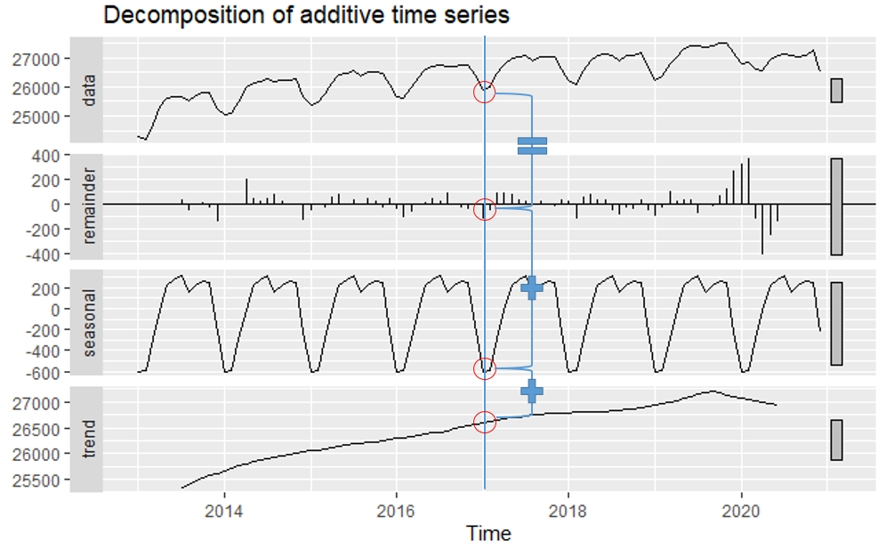
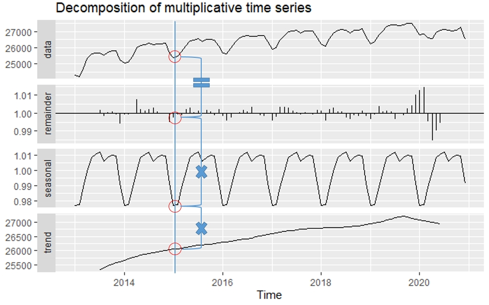

```{r message=FALSE, warning=FALSE, include=FALSE}
library(dplyr)
library(xts)
library(tsibble)
library(readxl)
students.all <- read_excel("./students.xlsx", skip = 16, na = '-', sheet = 1, col_types = c('text', 'text', 'numeric', 'numeric', 'numeric', 'numeric', 'numeric', 'numeric', 'numeric', 'numeric', 'numeric', 'numeric', 'numeric', 'numeric', 'numeric', 'numeric', 'numeric', 'numeric'))
students <- students.all %>% 
  filter(지역규모 == '계') %>% select(-지역규모)
students$연도 <- as.Date(paste0(students$연도, '-01-01'))
students.ts <- ts(students, frequency = 1, start = 1999)
students.xts <- as.xts(students[,-1], order.by = students$연도)
students.tsibble <- as_tsibble(students, index = 연도)


employees <- read.csv('./산업별_취업자_20210206234505.csv', header = TRUE, na = '-', strip.white = TRUE, stringsAsFactors = TRUE)
colnames(employees) <- c('time', 'total', 'employees.edu')
employees$time <- as.Date(paste0(employees$time, '. 01'), format = '%Y. %m. %d')
employees.ts <- ts(employees, start = c(2013, 01), frequency = 12)
employees.xts <- xts(employees[,2:3], order.by = employees[,1])
employees.tsibble <- as_tsibble(employees, index = time)


covid19 <- read.csv('./covid19.csv', header = TRUE, na = '-', strip.white = TRUE, stringsAsFactors = TRUE)
colnames(covid19) <- c('category', 'status', 'date', 'value')
covid19 <- covid19[, c(3, 1, 2, 4)]
covid19$date <- as.Date(covid19$date, "%Y. %m. %d")
covid19 <- covid19 %>% 
  filter(grepl('세', category)) %>% 
  filter(category != '세종')
covid19$value <- ifelse(is.na(covid19$value), 0, covid19$value)
covid19 <- tidyr::spread(covid19, category, value)
covid19.ts <- ts(covid19[, 2:10], frequency = 365)
covid19.xts <- as.xts(covid19[, 3:10], order.by = covid19$date)
covid19.tsibble <- as_tsibble(covid19, index = date)
knitr::opts_chunk$set(class.source = "watch-out", comment='')
```

# 시계열 forecasting Part I - 기초컨셉

시계열 데이터를 기반으로 미래 예측을 하는 데에는 사용하는 모델링 알고리즘은 일반적으로 알려진 머신러닝 알고리즘과는 조금 다른 특징이 있다. 앞 장에서 설명한 것처럼 머신러닝 모델링 알고리즘은 크게 선형 회귀분석, 로지스틱 회귀분석과 같은 회귀(regression) 알고리즘, 의사 결정 트리, 랜덤 포레스트, k 근접 이웃 알고리즘과 같은 분류(classification) 알고리즘, k-means, DB-scan과 같은 군집(clustering) 알고리즘, 신경망 알고리즘을 활용한 딥러닝 알고리즘 등이 있다. 이런 대부분의 알고리즘은 주어진 훈련(training) 데이터 셋을 기반으로 모델을 생성하고, 테스트 데이터 셋으로 생성된 모델의 성능을 측정하고 예측을 위한 새로운 데이터 셋을 모델에 적용함으로써 예측 데이터를 만든다.

그러나 시계열 데이터의 미래 예측은 예측에 사용해야하는 데이터의 특성에서 일반적인 머신러닝 모델과 조금 다르다.

첫 번째는 시계열 데이터에 사용되는 데이터는 데이터가 발생된 시간에 의해 순서가 명확하다는 점이다. 일반적인 머신러닝에 사용되는 데이터 셋은 관측치 자체가 가진 특성값에 집중하고 관측치의 시간적 순서에 신경 쓰지 않는 경우도 많다. 하지만 시계열 모델에서는 시간적 순서가 가장 중요한 요소이다.

두 번째는 보통 독립변수라고 부르는 예측의 기본 변수로 시간을 사용되기 때문에 같은 데이터가 다시 반복되지 않는다는 점이다. 2차원 선형회귀분석의 경우에는 X축에 독립변수와 Y축에 종속변수를 표기하는 것이 일반적이다. 이때 관측치의 기록된 순서에 따라 X 값이 증가할 수도 있고 감소할 수도 있다. 하지만 시계열 데이터의 경우 보통 X축에 시간을 표현하기 때문에 항상 신규로 들어오는 데이터는 X 축의 증가 방향으로만 데이터가 늘어나게 된다. 그러다 보니 시계열 데이터는 새로 들어오는 데이터의 경우 기존 데이터와 겹치는 경우가 매우 드물다.

따라서 시계열 데이터가 가지는 특징을 잘 알아야 효율적인 모델을 만들 수 있다. 시계열 데이터에서 필수적으로 분석되어야 것이 데이터들 간에 장기적인 패턴인 추세(Trend)와 중기적인 패턴인 계절성(seasonality), 자신의 이전 데이터와의 상관관계인 자기 상관관계(autocorrelation) 등이다. 이다. 결국 시계열 데이터를 분석한다는 것은 추세, 계절성, 자기상관관계 등의 시계열 데이터의 특성을 최대한 추출해 내고 이 패턴을 미래에 적용함으로써 예측값을 추정하는 과정이다.

시계열 데이터의 모델링을 위해 추출해야 할 시계열 데이터의 특성 몇가지를 먼저 알고 가야한다.

## 정상성(Stationary), 비정상성(Non-Stationary)

시계열 데이터를 분석할 때 가장 먼저 해야 할 작업은 분석 대상 시계열 데이터가 정상성(Stationary) 데이터인지 비정상성(Non Stationary) 데이터인지 확인하는 것이다. 사실 정상이라는 단어가 주는 긍정적 의미 때문에 왠지 정상성 시계열 데이터가 분석되어야 하고 비정상 데이터는 더 분석이 필요 없는 노이즈 같은 느낌이 든다. 아래에서 살펴볼 정상성 데이터 plot을 보면 더 그렇게 생각이 든다. 하지만 오히려 반대의 개념이라는 걸 알고 넘어가자.

**정상성 시계열은 한마디로 말하자면 어떤 시계열적 특성이 없는 데이터를 말한다.** 데이터가 관측된 시간과 무관하게 생성된 데이터라는 것이다[^forecasting_i-1]. 반대로 **비정성성 시계열이라고 하는 것은 추세, 계절성 등 시계열적 특성을 보유하고 있는 데이터를 말한다.**

[^forecasting_i-1]: <https://otexts.com/fpp2/stationarity.html#fn14>

```{r stationary_distribution, echo =FALSE, warning=FALSE, message=FALSE}
set.seed(345)
정상성시계열 <- arima.sim(model = list(order = c(0,0,0)), n = 200)
ts.plot(정상성시계열)
```

```{r nonstationary, echo =FALSE, warning=FALSE, message=FALSE}
set.seed(345)
비정상성시계열 <- arima.sim(model = list(order = c(0, 1, 0)), n = 200)
ts.plot(비정상성시계열)
```

우리가 항상 보는 시계열 데이터의 대부분이 비정상성 시계열이다. 사실 대부분의 보고서에 들어가는 시계열 plot은 추세나 계절적 반복이 있는 현상을 보고하기 위해 사용하지 아무 의미 없는 잡음 같은 plot을 보고서에 넣지는 않는다. 심지어는 우리 몸속에서도 비정상 시계열 데이터가 발생되고 있다. 우리 몸속에서 발생되는 비정상성 시계열 데이터는 우리 심장의 박동수이다. 심장 박동은 1분에 60\~100회라고 한다. 이는 사람마다 다르지만 중요한 것은 지속적으로 박동수가 유지되는 것이다. 따라서 심장박동의 plot은 일정한 주기를 반복해서 나타나야 한다. 그렇지 않고 정상성 시계열 데이터로 나타난다면?? 정상성 시계열이라고 정상이 아니다. 빨리 병원에 가야 한다.


뒤에서 설명할 백색잡음(white noise)은 정상성 시계열 데이터이다. 백색잡음은 시간에 의해 데이터의 특별한 패턴을 보이지 않는 랜덤하게 발생되는 데이터를 말한다. 그러나 모든 정상성 시계열이라고 백색잡음이 아니다. 정상성 시계열도 추세나 주기적 반복이 있는 경우도 있기 때문이다. 하지만 주기적 반복이 존재한다 하더라도 그 주기가 일정하지 않아서 예측이 어렵다면 정상성 시계열로 볼 수 있다.[^forecasting_i-2]

[^forecasting_i-2]: <https://otexts.com/fpp2/stationarity.html#fn14>

```{r stationalry_lynx, echo=FALSE, warning=FALSE, message=FALSE}
library(forecast)
plot.ts(lynx)
```

위의 plot은 주기적으로 데이터가 올라갔다 떨어졌다를 반복하는 사이클이 있어 비정상성 시계열로 볼 수 있지만 반복적 데이터 패턴의 주기가 일정하지 않기때문에 사이클의 예측이 어렵기 때문에 정상성 시계열로 볼 수 있다.

시계열 예측은 비정상성 데이터를 정상성 데이터로 만드는 과정이다. 비정상성 데이터를 정상성으로 만드는 과정에서 알아낸 추세, 계절성 등과 같은 시계열 데이터의 특성들을 모델링하고 이 특성을 사용하여 미래 데이터를 예측한다. 마지막으로 남은 정상성 데이터는 시계열 데이터 예측의 불확실성을 나타내는 오차로 간주된다. 이 오차들이 예측 구간을 만들어 내는데, 예측 기간이 늘어날 수록 중간 예측에서 발생되는 오차들이 계속 발생하기 때문에 예측 구간이 점점 넓어지게 된다.

정상성 시계열 데이터는 다음과 같은 특성을 가진다.

-   일정한 평균(등평균성)[^forecasting_i-3]

[^forecasting_i-3]: <https://boostedml.com/2020/05/stationarity-and-non-stationary-time-series-with-applications-in-r.html>

정상성 시계열 데이터는 시간의 흐름에 따른 데이터의 평균이 일정해야 한다. 데이터의 처음부터 시차 이동 평균을 구했을 때 그 평균값이 일정하게 유지되어야 한다.

-   일정한 분산(등분산성)[^forecasting_i-4]

[^forecasting_i-4]: <https://boostedml.com/2020/05/stationarity-and-non-stationary-time-series-with-applications-in-r.html>

정상성 시계열 데이터는 시간의 흐름에 따른 데이터의 분산이 일정하다는 의미이다. 등평균성과 같이 시차 이동 분산을 구했을 때 그 분산 값이 일정하게 유지된다는 것이다.

## 지연(Lag)와 차분(Difference)

앞서 설명한 바와 같이 시계열 데이터 분석은 비정상성 시계열 데이터를 정상화하는 과정의 패턴을 찾아내는 것이다. 비정상성 시계열을 정상성 시계열로 만드는 과정에서 사용되는 가장 대표적인 방법이 지연(Lag)와 차분(Difference)이다.

-   지연(Lag)

지연은 정해진 시간 동안의 데이터를 앞으로 당기거나 혹은 뒤로 밀어낸 데이터를 말한다. 지연은 데이터의 자기상관성(Autocorrelation)을 측정하기 위해 필수적으로 필요한 데이터이다. 아래의 그림처럼 지연 1의 데이터는 원본 데이터에 시간 period 1만큼 지연된 데이터이고 지연 2의 데이터는 원본 데이터에 시간 period 2만큼 지연된 데이터이다. 지연은 `lag()`를 통해 쉽게 만들 수 있다.


```{r lag}
students %>%
  mutate(lag1 = lag(학생수계, 1), 
         lag3 = lag(학생수계, 3)) %>%
  select(연도, 학생수계, lag1, lag3) %>%
  head(10)
```

::: {.comment}
-   코드 설명

    -   `lag()`를 이용하여 lag1 열을 생성하는데 students의 '학생수계' 열의 1차 지연 데이터(`lag(학생수계, 1)`)를 사용

    -   `lag()`를 이용하여 lag3 열을 생성하는데 students의 '학생수계' 열의 3차 지연 데이터(`lag(학생수계, 3)`)를 사용
:::

`timetk` 패키지에서도 `lag()` 함수와 유사한 함수인 lag_vec() 함수를 제공한다.

```{r lag_timetk, message=FALSE, warning=FALSE}
library(timetk)
students %>%
  mutate(lag1 = lag_vec(학생수계, lag = 1), 
         lag3 = lag_vec(학생수계, lag = 3)) %>%
  select(연도, 학생수계, lag1, lag3) %>%
  head(10)
```

::: {.comment}
-   코드 설명

    -   `timetk` 패키지의 `lag_vec()`을 사용하여 students의 '학생수계' 열의 1차 지연 데이터(`lag_vec(학생수계, lag = 1)`)를 생성하여 lag1 열 생성

    -   `timetk` 패키지의 `lag_vec()`을 사용하여 students의 '학생수계' 열의 3차 지연 데이터(`lag_vec(학생수계, lag = 3)`)를 생성하여 lag3 열 생성
:::

`xts` 클래스의 객체도 `lag()` 함수를 동일하게 적용할 수 있다.

```{r}
stats::lag(students.xts$학생수계, 1) %>% head(10)
```

-   차분(Difference)

차분은 연속된 관찰값들간의 차이를 말한다. 비정상성 시계열 데이터를 정상성으로 만드는데 일반적으로 사용되는 방법으로 전년대비 증감량, 전월대비 증감량과 같이 특정한 시간 간격의 데이터와의 차이를 나타낸다.


차분은 diff() 함수를 사용하여 간단히 구할 수 있고 앞의 lag()함수로 산출된 lag 벡터와의 연산을 통해서도 구할 수 있다. diff() 함수를 사용할 때 주의해야 할 점은 diff() 함수 결과 벡터는 원 데이터 벡터에 비해 lag만큼 데이터가 적다는 것이다. 위의 그림처럼 diff() 함수는 lag 만큼 데이터를 이동시켜서 이동된 자리에서부터 마지막 데이터까지 연산을 하기 때문에 lag 만큼 데이터가 적다. 따라서 이를 원래 데이터와 붙이기 위해서는 lag로 이동된 만큼 적절한 값을 채워줘야 한다. 반면 lag 함수는 lag 만큼 이동된 자리에 자동으로 NA를 채워준다.

```{r}
students %>%
  mutate(lag1 = lag(학생수계, 1), 
         lag3 = lag(학생수계, 3), 
         diff1 = c(NA, diff(학생수계, lag = 1)), 
         diff3 = c(NA, NA, NA, diff(학생수계, lag = 3))) %>%
  select(연도, 학생수계, lag1, diff1, lag3, diff3) %>%
  head(10)
```

::: {.comment}
-   코드 설명

    -   lag()를 사용하여 '학생수계' 열의 1차 지연 데이터인 lag1열 생성

    -   lag()를 사용하여 '학생수계' 열의 3차 지연 데이터인 lag3열 생성

    -   diff()를 사용하여 '학생수계' 열의 1차 차분 데이터를 생성하되 차분계산으로 인해 비워지는 데이터 하나를 NA로 채운 벡터를 생성하여 diff1 열 생성

    -   diff()를 사용하여 '학생수계' 열의 3차 차분 데이터를 생성하되 차분계산으로 인해 비워지는 데이터 세개를 NA로 채운 벡터를 생성하여 diff3 열 생성
:::

`timetk` 패키지에서도 `diff()` 함수와 유사한 함수인 `diff_vec()` 함수를 제공한다. `diff_vec()` lag 크기만큼의 빈자리를 NA로 채워 원본 데이터와 동일한 길이의 벡터를 반환한다.

```{r warning=FALSE, message=FALSE}
students %>%
  mutate(diff1 = diff_vec(학생수계, lag = 1), 
         diff3 = diff_vec(학생수계, lag = 3)) %>%
  select(연도, 학생수계, diff1, diff3) %>%
  head(10)
```

::: {.comment}
-   코드 설명

    -   `timetk` 패키지의 `diff_vec()`을 사용하여 students의 '학생수계' 열의 1차 차분 데이터(`diff_vec(학생수계, lag = 1)`)를 생성하여 lag1 열 생성

    -   `timetk` 패키지의 `diff_vec()`을 사용하여 students의 '학생수계' 열의 3차 차분 데이터(`diff_vec(학생수계, lag = 3)`)를 생성하여 lag3 열 생성
:::

`xts` 클래스 객체도 `diff()` 함수를 동일하게 적용할 수있다.

```{r}
diff(students.xts$학생수계, 1) %>% head(10)
```

## ACF와 PACF

시계열 데이터가 일반 데이터와 다른 특성 중 하나로 자기 상관성이 있다라는 것을 계속 언급하였다. 자기 상관성이라는 것은 1장에서 소개했듯이 시계열 데이터 원본과 lag된 데이터와의 상관관계가 있는 경우를 말한다.

그렇다면 해당 시계열 데이터가 자기 상관이 있는지를 어떻게 알 수 있을 것인까? 앞서 말한 것처럼 lag된 데이터와 원본데이터를 상관계수 산출 함수인 cor()를 사용해서 상관계수를 구해보면 얼마나 상관관계가 있는지 알 수 있다. 하지만 시계열 분석에서는 여러 lag의 상관관계를 확인해야 하는데 이처럼 시계열 데이터가 자기 상관관계를 가지는지를 확인하는 방법이 ACF, PACF이다. ACF는 자기 상관 함수를 가리키고 PACF는 부분 자기상관 함수를 말한다. 이들은 plot으로 확인할 수도 있고 수치로 확인할 수도 있다.

-   자기상관함수(ACF : AutoCorrelation Function)

ACF는 AutoCorrelation Function의 준말로 자기 상관성을 확인할 수 있는 함수를 말한다. ACF 함수는 주어진 데이터의 각각의 lag를 원본 데이터와 자기상관계수를 구해 자기상관관계를 확인할 수 있게 해주는데 자기상관관계계수는 일반적인 상관관계계수와는 산출 공식이 약간 다르다.

ACF를 확인하는 함수는 여러가지가 있는데 R에서 기본제공하는 stats 패키지의 acf(), forecast 패키지의 Acf(), ggACF(), timetk 패키지에는 plot_acf_diagnostics(), ts 패키지의 ts.acf() 등 대부분의 시계열 데이터를 다루는 패키지에서 ACF를 확인할 수 있는 방법을 제공하고 있다. 대부분의 ACF 함수들은 기본값으로 ACF plot을 제공하지만 매개변수를 설정함으로써 자기상관계수를 반환할 수도 있다.

아래각각의 ACF 함수를보면세로축자기상관계수 0.4에서가로점선이보이는데이선은자기상관계수의신뢰구간 95%를나타낸다.[^forecasting_i-5] 이 선은 자기 상관계수가 의미를 갖는지를 평가하는 선으로 자기상관계수가 이 선 위로 나가는 경우는 자기 상관이 있는 것으로 파악하는 것이 일반적이다.

[^forecasting_i-5]: <https://nwfsc-timeseries.github.io/atsa-labs/sec-tslab-correlation-within-and-among-time-series.html>

```{r acf_stat, fig.show='hide'}
###  stats 패키지의 acf plot 생성
acf(students$학생수계)
```


```{r acf_stat1}
#   stats 패키지의 acf 수치 산출
acf(students$학생수계, plot = FALSE)
```

```{r acf_forecast}
#   forecast 패키지의 Acf plot
students %>%
  select(학생수계) %>%
  forecast::Acf()
#   forecast 패키지의 Acf 수치
students %>%
  select(학생수계) %>%
  forecast::Acf(plot = FALSE)
#   forecast 패키지의 ggAcf plot
students %>%
  select(학생수계) %>%
  forecast::ggAcf()
#   forecast 패키지의 ggAcf 수치
students %>%
  select(학생수계) %>%
  forecast::ggAcf(plot = FALSE)
```

```{r acf_timetk, message=FALSE, warning=FALSE}
###   timetk 패키지의 plot_acf_diagnostics plot
students %>%
  select(연도, 학생수계) %>%
  timetk::plot_acf_diagnostics(.date_var = 연도, .value = 학생수계, .lag = 14, .show_white_noise_bars = TRUE)
```

-   부분자기상관함수(PACF : Partial AutoCorelation Fuctoin)

부분자기상관함수는 ACF의 문제점을 개선하기 위해 사용되는 함수이다.

위의 예제에서 1999년의 학생 수는 2001년의 학생 수와 자기상관계수는 0.745이다. 하지만 1999년 학생 수와 2000년 학생 수가 높은 상관관계인 0.875이기 때문에 2001년 학생 수는 단순히 1999년 학생 수와 상관관계가 높은 건지 2000년 학생 수와의 상관관계가 높기 때문에 2001년의 상관관계가 높은 건지 알 수가 없다.

따라서 부분자기상관함수는 2000년 학생 수의 개입을 제거하고 1999년과 2001년의 상관관계를 산출하는 함수이다. 따라서 중간에 개입되는 자기상관계수가 없는 첫번째 lag의 경우는 ACF 값과 PACF의 값이 같아지게 된다[^forecasting_i-6].

[^forecasting_i-6]: <https://otexts.com/fpp2/non-seasonal-arima.html>

PACF 함수도 ACF 함수의 제공과 거의 유사한 형태로 각각의 패키지에서 제공한다. stats 패키지의 `pacf(),` `forecast` 패키지의 `Pacf()`와 `ggPacf()`, `timetk` 패키지에는 `plot_acf_diagnostics()`, `ts` 패키지의 `ts.acf()`가 제공된다.

```{r pacf_stats}
#   stats 패키지의 pacf plot
students %>%
  select(학생수계) %>%
  stats::pacf()
#   stats 패키지의 pacf 수치
students %>%
  select(학생수계) %>%
  stats::pacf(plot = FALSE)
```

```{r pacf_forecast}
#   forecast 패키지의 Pacf plot
students %>%
  select(학생수계) %>%
  forecast::Pacf()
#   forecast 패키지의 Pacf 수치
students %>%
  select(학생수계) %>%
  forecast::Pacf(plot = FALSE)
#   forecast 패키지의 ggPacf plot
students %>%
  select(학생수계) %>%
  forecast::ggPacf()
#   forecast 패키지의 ggPacf 수치
students %>%
  select(학생수계) %>%
  forecast::ggPacf(plot = FALSE)
```

## 적합값(fitted value) 와 잔차(residuals)

적합값은 시계열 분석을 통해 생성된 시계열 모델을 과거 시간에 대입하여 생성된 예측값을 말한다. 예를 들어 1999년부터 2020년까지의 총 학생수를 분석하여 시계열 모델을 생성하고 이 모델을 통해 다시 1999년과 2020년의 데이터를 산출해 낼 때 이 데이터가 적합값(fitted value)이다.

이 때 실제 관측된 값과 모델이 추정한 값과의 차이가 발생한다. 이 값이 잔차(residuals)이다.  잔차는 시계열 모델의 성능과 정확성을 평가하기 위해 사용되는데, 잔차가 작은 모델이 시계열 분석을 통해 생성된 모델의 성능과 정확성 좋은 모델이다.

아래의 plot에서 파란색 선은 전체 학생수의 선형회귀 모델의 적합값 라인 plot이고 검은색 점은 각 년도별 전체 학생수의 실제값이다. 검은색 점부터 파란색 라인까지의 수직거리(붉은 선)이 잔차이다.

```{r fitted, echo=FALSE, warning=FALSE, message=FALSE}
library(ggplot2)
# 학생수계 열의 선형회귀모형을 생성
student.ts.lm <- tslm(students.ts[,2] ~ trend, data = students.ts)    # 선형회귀모형에 의한 잔차를 res에 저장
res <- as.vector(residuals(student.ts.lm))
# 선형회귀모형에 의한 적합값을 fit에 저장
fit <- as.vector(fitted(student.ts.lm))
ggplot(students, aes(x = 연도, y = 학생수계)) + 
  geom_point() + 
  geom_line(aes(y = fit, group = 1), color = 'blue', size = 1) +
  geom_segment(aes(xend = 연도, yend = fit), color = 'red') + 
  scale_color_continuous(low = "black", high = "red") +
  scale_y_continuous(labels = scales::number_format(big.mark = ','))
```

적합값과 잔차를 확인하기 위해서는 먼저 모델을 생성해야 한다. 생성된 모델에 대한 적합값은 `fitted()`를 사용하여 산출가능하고 잔차는 `residuals()`을 사용하여 산출 가능하다.

```{r}
# 전체 학생수계의 선형회귀 모델 생성(다음장에서 설명)
student.ts.lm <- forecast::tslm(students.ts[,2] ~ trend, data = students.ts)
#  전체 학생수 선형회귀 모델의 적합값 산출
fitted(student.ts.lm)               
#  전체 학생수 선형회귀 모델의 잔차 산출
residuals(student.ts.lm)
```

## 백색 잡음(White Noise)

백색잡음은 추세, 계절성, 자기상관성 등의 시계열적 특성이 모두 제거된 데이터를 말한다. 결국 백색잡음은 더이상 모델링으로 추상화 할 수 없는 시계열 데이터로 그 값을 예측할 수 없고 랜덤하게 발생되는 값들이다. 잘 모델링된 시계열 모델에서 발생된 잔차는 백색잡음이어야 하기 때문에 오류값이라고 여겨지기도 한다.

백색잡음은 시간의 흐름에 따라 영향을 받지 않는 독립적 데이터이어야 하며 시간의 변화에 관계없이 평균은 0, 분산은 1로 일정하게 유지된다. 하지만 사실상 정확히 평균 0, 분산 1이 유지되는 것은 아니고 대략 평균 0, 분산 1에서 큰 변화가 없다는 것으로 받아들이는 것이 좋다.

```{r whitenoise, echo =FALSE, warning=FALSE, message=FALSE}
set.seed(345)
백색잡음 <- arima.sim(model = list(order = c(0,0,0)), n = 200)
ts.plot(백색잡음)
ggAcf(백색잡음)
```

위의 ACF plot에서 보면 백색 잡음의 모든 lag의 ACF 값이 자기상관계수의 95% 신뢰구간 아래에 있기 때문에 자기 상관이 없다고 판단할 수 있다.

하지만 주어진 데이터가 백색잡음인지 아닌지를 결정할 때 눈으로 보고 판단한다면 판단하는 사람의 주관적 의견에 따라 백색잡음 여부를 다르게 판단할 수 있다. 따라서 주어진 데이터가 백색잡음인지를 수치적으로 판단할 수 있는 방법이 필요한데 이 방법으로 사용하는 것이 Ljung-Box test이다. Ljung-Box test는 자기상관값이 백색잡음과 다른지를 검사하는 방법이다. [^forecasting_i-7]

[^forecasting_i-7]: <https://otexts.com/fpp2/residuals.html>

일반적으로 Ljung-Box test의 결과로 산출되는 Q\*값이 유의미한지를 검사하는데 이를 위해 제공하는 값이 p-value이다. p-value가 0.05보다 작다면 우연히 Q\*값이 나올 확률이 미미하기 때문에 Q\*값이 통계적으로 유의미하지만 0.05보다 크면 우연히 발생될 확률이 있기 때문에 통계적으로 유의미하지 않다고 본다. 따라서 유의미하지 않다면(0.05보다 크다면) 해당 시계열의 잔차의 자기상관성은 백색잡음과 다르지 않다(백색잡음 이다)고 판단할 수 있다.

LLjung-Box test는 `forecast` 패키지의  `box.test()`나 `checkresiduals()`를 이용하면 구할 수 있다. `checkresiduals()`는 시계열 모델을 통해 산출된 잔차의 plot과 잔차에 대한 검정 결과 같이 보여주기 때문에 좀 더 편리하다.

아래의 예제는 `fpp2` 패키지에서 제공하는 구글의 주식 종가 데이터에 대해 `forecast` 패키지에서 제공하는 `naive()`를 사용하여 모델링한 결과의 잔차를 checkresiduals() 함수에 적용한 결과이다. 잔차의 자기상관 plot(ACF plot)의 자기상관계수는 모두 95% 신뢰구간 아래에 위치하므로 자기상관성이 없다고 볼 수 있고 잔차의 분포도 하나의 이상치를 제외하면 백색잡음과 유사한 패턴을 보이고 있다. 마지막으로 잔차에 대한 Ljung-Box test 결과를 보면 p-value가 0.05보다 큰 0.3551이기 때문에 잔차의 분포는 백색잡음과 다르지 않다고 판단할 수 있다.

```{r checkresiduals}
library(forecast)
data(goog200, package = 'fpp2')
checkresiduals(naive(goog200))
```

## 시계열 분해(Decomposition)

자기상관성(Autocorrelation)을 설명하였다. 이 중 자기상관성을 확인하기 위해 ACF, PACF를  확인하는 방법에 대해서도 설명했다.

그렇다면 추세와 계절성은 어떻게 확인할 수 있을까?

몇몇 패키지에서는 시계열 데이터에서 추세와 계절성을 눈으로 확인하기 위한 plot을 만드는 함수를 제공한다. `seasonal`패키지의 `seas()`가 대표적인데 이를 통해 주어진 시계열 데이터의 추세, 계절성, 잔차에 관한 상세한 plot을 볼 수 있다. 이와 같이 시계열적 특성을 분리하는 것을 시계열 분해(decomposition)이라 한다. 시계열 분해(decomposition)하는 알고리즘이 여러가지 있기 때문에 이로 인한 차이로 인해 알고리즘 마다 약간씩 결과가 다르게 나타난다.

시계열 데이터를 분해하는 방법은 크게 덧셈방법(additive)과 곱셈방법(multiplicative)의 두가지가 있다.

덧셈방법으로 분해되는 데이터는 추세에 따라 계절성의 변화량이 비교적 일정하게 유지되는 경우이며 곱셈방법으로 분해되는 데이터는 추세에 따른 계절성의 변화량이 증가 또는 감소하는 경우이다. 아래의 예를 보면 덧셈방법의 plot은 전반적으로 증가하는 추세가 보이지만 추세에 따라 변동되는 계절성의 진폭이 거의 일정하게 유지된다. 반면 곱셈방법의 plot은 추세가 증가하면서 계절성의 진폭도 증가하는 것을 눈으로 확인할 수 있다.

```{r decompose_add_multi, echo=FALSE, message=FALSE, warning=FALSE}
library(fpp2)
par(mfrow = c(1, 2))
data(ausbeer)
plot.ts(head(ausbeer, 64), main = '시계열 분해 : 덧셈방법 예', xlab = '', ylab = '')
data("AirPassengers")
plot(AirPassengers, main = '시계열 분해 : 곱셈방법 예', xlab = '', ylab = '')
par(mfrow = c(1, 1))
```

덧셈방법은 추세값, 계절성값, 잔차값을 모두 더하면 원본 데이터 값이 계산되고 곱셈방법은 추세값, 계절성값, 잔차값을 모두 곱하면 데이터 원본 값을 계산할 수 있다. 아래의 plot은 월별 데이터인 전체 취업자수를 `decompose()`를 사용하여 분해한 plot인데 덧셈(additive) 방법과 곱셈(multiplicative) 방법을 각각 적용한 결과이다.





ts 객체로 저장된 시계열 데이터의 시계열성 분해에는 R의 기본 패키지인 `stats` 패키지에서 `decompose()`, `stl()` 을 사용할 수 있다. `decompose()`는 이동평균 방법을 통해 추세(trend), 계절성(seasonality), 잔차(remainder)로 분해하는데 분해하는 방법이다.

아래의 코드에서 보면 연도별 학생수계의 시계열성을 분해하는 코드에서는 오류가 발생한다. 그 이유는 계절성은 연도별 데이터에서는 찾아낼 수 없기 때문이다.

```{r decomposition, error=TRUE}
# 학생수계는 년별 데이터이기 때문에 계절성을 추출할 수 없음.  
students.ts[, 2] %>%
  decompose() %>% autoplot()
```

다음은 앞서 `decompse()`로 분해했던 전체 취업자수를 stl()을 사용하여 분해하는 방법이다. `stl()`은 'Seasonal and Trend decomposition using Loess'의 준말이다. Loess는 비선형에는 회귀에서 주로 사용하는 방법으로 `stl()`은 t.window와 `s.window`를 사용하여 추세의 주기와 계절성의 주기를 설정할 수 있다는 장점이 있다. `s.window`의 값은 'periodic'이나 계절 추출을 위한 홀수 숫자의 lag 갯수를 지정해야 하는데 7을 넘을 수 없다는 제한이 있다.

```{r decompose_stl}
# 취업자수를 stl()을 사용하여 분해  
employees.ts[,2] %>%
  stl(s.window = 'periodic') %>% autoplot()
```

하지만 단점으로 곱셈방법을 지원하지 못하는 단점이 있다. 이를 해결하기 위해 원본 데이터에 log를 취하면 진폭이 일정해져서 뎃셈방법으로 분해하고 다시 지수를 취해 원본데이터로 복귀시키는 방법을 사용할 수 있다.

```{r decompose_stl_log, echo=FALSE}
par(mfrow = c(1, 2))
plot(AirPassengers, main = '시계열 데이터', xlab = '', ylab = 'data')
plot(log(AirPassengers), main = 'log(시계열 데이터)', xlab = '', ylab = 'log(data)')
par(mfrow = c(1, 1))
```

## 정상성 테스트

백색잡음을 설명할 때 눈으로 확인하기 어려운 백색잡음 여부를 확인하기 위해 Ljung-Box test를 시행한다고 하였다. 이와 같이 주어진 데이터가 정상성인지 비정상성인지를 검사하는 방법이 몇개 더 있는데 이 방법들을 단위근 검정(Unit Root test)이라고 한다. 단위근 검정은 차분을 통해 정상성 시계열이 가능한지 여부를 검사하는 방법이다. 단위근 검정의 방법으로 `urca` 패키지의 `ur.kpss()`를 소개한다.

`ur.kpss()` 는 귀무가설을 "시계열이 정상성(stationary)이다", 대립가설을 "시계열이 비정상 시계열(non stationary)이다"로 설정하고 이를 검정하는 방법이다. 즉 검정통계량(test-statistics)이 유의수준 5%p(0.05)의 임계치보다 작으면 귀무가설을 채택하여 정상성으로 판단하고 유의수준 5%p(0.05) 보다 크면 귀무가설을 기각하고 대립가설인 비정상성으로 판단할 수 있는 것이다.

```{r stationary_test}
library(urca)
employees.ts[,2] %>% ur.kpss() %>% summary()
```

::: {.comment style="color: DarkBlue;"}
-   결과 해석

    -   KPSS Unit Root Test의 검정 통계치는 1.9226임

    -   유의 수준(significance level)의 임계치가 4가지 나오는데 이 중 많이 사용되는 유의수준인 5%p(p value 0.05)의 임계치가 0.463임

    -   검정통계치가 유의수준 5%p보다 크기 때문에(1.9226 \> 0.463) 귀무가설인 '정상성'을 기각하고 대립가설인 '비정성성'을 채택하므로 비정상성 데이터임
:::

KPSS 검정법은 단위근 검정 방법이기 때문에 시계열데이터가 단위근을 포함하는가를 정상성 판단의 근거로 삼는다. 따라서 KPSS에서 판단한 비정상성 시계열 데이터를 정상성으로 만들기 위해서는 차분이 필요하다. `forecast` 패키지에서 제공하는 `nsdiffs()`는 정상성을 가지기 위해서 몇 번의 차분이 필요한지를 알려준다. 결국 KPSS에서 비정상성이라고 판단되면 `nsdiffs()`를 사용하여 몇 번 차분이 필요한지 알아내고 차분을 해주면 비정상 시계열이 된다.

```{r}
# nsdiffs()로 몇번의 차분이 필요한지 검사 - 1번의 차분이 필요함
forecast::nsdiffs(employees.ts[,2], alpha = 0.05)
# 한번 차분한 결과에 대한 KPSS 테스트 시행
diff(employees.ts[,2]) %>% ur.kpss() %>% summary()
```

::: {.comment style="color: DarkBlue;"}
-   결과 해석

    -   1차 차분한 데이터의 KPSS Unit Root Test의 검정 통계치는 0.1348임

    -   유의 수준(significance level)의 임계치 중 유의수준인 5%p(p value 0.05)의 임계치가 0.463임

    -   검정통계치가 유의수준 5%p보다 작기 때문에(0.134\<0.463) 귀무가설인 '정상성'을 채택하므로 1차 차분한 데이터는 정상성 시계열 데이터임
:::

## 계절성 검정

앞에서는 정상성을 테스트하기 위한 방법을 살펴보았다. 그렇다면 계절성이 있는지 없는지는 어떻게 알 수 있을까? 이에 대한 검정 방법도 존재한다.

계절성 검정을 위해 많이 사용되는 방법이 WO(Webel-Ollech) 테스트이다. `seastests` 패키지에서 제공하는 함수로 QS-test와 kwman-test를 혼합하여 계절성을 판단한다. `wo()`는 `qs()`의 p value가 0.01보다 작거나 `kw()`이 결과가 0.002보다 작다면 계절성이 있다고 판단한다.

`wo()`는 앞선 `ur.kpss()`나 `box.test()`와는 달리 명확하게 계절성이 있는지 없는지를 알려준다.(`ur.kpss()`나 `box.test()`도 이렇게 해주면 얼마나 좋을까.맨날 헤깔린다.)

```{r message=FALSE, warning=FALSE}
library(seastests)
# 총학생수계는 년별 데이터이므로 계절성이 존재할수 없다.
summary(wo(students.ts[,2]))

# 총 취업자수는 계절성이 존재하는지 검사
summary(wo(employees.ts[,2]))
forecast::nsdiffs(employees.ts[,2])   ### seasonality를 제거하기 위해 필요한 차분수
# 교육서비스업 취업자 수의 계절성 검사
summary(wo(employees.ts[,3]))
```

위에서 살펴본 계절성은 데이터의 해석에 방해되는 경우들이 있다.

예를 들자면 우리는 지금 지구온난화의 시대에 살고 있다고 한다. 지구의 평균 온도가 계속 올라가고 있다고 한다. 그런데 우리의 데이터는 여름엔 기온이 올라가고 겨울엔 기온이 떨어지기를 반복한다. 이 패턴을 자세히 보면 추세를 볼 수 있을 테니 전반적으로 올라가거나 떨어지는 것을 확인할 수 있을 것이다. 하지만 지난 여름보다 올 여름은 얼마나 올라갔으며 지난 겨울보다 올 겨울은 얼마나 떨어진 것일까? 이러한 분석을 하기 위해서는 여름의 기온만 따로, 겨울의 기온만 따로 봐야 좀 더 확실히 알 수 있을 것이다. 하지만 여름에 기온이 올라가고 겨울에 떨어지는 전체적인 계절성을 보는 건 큰 의미가 없을 것이다.

또 하나의 예로 지금까지 우리가 계속 그려온 전체 취업자를 생각해보자. 취업자 plot에서 봐서 알겠지만 겨울에 떨어졌던 취업자는 3월부터 회복을 시작하여 여름 휴가철에 잠깐 떨어졌다. 겨울이 되면서 다시 떨어졌다. 하지만 전반적인 추세는 올라가고 있는 것을 볼 수 있다. 그렇다면 월별로 얼마나 올라고 있는 것일까? 겨울에 떨어졌다가 여름에 올라가는 것을 감안한다 하더라도 지속적으로 올라가는 것일까? 혹시 예외는 없을까? 이런 질문에 지금까지의 취업자 시계열 plot은 잘 대답할 수 있을까?

답할 수 없다면 계절성을 빼고 데이터를 살펴보자. 그러면 질문의 답이 될 것이다.

`forecast` 패키지에서는 이렇게 계절성을 제거하는 `seasadj()`를 제공한다. `seasadj()`를 사용하면 계절성이 제거된 데이터를 산출해주고 이에 대한 plot을 그리면 계절성이 제거된 데이터를 확인하기가 편리하다.

아래의 plot이 총취업자수 데이터에서 계절성을 제거한 plot을 보여준다. 2013년 이후로 우리나라의 취업자수는 전반적으로 증가하고 있는 것이 확실히 보인다. 겨울에 줄어들었다 봄부터 늘어나는 계절성을 뺀다해도 계속 증가 추세이다. 다만 plot 뒤쪽에 보이는 급격한 하락의 시작점은 2020년 2월이다. 이때가 코로나19의 시작이었다.

```{r seasadj}
library(forecast)
employees.ts[,2] %>% decompose() %>% seasadj() %>% autoplot()
```

그렇다면 반대로 계절성을 확실하게 보고 싶을땐 어떻게 할까? 예를 들어 앞의 취업자수의 계절성이 정말로 매년 반복되는지 그 차이는 얼마나 되는지를 정확히 살펴보고 싶으면 어떤 plot을 그려야 할까?

이 경우에도 `forecast` 패키지에서 제공하는 함수를 사용하면 간단히 해결된다.

`ggseasonplot()`과 `ggsubseriesplot()`을 사용할 수 있는데 `ggseasonplot()`은 시계열 데이터를 연도별로 그룹핑하여 월별 라인 plot을 그려주고 `ggsubseriesplot()`은 월별로 그룹핑하여 연도별 라인 plot을 그려준다.

```{r seasonal_plot}
ggseasonplot(employees.ts[,2], main = '연도별 월간 plot', ylab = '취업자수', xlab = '월', year.labels = T)
ggsubseriesplot(employees.ts[,2], main = '월별 연간 plot', ylab = '취업자수', xlab = '월')
```
