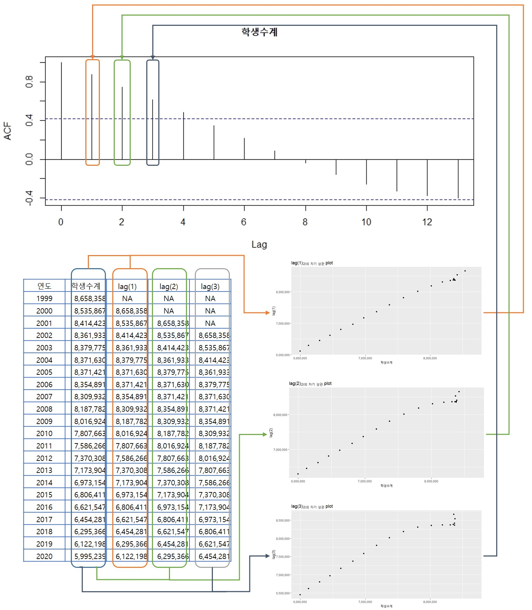

```{r message=FALSE, warning=FALSE, include=FALSE}
library(dplyr)
library(xts)
library(tsibble)
library(readxl)
students.all <- read_excel("./students.xlsx", skip = 16, na = '-', sheet = 1, col_types = c('text', 'text', 'numeric', 'numeric', 'numeric', 'numeric', 'numeric', 'numeric', 'numeric', 'numeric', 'numeric', 'numeric', 'numeric', 'numeric', 'numeric', 'numeric', 'numeric', 'numeric'))
students <- students.all %>% 
  filter(지역규모 == '계') %>% select(-지역규모)
students$연도 <- as.Date(paste0(students$연도, '-01-01'))
students.ts <- ts(students, frequency = 1, start = 1999)
students.xts <- as.xts(students[,-1], order.by = students$연도)
students.tsibble <- as_tsibble(students, index = 연도)


employees <- read.csv('./산업별_취업자_20210206234505.csv', header = TRUE, na = '-', strip.white = TRUE, stringsAsFactors = TRUE)
colnames(employees) <- c('time', 'total', 'employees.edu')
employees$time <- as.Date(paste0(employees$time, '. 01'), format = '%Y. %m. %d')
employees.ts <- ts(employees, start = c(2013, 01), frequency = 12)
employees.xts <- xts(employees[,2:3], order.by = employees[,1])
employees.tsibble <- as_tsibble(employees, index = time)


covid19 <- read.csv('./covid19.csv', header = TRUE, na = '-', strip.white = TRUE, stringsAsFactors = TRUE)
colnames(covid19) <- c('category', 'status', 'date', 'value')
covid19 <- covid19[, c(3, 1, 2, 4)]
covid19$date <- as.Date(covid19$date, "%Y. %m. %d")
covid19 <- covid19 %>% 
  filter(grepl('세', category)) %>% 
  filter(category != '세종')
covid19$value <- ifelse(is.na(covid19$value), 0, covid19$value)
covid19 <- tidyr::spread(covid19, category, value)
covid19.ts <- ts(covid19[, 2:10], frequency = 365)
covid19.xts <- as.xts(covid19[, 3:10], order.by = covid19$date)
covid19.tsibble <- as_tsibble(covid19, index = date)
```

# 시계열 forecasting Part I - 기초컨셉

시계열 데이터를 기반으로 미래 예측을 하는데에는 사용하는 모델링 알고리즘은 일반적으로 알려진 머신러닝 알고리즘과는 조금 다른 특징이 있다. 앞에서 설명했다시피 머신러닝 모델링 알고리즘은 크게 선형 회귀분석, 로지스틱 회귀분석과 같은 회귀(regression) 알고리즘, 의사 결정 트리, 랜덤 포레스트, k 근접 이웃 알고리즘과 같은 분류(classification) 알고리즘, k-means, DB-scan과 같은 군집(clustering) 알고리즘, 신경망 알고리즘을 활용한 딥러닝 알고리즘 등이 있다. 이런 대부분의 알고리즘은 주어진 훈련(training) 데이터 셋을 기반으로 모델을 생성하고 예측을 위한 새로운 데이터 셋을 모델에 적용함으로써 미래 데이터 섯에 대한 예측을 시행한다.

그러나 시계열 데이터의 미래예측은 예측에 사용해야하는 데이터의 특성에서 일반적인 머신러닝 모델과 차이가 있다.

시계열 데이터에 사용되는 데이터는 시간에 따라 순서가 명확하다는 점이다. 일반적인 머신러닝에 사용되는 데이터 셋은 관측치 자체가 가진 특성값에 집중하고 관측치의 시간적 순서에 큰 영향을 두지 않는다. 하지만 시계열 모델에서는 시간적 순서가 가장 중요한 요소이다.

또한 보통 독립변수라고 부르는 예측의 기초 데이터는 시간이 명기되기 때문에 다시 반복되지 않는다는 점이다. 선형회귀분석의 경우의 예를 보면 2차원의 X축에 독립변수과 Y축에 종속변수를 표기하는 것이 일반적인데 관측치의 기록된 순서에 따라 X값이 증가할 수 도 감소할 수도 있다. 하지만 시계열 데이터의 경우 보통 X축에 시간을 표현하기 때문에 항상 신규로 들어오는 데이터는 X 축의 증가방향으로만 데이터가 늘어나게 된다. 그러다보니 시계열 데이터는 새로 들어오는 데이터의 경우 기존데이터와 겹치는 경우가 매우 드물다.

따라서 시계열 데이터가 가지는 특징을 잘 파악해야 효율적인 모델링이 가능하다. 시계열 데이터에서 필수적으로 분석되어야 것이 데이터들 간에 장기적인 패턴인 추세(Trend)와 중기적인 패턴인 계절성(seasonality), 바로 앞 데이터와의 관계인 자기 상관 관계(autorelationa)이다. 결국 시계열 데이터를 분석한다는 것은 추세, 계절성, 자기상관관계 등의 시계열성 특성을 최대한 추출해 내어 이 패턴을 미래에 적용함으로써 예측값을 추정하는 일련의 과정이다.

시계열 데이터의 모델링을 위해 추출해야 할 시계열 데이터의 특성 몇가지를 먼저 알고 가야한다.

## 정상성(Stationary), 비정상성(Non-Stationary)

시계열 데이터를 분석할때 가장 먼저 해야할 작업은 분석 대상 시계열 데이터가 정상성(Stationary) 데이터인지 비정상성(Non Stationary) 데이터인지를 확인하는 것이다. 사실 정상이라는 단어가 주는 긍정적 의미때문에 왠지 정상성 시계열 데이터가 분석되어야 하고 비정상 데이터는 더 분석이 필요없는 노이즈 같은 느낌이 든다. 아래에서 살펴볼 정상성 데이터 plot을 보면 더 그렇게 생각이 든다. 하지만 오히려 반대의 개념이라는 걸 알고 넘어가자.

정상성 시계열은 한마디로 말하자면 어떤 시계열적 특성이 없는 데이터를 말한다. 데이터가 관측된 시간과 무관하게 생성된 데이터라는 것이다[^forecasting_i-1]. 반대로 비정성성 시계열이라고 하는 것은 추세, 계절성 등 시계열적 특성을 보유하고 있는 데이터를 말한다.

[^forecasting_i-1]: <https://otexts.com/fpp2/stationarity.html#fn14>

우리가 항상보는 시계열 데이터의 대부분이 비정상성 시계열이다. 심지어는 우리 몸속에서도 비정상 시계열 데이터가 발생되고 있다. 사실 대부분의 보고서에 들어가는 시계열 plot은 추세나 계절적 반복이 있는 현상을 보고하기 위해 사용하지 아무 의미없는 잡음같은 plot을 보고서에 넣지는 않는다. 또 우리 몸속에서 발생되는 비정상성 시계열 데이터는 우리 심장의 박동수이다. 심장 박동은 1분에 60\~100회라고 한다. 이는 사람마다 다르지만 중요한 것은 지속적으로 박동수가 유지되는 것이다. 따라서 심장박동의 plot은 일정한 주기를 반복해서 나타나야 한다. 그렇지 않고 정상성 시계열 데이터로 나타난다면?? 정상성 시계열이라고 정상이 아니다. 빨리 병원에 가야한다.


뒤에서 설명할 백색 잡음(white noise)은 정상성 시계열 데이터이다. 백색잡음은 시간에 의해 데이터의 특별한 패턴을 보이지 않기 때문이다. 그러나 모든 정상성 시계열라고 백색잡음이 아니다. 정상성 시계열도 추세나 주기적 반복이 있는 경우도 있기 때문이다. 하지만 주기적 반복이 존재한다 하더라도 그 주기가 일정하지 않아서 예측이 어렵다면 정상성 시계열로 볼 수 있다.[^forecasting_i-2]

[^forecasting_i-2]: <https://otexts.com/fpp2/stationarity.html#fn14>

```{r stationalry_lynx, echo=FALSE, warning=FALSE, message=FALSE}
library(forecast)
plot.ts(lynx)
```

위의 plot은 주기적으로 데이터가 올라갔다 떨어졌다를 반복하는 사이클이 있어 비정상성 시계열로 볼 수 있지만 반복적 데이터 패턴의 주기가 일정하지 않기때문에 사이클의 예측이 불가하기 때문에 정상성 시계열로 볼 수 있다.

시계열 예측은 비정상성 데이터를 정상성 데이터로 만드는 과정이다. 비정상성 데이터를 정상성으로 만드는 과정에서 발생된 시계열 데이터의 특성들을 모델링화하여 이 특성만으로 미래 데이터를 예측한다. 최종적으로 정상성 데이터는 시계열 데이터 예측의 불확실성을 나타내는 오차로 간주된다. 예측기간이 늘어날 수록 중간 예측에서 발생되는 오차들이 계속 발생하기 때문에 예측구간이 점점 넓어지게 된다.

정상성 시계열 데이터는 다음과 같은 특성을 가진다.

-   일정한 평균(등평균성)[^forecasting_i-3]

[^forecasting_i-3]: <https://boostedml.com/2020/05/stationarity-and-non-stationary-time-series-with-applications-in-r.html>

정상성 시계열 데이터는 시간의 흐름에 따른 데이터의 평균(시계열 데이터의 rolling window 평균)이 일정하해야 한다. 데이터의 처음부터 시차 이동평균을 구했을 때 그 평균값이 일정하게 유지되어야 한다.

-   일정한 분산(등분산성)[^forecasting_i-4]

[^forecasting_i-4]: <https://boostedml.com/2020/05/stationarity-and-non-stationary-time-series-with-applications-in-r.html>

정상성 시계열 데이터는 시간의 흐름에 따른 데이터의 분산(시계열 데이터의 rolliing window 분산)이 일정하다는 의미이다. 등평균성과 같이 시차 이동분산을 구했을때 그 분산 값이 일정하게 유지된다는 것이다.

```{r stationary_distribution, echo =FALSE, warning=FALSE, message=FALSE}
set.seed(345)
정상성시계열 <- arima.sim(model = list(order = c(0,0,0)), n = 200)
ts.plot(정상성시계열)
```

```{r nonstationary, echo =FALSE, warning=FALSE, message=FALSE}
set.seed(345)
비정상성시계열 <- arima.sim(model = list(order = c(0, 1, 0)), n = 200)
ts.plot(비정상성시계열)
```

## 지연(Lag)와 차분(Difference)

앞서 설명한 바와 같이 시계열 데이터 분석은 비정상성 시계열 데이터를 정상화하는 과정의 패턴을 찾아내는 것이다. 비정상성 시계열을 정상성 시계열로 만드는 과정에서 사용되는 가장 대표적인 방법이 지연(Lag)와 차분(Difference)이다.

-   지연(Lag)

지연은 정해진 시간동안 데이터를 앞으로 당기거나 혹은 뒤로 밀어내어 생성되는 데이터를 말한다. 지연은 데이터의 자기상관성(Autocorelation)을 측정하기 위해 필수적으로 필요한 데이터이다. 지연 1의 데이터는 원본 데이터에 시간 period 1만큼 딜레이된 데이터가 생성된다. 예를 들어 매일 기록된 주기의 데이터는 다음날 데이터로 전날 데이터를 사용하는 형태이다. 지연을 구하는 함수는 `lag()`를 통해 쉽게 산출이 가능하다.


```{r lag}
students %>%
  mutate(lag1 = lag(학생수계, 1), 
         lag3 = lag(학생수계, 3)) %>%
  select(연도, 학생수계, lag1, lag3) %>%
  head(10)
```

::: {.comment}
-   코드 설명

    -   `lag()`를 이용하여 lag1 열을 생성하는데 students의 '학생수계' 열의 1차 지연 데이터(`lag(학생수계, 1)`)를 사용

    -   `lag()`를 이용하여 lag3 열을 생성하는데 students의 '학생수계' 열의 3차 지연 데이터(`lag(학생수계, 3)`)를 사용
:::

`timetk` 패키지에서도 `lag()` 함수와 유사한 함수인 lag_vec() 함수를 제공한다.

```{r lag_timetk}
library(timetk)
students %>%
  mutate(lag1 = lag_vec(학생수계, lag = 1), 
         lag3 = lag_vec(학생수계, lag = 3)) %>%
  select(연도, 학생수계, lag1, lag3) %>%
  head(10)
```

::: {.comment}
-   코드 설명

    -   `timetk` 패키지의 `lag_vec()`을 사용하여 students의 '학생수계' 열의 1차 지연 데이터(`lag_vec(학생수계, lag = 1)`)를 생성하여 lag1 열 생성

    -   `timetk` 패키지의 `lag_vec()`을 사용하여 students의 '학생수계' 열의 3차 지연 데이터(`lag_vec(학생수계, lag = 3)`)를 생성하여 lag3 열 생성
:::

`xts` 클래스의 객체도 `lag()` 함수를 동일하게 적용할 수 있다.

```{r}
stats::lag(students.xts$학생수계, 1) %>% head(10)
```

-   차분(Difference)

차분은 연속된 관찰값들간의 차이를 말한다. 비정상성 시계열 데이터를 정상성으로 만드는데 일반적으로 사용되는 방법으로 전년대비 증감량, 전월대비 증감량과 같이 특정한 시간 간격의 데이터와의 차이값을 나타낸다.


차분은 `diff()` 함수를 사용하여 간단히 구할 수 있고 앞의 `lag()`함수로 산출된 lag 벡터와의 연산을 통해서도 구할 수 있다. `diff()` 함수를 사용할 때 주의해야 할 점은 `diff()` 함수 결과 벡터는 원 데이터 벡터에 비해 lag만큼 데이터가 적다는 것이다. `diff()` 함수는 lag 만큼 데이터를 shift 시켜서 shift된 자리에서부터 마지막 데이터까지 연산을 하기 때문에 데이터가 적다. 따라서 이를 원래 데이터와 붙이기 위해서는 lag로 shift된 만큼 적절한 값을 채워줘야한다. 반면 lag 함수는 lag 만큼 shift된 자리에 NA를 채워준다.

```{r}
students %>%
  mutate(lag1 = lag(학생수계, 1), 
         lag3 = lag(학생수계, 3), 
         diff1 = c(NA, diff(학생수계, lag = 1)), 
         diff3 = c(NA, NA, NA, diff(학생수계, lag = 3))) %>%
  select(연도, 학생수계, lag1, diff1, lag3, diff3) %>%
  head(10)
```

::: {.comment}
-   코드 설명

    -   lag()를 사용하여 '학생수계' 열의 1차 지연 데이터인 lag1열 생성

    -   lag()를 사용하여 '학생수계' 열의 3차 지연 데이터인 lag3열 생성

    -   diff()를 사용하여 '학생수계' 열의 1차 차분 데이터를 생성하되 차분계산으로 인해 비워지는 데이터 하나를 NA로 채운 벡터를 생성하여 diff1 열 생성

    -   diff()를 사용하여 '학생수계' 열의 3차 차분 데이터를 생성하되 차분계산으로 인해 비워지는 데이터 세개를 NA로 채운 벡터를 생성하여 diff3 열 생성
:::

`timetk` 패키지에서도 `diff()` 함수와 유사한 함수인 `diff_vec()` 함수를 제공한다. `diff_vec()` lag 크기만큼의 빈자리를 NA로 채워원본 데이터와 동일한 길이의 벡터를 반환한다.

```{r warning=FALSE, message=FALSE}
students %>%
  mutate(diff1 = diff_vec(학생수계, lag = 1), 
         diff3 = diff_vec(학생수계, lag = 3)) %>%
  select(연도, 학생수계, diff1, diff3) %>%
  head(10)
```

::: {.comment}
-   코드 설명

    -   `timetk` 패키지의 `diff_vec()`을 사용하여 students의 '학생수계' 열의 1차 차분 데이터(`diff_vec(학생수계, lag = 1)`)를 생성하여 lag1 열 생성

    -   `timetk` 패키지의 `diff_vec()`을 사용하여 students의 '학생수계' 열의 3차 차분 데이터(`diff_vec(학생수계, lag = 3)`)를 생성하여 lag3 열 생성
:::

`xts` 클래스 객체도 `diff()` 함수를 동일하게 적용할 수있다.

```{r}
diff(students.xts$학생수계, 1) %>% head(10)
```

## ACF와 PACF

시계열 데이터가 일반 데이터와 다른 점으로 자기 상관이라는 것을 계속 언급하였다. 자기 상관이라는 것은 1장에서 소개했듯이 시계열 데이터 원본과 lag된 데이터와의 상관관계가 있는 경우를 말한다.

그렇다면 해당 시계열 데이터가 자기 상관이 있는지를 어떻게 알수 있을것인까? 앞서 말한것처럼 lag된 데이터와 원본데이터를 상관계수 산출 함수인 `cor()`를 사용해서 상관계수를 구해보면 얼마나 상관관계가 있는지 알 수 있다. 하지만 시계열 분석에서는 여러 lag의 상관관계를 확인해야 하는데 이처럼 시계열 데이터가 자기 상관관계를 가지는 지를 확인하는 방법이 ACF, PACF 이다. ACF는 자기 상관 함수를 가리키고 PACF는 부분 자기상관 함수를 말한다. 이들은 plot으로 확인할 수도 있고 수치로 확인할 수도 있다.

-   자기상관함수(ACF : AutoCorelation Function)

ACF는 AutoCorelation Function의 준말로 자기 상관 관계를 확인할 수 있는 함수이다. ACF 함수는 주어진 데이터의 각각의 lag를 원본데이터와 상관계수를 구해 자기상관관계를 확인할 수 있게 해준다. ACF를 확인하는 함수는 여러가지가 있는데 R에서 기본제공하는 stats 패키지의 `acf()`, `forecast` 패키지의 `Acf()` 함수와 `ggACF()` 함수, `timetk` 패키지에는 `plot_acf_diagnostics()` 함수, `ts` 패키지의 `ts.acf()` 함수 등 대부분의 시계열 데이터를 다루는 패키지에서 acf를 확인할 수 있는 방법을 제공하고 있다. 대부분의 ACF 함수들은 기본값으로 ACF plot을 제공하지만 매개변수를 설정함으로써 자기상관계수를 반환할 수도 있다.

아래 각각의 ACF 함수를 보면 세로축 상관계수 0.4에서 가로선이 보이는데 이 선은 자기 상관계수의 신뢰구간 95%를 나타낸다.[^forecasting_i-5] 이 선은 자기 상관계수가 의미를 갖는지를 평가하는 선으로 자기상관계수가 이 선 밖으로 나가는 경우는 자기 상관이 있는 것으로 파악하는 것이 일반적이다.

[^forecasting_i-5]: <https://nwfsc-timeseries.github.io/atsa-labs/sec-tslab-correlation-within-and-among-time-series.html>

```{r acf_stat, fig.show='hide'}
###  stats 패키지의 acf plot 생성
acf(students$학생수계)
```



```{r acf_stat1}
###   stats 패키지의 acf 수치 산출
acf(students$학생수계, plot = FALSE)
```

```{r acf_forecast}
###   forecast 패키지의 Acf plot
students %>%
  select(학생수계) %>%
  forecast::Acf()
###   forecast 패키지의 Acf 수치
students %>%
  select(학생수계) %>%
  forecast::Acf(plot = FALSE)
###   forecast 패키지의 ggAcf plot
students %>%
  select(학생수계) %>%
  forecast::ggAcf()
###   forecast 패키지의 ggAcf 수치
students %>%
  select(학생수계) %>%
  forecast::ggAcf(plot = FALSE)
```

```{r acf_timetk, message=FALSE, warning=FALSE}
###   timetk 패키지의 plot_acf_diagnostics plot
students %>%
  select(연도, 학생수계) %>%
  timetk::plot_acf_diagnostics(.date_var = 연도, .value = 학생수계, .lag = 14, .show_white_noise_bars = TRUE)
```

-   부분자기상관함수(PACF : Partial AutoCorelation Fuctoin)

부분자기상관함수는 ACF의 문제점을 개선하기 위해 사용되는 함수이다.

위의 예제에서 1999년의 학생수는 2001년의 학생수와 자기상관계수는 0.745이다. 하지만 1999년 학생수와 2000년 학생수가 높은 상관관계인 0.875이기 때문에 2001년 학생수는 단순히 1999년 학생수와 상관관계가 높은건지 2000년 학생수와의 상관관계가 높기 때문에 2001년의 상관관계가 높은건지 알수가 없다.

따라서 부분자기상관함수는 2000년 학생수의 개입을 제거하고 1999년과 2001년의 상관관계를 산출하는 함수이다. 따라서 중간에 개입되는 자기상관계수가 없는 첫번째 lag의 경우는 ACF 값과 PACF의 값이 같아지게 된다[^forecasting_i-6].

[^forecasting_i-6]: <https://otexts.com/fpp2/non-seasonal-arima.html>

PACF 함수도 ACF 함수의 제공과 거의 유사한 형태로 각각의 패키지에서 제공한다. `stats` 패키지의 `pacf()`, `forecast` 패키지의 `Pacf()` 함수와 `ggPacf()` 함수, `timetk` 패키지에는`plot_acf_diagnostics()` 함수, `ts` 패키지의 `ts.acf()` 함수가 제공된다.

```{r pacf_stats}
###   stats 패키지의 pacf plot
students %>%
  select(학생수계) %>%
  stats::pacf()
###   stats 패키지의 pacf 수치
students %>%
  select(학생수계) %>%
  stats::pacf(plot = FALSE)
```

```{r pacf_forecast}
###   forecast 패키지의 Pacf plot
students %>%
  select(학생수계) %>%
  forecast::Pacf()
###   forecast 패키지의 Pacf 수치
students %>%
  select(학생수계) %>%
  forecast::Pacf(plot = FALSE)
###   forecast 패키지의 ggPacf plot
students %>%
  select(학생수계) %>%
  forecast::ggPacf()
###   forecast 패키지의 ggPacf 수치
students %>%
  select(학생수계) %>%
  forecast::ggPacf(plot = FALSE)
```

## 적합값(fitted value) 와 잔차(residuals)

적합값은 시계열 분석을 통해 생성된 시계열 모델을 사용해 기존 데이터을 얻은 시간 인덱스에 대한 예측값을 말한다. 예를 들어 위의 예제에서 1999년부터 2020년까지의 총 학생수를 분석하여 시계열 모델을 생성하였고 이 모델을 통해 다시 1999년과 2020년의 데이터를 산출해 낼 때 이 데이터가 적합값(fitted value)이다.

잔차는 실제값과 적합값과의 차이를 잔차라고 한다. 잔차는 시계열 모델의 성능과 정확성을 평가하기 위해 사용된다. 결국 시계열 분석을 통해 생성된 모델의 성능과 정확성을 측정하기 위해서는 잔차가 필요하고 잔차를 계산하기 위해서는 적합값이 산출되어야 한다.

아래의 plot에서 파란색 선은 전체 학생수의 선형회귀 모델의 적합값 라인 plot이고 검은색 점은 각 년도별 전체 학생수의 실제값이다. 검은색 점부터 파란색 라인까지의 수직거리(붉은 선)이 잔차이다.

```{r fitted, echo=FALSE, warning=FALSE, message=FALSE}
library(ggplot2)
student.ts.lm <- tslm(students.ts[,2] ~ trend, data = students.ts)                   
res <- as.vector(residuals(student.ts.lm))
fit <- as.vector(fitted(student.ts.lm))

ggplot(students, aes(x = 연도, y = 학생수계)) + 
  geom_point() + 
  geom_line(aes(y = fit, group = 1), color = 'blue', size = 1) +
  geom_segment(aes(xend = 연도, yend = fit), color = 'red') + 
  scale_color_continuous(low = "black", high = "red") +
  scale_y_continuous(labels = scales::number_format(big.mark = ','))
```

적합값과 잔차를 확인하기 위해서는 먼저 모델을 생성해야 한다. 생성된 모델에 대한 적합값은 `fitted()`를 사용하여 산출가능하고 잔차는 `residuals()`을 사용하여 산출 가능하다.

```{r}
### 전체 학생수계의 선형회귀 모델 생성(다음장에서 설명)
student.ts.lm <- forecast::tslm(students.ts[,2] ~ trend, data = students.ts)
###  전체 학생수 선형회귀 모델의 적합값 산출
fitted(student.ts.lm)               
###  전체 학생수 선형회귀 모델의 잔차 산출
residuals(student.ts.lm)
```

## 백색 잡음(White Noise)

백색 잡음은 시계열적 특성 중에 추세, 계절성, 자기상관성이 제거된 데이터를 말한다. 결국 백색 잡음은 더이상 모델링으로 추상화할 수 없는 시계열 데이터로 그 값을 예측할 수 없고 랜덤하게 발생되는 값들이다. 잘 모델링된 시계열 모델에서 발생된 잔차는 백색 잡음이어야 하기 때문에 오류값이라고 여겨지기도 한다.

백색잡음은 시간의 흐름에 따라 독립적이어야 하며 시간의 변화에 관계없이 평균은 0, 분산은 1로 일정하게 유지된다. 하지만 사실상 정확히 평균 0, 분산 1이 유지되는 것은 아니고 대략 평균 0, 분산 1에서 큰 변화가 없다는 것으로 받아들이는 것이 좋다.

```{r whitenoise, echo =FALSE, warning=FALSE, message=FALSE}
set.seed(345)
백색잡음 <- arima.sim(model = list(order = c(0,0,0)), n = 200)
ts.plot(백색잡음)
ggAcf(백색잡음)
```

위의 ACF plot에서 보면 백색 잡음의 모든 lag의 ACF 값이 자기상관계수의 95% 신뢰구간 아래에 있기 때문에 자기 상관이 없다고 판단할 수 있다.

그런데 시각적으로 백색잡음을 판단할 경우 판단하는 사람의 주관적 의견에 따라 백색 잡음 여부를 다르게 판단할 수 있다. 따라서 주어진 데이터가 백색 잡음인지를 수치적으로 판단할 수 있는 방법이 필요한데 이 방법으로 사용하는 것이 Ljung-Box test이다. Ljung-Box test는 자기상관값이 백색잡음과 다른지를 검사하는 방법이다. [^forecasting_i-7]

[^forecasting_i-7]: <https://otexts.com/fpp2/residuals.html>

일반적으로 Ljung-Box test의 결과로 산출되는 Q\*값이 유의미한지를 검사해야하는데 이를 위해 제공하는 값이 p-value이다. p-value가 0.05보다 작다면 우연히 Q\*값이 나올 확률이 미미하기 때문에 유의미하지만 이보다 크면 우연히 발생될 확률이 있기 때문에 유의미하지 않다고 본다. 따라서 유의미하지 않다면(0.05보다 클 때) 해당 시계열의 잔차값은 백색잡음과 다르지 않다고 판단할 수 있다.

Ljung-Box test는 `forecast` 패키지의 `checkresiduals()`를 이용하면 시계열 모델을 통해 산출된 잔차의 plot과 잔차에 대한 결과가 산출되어 출력된다.

아래의 예제는 `fpp2` 패키지에서 제공하는 구글의 주식 종가 데이터를 `forecast` 패키지에서 제공하는 `naive()` 모델링한 결과의 잔차를 `checkresiduals()` 함수에 적용한 결과를 보이고 있다. 결과 plot의 잔차 ACF plot의 자기상관계수는 모두 95% 신뢰구간 아래에 위치하므로 자기상관성이 없다고 볼 수 있고 잔차의 분포도 하나의 이상치를 제외하면 백색잡음과 유사한 패턴을 보이고 있다. 마지막으로 잔차에 대한 Ljung-Box test 결과를 보면 p-value가 0.05보다 큰 0.3551이기 때문에 잔차의 분포는 백색잡음과 다르지 않다고 판단할 수 있다.

```{r checkresiduals}
library(forecast)
data(goog200, package = 'fpp2')
checkresiduals(naive(goog200))
```

## 시계열 분해(Decomposition)

앞에서 계속 언급했던 시계열 특성인 추세(Trend), 계절성(Seasonality), 자기상관성(Autocorelation) 중에 자기상관성은 `ACF()`, `PACF()`를 사용하여 확인할 수 있는 방법을 설명하였다. 그렇다면 추세와 계절성은 어떻게 확인할 수 있는가? 몇몇 패키지에서는 시계열 데이터에서 추세와 계절성을 분해하여 볼 함수를 제공한다. R의 기본 패키지인 `stats` 패키지에서 `decompose()`, `stl()` , `seasonal` 패키지의 `seas()` 함수를 통해 시계열을 trend, seasonality, 잔차 등으로 분리하여 ploting 할 수 있다. 각각의 함수는 시계열 decomposition 알고리즘의 차이로 인해 약간씩 결과가 다르게 나타난다.

```{r decomposition}
ts(employees$employees.edu, start = c(2013, 01), frequency = 12) %>%
  decompose() %>% autoplot()

ts(employees$employees.edu, start = c(2013, 01), frequency = 12) %>%
  stl(s.window = 'periodic') %>% autoplot()

ts(employees$employees.edu, start = c(2013, 01), frequency = 12) %>%
  seasonal::seas() %>% autoplot()

ts(employees$employees.edu, start = c(2013, 01), frequency = 12) %>%
  seasonal::seas(x11 = '') %>% autoplot()
```

## 정상성 테스트

```{r stationary_test}
library(tseries)
Box.test (ts(employees$employees.edu, start = c(2013, 01), frequency = 12), lag = 1, type = "Ljung") #p-value가 0.05보다 작으면 비정상성
adf.test(ts(employees$employees.edu, start = c(2013, 01), frequency = 12)) # p-value 0.05보다 작으면 정상성
kpss.test(ts(employees$employees.edu, start = c(2013, 01), frequency = 12))
# p-value가 0.05보다 작으면 비정상성
```

## 계절성 ploting과 테스트

```{r message=FALSE, warning=FALSE}
library(seastests)
summary(wo(employees.ts[,2]))
summary(wo(employees.ts[,2]))
nsdiffs(employees.ts[,2])   ### seasonality를 제거하기 위해 필요한 차분수
summary(wo(employees.ts[,3]))
```

```{r seasonal_plot}
ggseasonplot(employees.ts[,2])
ggsubseriesplot(employees.ts[,2])
```

```{r seasadj}
library(forecast)
seasadj(decompose(employees.ts[,2])) %>% autoplot()
```
