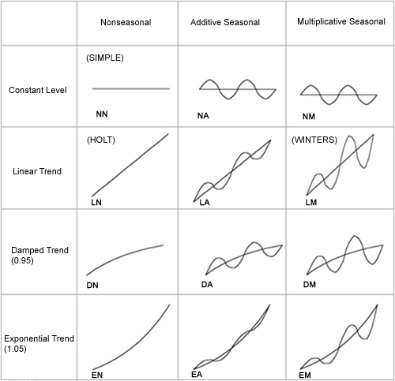

```{r message=FALSE, warning=FALSE, include=FALSE}
library(tidyverse)
library(xts)
library(timetk)
library(forecast)
students <- read.csv('./students.csv', skip = 16, header = TRUE, na = '-', strip.white = TRUE, stringsAsFactors = TRUE)
students[, 3:18] <- apply(students[, 3:18], 2, function(y) as.numeric(gsub(",", "", y)))
students.total.xts <- students %>% filter(지역규모 == '계') %>% select(-지역규모)
students.total.xts <- as.xts(students.total.xts, order.by = as.Date(paste0(students.total.xts[,1], '-01-01'), format = '%Y-%m-%d'))

students.total.ts <- students %>% 
  filter(지역규모 == '계') %>% 
  select(3:18) %>%
  ts(start = c(1999), frequency = 1)

employees <- read.csv('./산업별_취업자_20210206234505.csv', header = TRUE, na = '-', strip.white = TRUE, stringsAsFactors = TRUE)
colnames(employees) <- c('time', 'total', 'employees.edu')
employees.ts <- ts(employees, start = c(2013, 01), frequency = 12)

covid19 <- read.csv('./covid19.csv', header = TRUE, na = '-', strip.white = TRUE, stringsAsFactors = TRUE)
colnames(covid19) <- c('category', 'status', 'date', 'value')
covid19 <- covid19[, c(3, 1, 2, 4)]
covid19$date <- as.Date(covid19$date, "%Y. %m. %d")
covid19.by.age <- covid19 %>% 
  filter(grepl('세', category)) %>% 
  filter(category != '세종')
covid19.by.age$value <- ifelse(is.na(covid19.by.age$value), 0, covid19.by.age$value)
wide.covid19.by.age <- spread(covid19.by.age, category, value)

wide.covid19.by.age.ts = ts(wide.covid19.by.age[, 2:10], frequency = 365)
```

# 시계열 forecasting Part II - 시계열 모델링 알고리즘

**A future like the past:fdsafdsafd**

시계열 예측의 가장 기본적인 가정은 과거의 패턴은 미래에도 계속된다는 가정이다. 이 가정은 단기 미래에서는 데이터가 발생되는 환경이 현재와 유사하기 때문에 불확실성이 작지만 장기 미래로 갈수록 데이터가 발생되는 환경이 달라질 가능성이 높아지면서 예측 데이터에 대한 불확실성이 높아질 수 밖에 없다.

이러한 이유때문에 시계열 예측은 외부 충격이나 원인모를 이유에 의한 갑작스런 데이터 흐름 변화를 예측해낼 수 없다는 한계를 지닌다. 그런 지점을 전환점(Turning Point)라고 한다. 이 전환점은 시계열 분석에 있어 중요한 부분이지만 전환점을 예측하기 위해서는 전통적인 시계열 분석 기법보다는 다른 기법을 활용해야 할 수 있다. [^forecasting-ii-1]

[^forecasting-ii-1]: <https://hbr.org/1971/07/how-to-choose-the-right-forecasting-technique>

본 장에서는 세가지 데이터를 이용하여 알고리즘을 적용한다. 첫번째 데이터는 교육통계홈페이지에서 다운로드 받은 students 데이터로 1999년부터 2020년까지의 전국 학생수 데이터이고, 두번째 데이터는 KOSIS에서 다운로드 받은 경제활동인구조사 데이터 중 전체 취업자 데이터로 2003.1월부터 2020년 12월까지의 데이터, 세번째 데이터는 두번째 데이터와 같은 조사에서 얻어진 데이터로 교육서비스업 데이터이다. 첫번째 데이터는 년별 데이터이기 때문에 추세는 보이지만 계절성은 없고 두번째와 세번째 데이터는 월별 데이터이지만 두번째 데이터는 세번째 데이터보다 계절성이 더 짙은 데이터이다.

## Simple 모델링 알고리즘

simple 모델링 알고리즘은 Rob Hyndman의 'Forecasting : principals and practice'에서 그룹핑한 알고리즘과 명칭을 사용했다.[^forecasting-ii-2] 따라서 Simple 모델링이라는 명칭과 알고리즘들은 일반적인 분류는 아닐수 있다.

[^forecasting-ii-2]: <https://otexts.com/fpp2/>

사실 Simple 알고리즘을 보면 '이게 무슨 예측이야?'라고 생각할 수도 있다. 하지만 우리가 매우 쉽게 접하고 사용하는 '평균'이라는 것도 통계적 모델링에 하나라고 보면 Simple 알고리즘도 충분히 시계열 데이터의 모델링으로 볼 수도 있다.

Simple 모델링의 대부분은 매우 간단한 개념을 함수화 하여 미래 예측에 활용할 수 있도록 제작되었다. Simple 모델링에서 제시하는 대부분의 함수는 forecast 패키지(앞에서 설명한 Rob Hyndman이 주도하여 제작된 패키지임)에서 제공하는 함수를 위주로 설명하고자 한다. [^forecasting-ii-3]

[^forecasting-ii-3]: <https://otexts.com/fpp2/simple-methods.html>

### 평균 모델(forecast::meanf)

평균 모델은 우리가 흔히 알고 있는 평균이 앞으로의 미래에도 적용하는 방법이다. forecast 패키지에서는 meanf() 함수를 통해 시계열 데이터의 평균을 활용한 미래 예측값을 반환하는 함수를 제공한다. 이 함수에서는 평균 모델에 의한 점 예측값(Point Forecast)뿐 아니라 예측구간 80%와 95%를 산출해 준다. 매개변수를 설정함으로써 이 예측구간을 Bootstrap 방법을 통해 산출할 수도 있다. meanf() 함수의 입력 데이터는 숫자 벡터나 ts 클래스 객체를 사용한다. meanf()함수의 결과를 plot하기 위해서는 autoplot() 함수에 meanf() 결과 객체를 전달하여 ploting 할 수 있다.

```{r meanf, warning=FALSE, message=FALSE}
library(forecast)
summary(meanf(students.total.ts[,1]))
autoplot(meanf(students.total.ts[,1]))
autoplot(meanf(students.total.ts[,1], bootstrap = TRUE))
autoplot(meanf(employees.ts[,2]))
autoplot(meanf(employees.ts[,3]))
```

### 단순(Naive) 모델

단순(Naive) 모델은 시계열 측정값의 마지막 값이 지속될 것이라는 가정하에 향후 데이터값을 예측하는 모델이다. 이 모델은 경제 금융 시계열 모델에서 많이 사용된다. [^forecasting-ii-4] 앞선 평균 모델과 달리 Naive 모델의 예측구간은 예측 시간이 늘어날수록 범위가 늘어난다. 일반적으로 시계열 모델의 예측구간은 예측기간이 늘어날 수록 범위가 넓어지는 경향을 지닌다.

[^forecasting-ii-4]: <https://otexts.com/fpp2/simple-methods.html>

```{r naive}
summary(naive(students.total.ts[,1]))
autoplot(naive(students.total.ts[,1]))
summary(naive(employees.ts[,2]))
autoplot(naive(employees.ts[,2]))
summary(naive(employees.ts[,3]))
autoplot(naive(employees.ts[,3]))
```

### 계절성 단순(Seasonal Naive) 모델

계절성 단순(Seasonal Naive) 모델은 단순(Naive) 모델에서 계절성을 추가한 모델이다. 계절성(Seasonal Pattern)은 주기성(Cyclic Pattern)과 다르다. 계절성은 일정한 주기를 가지고 반복되는 패턴을 의미하지만 주기성은 패턴은 반복되지만 주기가 일정하지 않다는 점에서 다르다. 주기성의 주기는 일반적으로 2년보다 크기때문에 여러 연도에 걸쳐 나타나지만 계절성은 일반적으로 달력의 특성에 연관되어 주기를 갖는 경우가 일반적이다. [^forecasting-ii-5]

[^forecasting-ii-5]: <https://robjhyndman.com/hyndsight/cyclicts/>

```{r}
summary(snaive(students.total.ts[,1], 10))
autoplot(snaive(students.total.ts[,1], 10))
summary(snaive(employees.ts[,2], 10))
autoplot(snaive(employees.ts[,2], 10))
summary(snaive(employees.ts[,3], 10))
autoplot(snaive(employees.ts[,3], 10))
```

### Random Work 모델

랜덤 워크는 시간적으로 다음값이 시간적으로 현재값의 영향을 받는다는 이론이다. 주식의 예에서 보면 내일의 종가는 오늘의 종가에 랜덤한 값이 더해지거나 빼져서 결정되는 것과 같은 이치이다. 랜덤 워크에는 어제값 이외에 의미있는 정보가 없기 때문에 예측이 복잡하지 않다[^forecasting-ii-6]. 앞에서 설명한 Naive 모델은 마지막 값이 지속되는 예측인데 이것이 결국 랜덤 워크와 동일한 결과를 가지게 된다. 랜덤 워크 모델은 드리프트가 없는 모델과 드리프트가 존재하는 모델의 두가지 종류가 있다. 드리프트가 존재하는 모델은 랜덤워크 모델을 기반으로 하지만 예측값이 시간의 흐름에 따라 증가하거나 감소하는 모델이다.

[^forecasting-ii-6]: <https://robjhyndman.com/files/solutions.pdf>

```{r}
summary(rwf(students.total.ts[,1]))
autoplot(rwf(students.total.ts[,1]))
summary(rwf(employees.ts[,2]))
autoplot(rwf(employees.ts[,2]))
summary(rwf(employees.ts[,3]))
autoplot(rwf(employees.ts[,3]))

summary(rwf(students.total.ts[,1], drift = TRUE))
autoplot(rwf(students.total.ts[,1], drift = TRUE))
summary(rwf(employees.ts[,2], drift = TRUE))
autoplot(rwf(employees.ts[,2], drift = TRUE))
summary(rwf(employees.ts[,3], drift = TRUE))
autoplot(rwf(employees.ts[,3], drift = TRUE))
```

랜덤 워크는 시간적으로 하나 앞선 값과 현재값을 뺀 차이값들은 백색잡음이 되어야한다는 조건을 만족해야한다. 따라서 랜덤 워크 모델은 차분을 통해서백색잡음이 될 수도 있고 백색잡음은 누적합계를 통해서 랜덤 워크가 될 수 있다.

```{r randomwalk}
set.seed(345)
whitenoise <- ts(rnorm(100), start = 1)  ###  white noise simulation 데이터 생성
ts.plot(whitenoise)
whitenoise.to.randomwalk <- cumsum(whitenoise) ### white noise 데이터로 random walk 생성
ts.plot(whitenoise.to.randomwalk)
randomwalk.to.whitenoise <- diff(whitenoise.to.randomwalk) ### random walk에서 white noise 생성
ts.plot(randomwalk.to.whitenoise)
```

### Simple 모델 비교

위에서 설명한 모델들을 하나의 plot으로 그려보면 모델 간의 차이를 살펴볼 수 있다.

```{r simple_total}
autoplot(meanf(students.total.ts[,1], h = 10), PI = FALSE, series = 'Mean') + 
  autolayer(naive(students.total.ts[,1], h = 10), PI = FALSE, series = 'Naive') +
  autolayer(snaive(students.total.ts[,1], h = 10), PI = FALSE, series = 'Snaive') +
  autolayer(rwf(students.total.ts[,1], h = 10), PI = FALSE, series = 'RW') +
  autolayer(rwf(students.total.ts[,1], h = 10, drift = TRUE), PI = FALSE, series = 'RW with drift')

autoplot(meanf(employees.ts[,2], h = 10), PI = FALSE, series = 'Mean') + 
  autolayer(naive(employees.ts[,2], h = 10), PI = FALSE, series = 'Naive') +
  autolayer(snaive(employees.ts[,2], h = 10), PI = FALSE, series = 'Snaive') +
  autolayer(rwf(employees.ts[,2], h = 10), PI = FALSE, series = 'RW') +
  autolayer(rwf(employees.ts[,2], h = 10, drift = TRUE), PI = FALSE, series = 'RW with drift')

autoplot(meanf(employees.ts[,3], h = 10), PI = FALSE, series = 'Mean') + 
  autolayer(naive(employees.ts[,3], h = 10), PI = FALSE, series = 'Naive') +
  autolayer(snaive(employees.ts[,3], h = 10), PI = FALSE, series = 'Snaive') +
  autolayer(rwf(employees.ts[,3], h = 10), PI = FALSE, series = 'RW') +
  autolayer(rwf(employees.ts[,3], h = 10, drift = TRUE), PI = FALSE, series = 'RW with drift')
```

## Regression 모델

회귀 모델은 선형 회귀(Linear Regression), 비선형 회귀,(Non-linear Regression) 로지스틱 회귀(Logistic Regression) 등의 방법이 있다. 회귀 모델은 종속변수와 독립변수와의 관계를 가장 잘 나타내는 회귀방정식을 도출하여 미래 데이터에 대한 예측치를 생성하는 방법으로 아직도 머신러닝 알고리즘 중에 가장 많이 사용되는 알고리즘 중에 하나이다.[^forecasting-ii-7]

[^forecasting-ii-7]: 이기준 외, 인구지형변화에 따른 머신러닝 기반 고등교육 계열별 수요예측 모형 개발(2020), 한국교육개발원

본 문서에서는 R에서 회귀 알고리즘을 구현하는 방법을 다루지는 않고 시계열 데이터의 회귀 알고리즘을 적용하는 방법에 대해 설명하겠다. 시계열 데이터의 회귀 모델은 두가지로 구분할 수 있다. 첫번째는 두가지이상의 시계열 데이터(Multivariate) 간의 회귀 모델과 한가지 시계열 데이터(Univariate)의 시간에 따른 회귀모델이다. 사실 첫번째 모델의 경우는 일반적 회귀모델과 큰 차이는 없지만 사용하는 함수는 시계열 패키지에서 따로 제공된다. 두번째 모델의 경우는 시계열 데이터의 특성인 추세(trend)와 계절성(season), 반복성(cycle)을 회귀에 반영한다는 점에서 일반적 회귀와는 차이가 있다.

시계열 선형 회귀 모델은 데이터간의 관계를 가장 잘 나타내는 직선(Linear)을 산출하여 미래 데이터를 예측하는 방법이다. 선형 회귀 모델은 선형 방정식으로 표현되는데 직선의 기울기(Slope)와 Y 축 절편(Intercept)의 계수(Coefficient)가 산출된다. 시계열 데이터의 선형 회귀를 위해서 forecast 패키지에서 tslm()함수, timetk 패키지의 plot_time_series_regression() 함수(stats::lm() 함수를 사용하여 선형회귀 결과를 ploting하는 함수), modeltime 패키지(timetk 패키지의 모델링 패키지)의 linear_reg() 함수 등을 사용할 수 있다.

### tslm 함수(forecast 패키지)

forecast 패키지에서 제공하는 tslm() 함수는 시계열 선형회귀 모델을 위한 함수이다. tslm() 함수는 lm() 함수의 래퍼 함수(Wrapper)로 사용법은 비슷하고 시간축이 독립변수에 포함되지 않은 두개 혹은 두개 이상의 시계열 객체에 대한 선형회귀는 lm() 함수의 결과와 같다. 즉 시계열 데이터이지만 독립변수 시간이 포함되지 않는다면 시계열 데이터로써의 특성이 적용되지 않은 양 데이터간의 특성정보만으로 선형회귀 방정식이 얻어진다.

반면 시간을 독립변수로 하여 선형회귀 모형을 적용하기 위해서는 'trend', 'season' 키워드를 함수식의 독립변수에 적용해 줌으로써 시간에 대한 선형회귀 방정식을 얻을 수 있다. 'trend'는 시계열적인 추세를 반영하여 선형회귀 모델을 만들고 'season'은 시계열의 계절성을 반영하여 회귀모델을 만들게 되는데 두가지를 모두 고려할 때는 '+' 기호로 연결하여 사용할 수 있다. 이 과정에서 추가적인 독립변수를 추가할 수도 있는데 독립변수를 추가할 때도 '+' 기호를 사용하여 회귀모델을 만들 수 있다.

```{r tslm}
### 전체 학생수 예측 모델을 추세를 반영하여 생성
student.ts.lm <- tslm(students.total.ts[,1] ~ trend, data = students.total.ts)
summary(student.ts.lm)
student.ts.lm %>% forecast()  ### tslm 함수로 생성된 모델을 forecast()함수를 통해 예측값을 생성
student.ts.lm %>% forecast() %>% autoplot()
student.ts.lm <- tslm(students.total.ts[,3] ~ trend, data = students.total.ts)  ### 초등학생 학생수를 예측모델에 독립변수로 트랜드를 사용하는 선형 모델을 생성
student.ts.lm %>% forecast(h = 22) %>% autoplot()
student.ts.lm <- tslm(students.total.ts[,3] ~ students.total.ts[,2] + trend, data = students.total.ts)  ### 초등학생 학생수를 예측모델에 독립변수로 유치원 학생수와 트랜드를 사용하는 선형 모델을 생성
student.ts.lm %>% forecast(h = 22) %>% autoplot()
```

위의 예제에서 사용한 데이터는 연도별 학생수의 합계이다. 이 데이터와 같은 연도별 데이터는 계절성이 존재하지 않기 때문에 season 키워드를 사용하면 아래와 같이 에러를 낸다.

```{r error=TRUE}
student.ts.lm <- tslm(students.total.ts[,1] ~ trend + season, data = students.total.ts)
```

전체 취업자수와 교육서비스업 취업자수에 대한 선형회귀분석 모델과 plot은 다음과 같다.

```{r tslm1}
### 전체 취업자수를 추세(trend)만으로 선형 회귀분석
employee.total.ts.lm <- tslm(employees.ts[,2] ~ trend, data = employees.ts)
summary(employee.total.ts.lm)
employee.total.ts.lm %>% forecast()  ### tslm 함수로 생성된 모델을 forecast()함수를 통해 예측값을 생성
employee.total.ts.lm %>% forecast() %>% autoplot()
### 전체 취업자수를 추세(trend)와 계절성(season)으로 선형 회귀분석
employee.total.ts.lm <- tslm(employees.ts[,2] ~ trend + season, data = employees.ts)
summary(employee.total.ts.lm)
employee.total.ts.lm %>% forecast()  ### tslm 함수로 생성된 모델을 forecast()함수를 통해 예측값을 생성
employee.total.ts.lm %>% forecast() %>% autoplot()
### 교육분야 취업자수를 추세(trend)와 계절성(season)으로 선형 회귀분석
employee.total.ts.lm <- tslm(employees.ts[,3] ~ trend + season, data = employees.ts)
summary(employee.total.ts.lm)
employee.total.ts.lm %>% forecast()  ### tslm 함수로 생성된 모델을 forecast()함수를 통해 예측값을 생성
employee.total.ts.lm %>% forecast() %>% autoplot()
```

선형 회귀분석을 시행할 때 주의해야 할 점은 잔차가 백색 잡음이어야 한다는 점이다. 잔차의 자가회귀성이 존재하는 경우는 시계열적 특성을 여전히 지니고 있기 때문에 이를 제거할 필요가 있다. 다만 이 예측은 '잘못된' 것은 아니나 예측구간이 커지기 때문에 비효율적 예측 모델이 된다.[^forecasting-ii-8] 또한 예측에 적용해야할 시계열적 특성이 남아있다는 것을 잔차에서 확인할 수 있다.

[^forecasting-ii-8]: <https://otexts.com/fppkr/regression-evaluation.html>

아래의 예에서 보면 전체 학생수를 추세에 의해 선형 회귀분석을 시행한 경우 잔차는 자기 상관성을 지니고 있음을 볼 수 있다. checkresiduals() 함수를 사용하여 확인하는데 plot만 봐도 백색잡음이 아님을 확인할 수 있지만 백색잡음 테스트인 Breusch-Godfrey 테스트 결과(checkresiduals() 함수는 회귀모델에 대해서는 Breusch-Godfrey 테스트를, 나머지는 Ljung-Box 테스트를 시행한다.)의 p-value가 0.05보다 작기 때문에 자기상관성이 존재하여 백색잡음으로 볼 수 없다.

```{r tslm_resid}
checkresiduals(tslm(students.total.ts[,1] ~ trend, data = students.total.ts))
```

### plot_time_series_regression 함수(timetk 패키지)

timetk 패키지는 시계열 데이터를 핸들링하고 plotting 하는 데 주로 활용하는 패키지이다. 그래서 모델링을 위한 함수를 바로 제공하지는 않고 plotting 함수에서 회귀 모델을 호출하여 회귀 결과를 plotting 하는 함수를 제공한다. plot_time_series_regression() 함수에서 사용하는 선형회귀 함수에서도 trend, season 을 적용할 수 없다. 다만 ts 객체가 아닌 data.frame 객체를 사용할 수있다는 장점이 있다.

```{r lm_timetk}
plot_time_series_regression(.data = students %>% filter(지역규모 == '계'), 
                            .date_var = 연도, 
                            .formula = 학생수계 ~ 연도, 
                            .interactive = FALSE, 
                            .show_summary = TRUE) 
employees$date <- as.Date(as.yearmon(employees$time, "%Y. %m"))
###as.Date(paste0(employees[, 1], '. 01'), format = '%Y. %m. %d')

### plot_time_series_regression에 trend만 반영시
plot_time_series_regression(.data = employees, 
                            .date_var = time, 
                            .formula = total ~ as.numeric(date), 
                            .interactive = FALSE) 
### plot_time_series_regression에 trend, season(월)까지 반영시
plot_time_series_regression(.data = employees, 
                            .date_var = time, 
                            .formula = total ~ as.numeric(date) +
                            lubridate::month(date, label = TRUE), 
                            .interactive = FALSE) 
### plot_time_series_regression에 trend만 반영시
plot_time_series_regression(.data = employees, 
                            .date_var = time, 
                            .formula = employees.edu ~ as.numeric(date), 
                            .interactive = FALSE) 
# plot_time_series_regression에 trend, season(월)까지 반영시
plot_time_series_regression(.data = employees, 
                            .date_var = time, 
                            .formula = employees.edu ~ as.numeric(date) +
                              lubridate::month(date, label = TRUE), 
                            .interactive = FALSE) 
```

### linear_reg 함수(tidymodels, parsnip, modeltime 패키지)

본 절에서 parship 패키지와 modeltime 패키지를 사용하여 선형 회귀 모델을 생성하는 방법을 소개한다. parsnip 패키지는 머신러닝 패키지인 'caret' 패키지를 개발한 Max Kuhn이 개발한 패키지이다. 이 패키지는 R, Spark, Stan 등의 엔진에서 사용하는 함수들이 함수마다 다른 인수를 사용하기 때문에 사용자들이 사용하기 힘들다는 점에 착안하여 인수 이름을 표준화하여 사용할 수 있는 인터페이스를 제공한다.[^forecasting-ii-9]

[^forecasting-ii-9]: <https://cran.r-project.org/web/packages/parsnip/index.html>

parsnip은 R의 여러 패키지에서 유사한 기능으로 제공하는 함수들을 사용하는 표준화된 접근 방법을 제공하는데 이 패키지를 사용하여 전체적인 머신러닝 모델을 생성하기 위해서는 몇가지 더 필요한 패키지를 사용해야한다. tidymodels(tidy 타입의 모델생성), skim(데이터 탐색), rsample(훈련용, 테스트용 데이터 분리), reciepes(데이터 전처리), yardstick(성능 분석)등의 패키지를 사용하는 방법이 많이 사용되고 있다. 그러나 시계열 모델에서는 tidymodels, modeltime 패키지를 사용할 수 있다.

modeltime은 tidymodels 환경에서 시계열 데이터의 예측 프레임워크로 forecast 패키지에서 제공하는 대부분의 예측 방법을 제공하며 facebook에서 개발된 prophet 알고리즘까지 제공한다. [^forecasting-ii-10]

[^forecasting-ii-10]: <https://cran.r-project.org/web/packages/modeltime/index.html>

tidymodels, parsnip, modeltime 패키지를 사용하여 시계열 데이터 선형 회귀 모델은 다음의 순서와 같이 만들 수 있다.

1.  트레이닝 셋과 테스트 셋을 나눈다. (권장되지만 필수는 아니다.)

2.  linear_reg(), set_engine(), fit() 함수를 사용하여 선형 회귀모델을 생성한다. 먼저 linear_reg()함수를 통해 선형 회귀분석을 선언한다. 이 후 set_engine() 함수를 사용하여 선형 회귀 모델을 선정하는 계산방법을 지정한다. 아래의 예제에서는 'lm' 방법을 지정함으로써 최소제곱법을 사용하여 선형 회귀 모델을 선정하게 된다. 마지막으로 모델링을 위한 포뮬라와 데이터를 fit() 함수를 통해 전달함으로서 최종 모델이 생성된다.[^forecasting-ii-11]

3.  생성된 모델을 modeltime_table() 함수에 적용하여 모델 테이블을 생성한다. 향후 설명하겠지만 모델 테이블에 여러 모델을 전달할 수 있는데 모델 테이블에 전달된 각각의 모델은 추후 성능비교 테이블이 제공되기 때문에 여러 모델의 성능을 비교하는데 편리하게 사용될 수 있다 .

4.  modeltime_calibrate() 함수를 사용하여 테스트 데이터를 사용하여 모델을 교정한다. 앞서 테스트 셋을 나누지 않은 경우는 전체 데이터 셋을 사용할 수 있다.

5.  modeltime_forecast() 함수를 사용하여 미래 데이터를 생성한다. 이후 plot_modeltime_forecast() 함수를 사용하여 plotting을 생성한다.

[^forecasting-ii-11]: <https://www.tidymodels.org/start/models/>

```{r linear_reg, message=FALSE, warning=FALSE}
###  parsnip과 modeltime을 전체 취업자수에 적용한 linear modeling(tredn + seasonality)
library(modeltime)
library(parsnip)
library(tidymodels)
### 트레이닝 셋과 테스트 셋을 나눈다
splits <- initial_time_split(employees, prop = 0.9)
###  trend와 season을 반영하여 linear model을 생성
model_fit_lm <- linear_reg() %>%
  set_engine("lm") %>%
  fit(total ~ as.numeric(date) + factor(lubridate::month(date, label = TRUE), ordered = FALSE),
      data = training(splits))
###  모델 테이블 생성
model_tbl <- modeltime_table(model_fit_lm)
###  테스팅 셋으로 모델 교정
calibration_tbl <- model_tbl %>% modeltime_calibrate(new_data = testing(splits))
###  3년 예측치 생성후 plotting
calibration_tbl %>%
  modeltime_forecast(
    h = '3 years',
    actual_data = employees, 
    conf_interval = 0.95
  ) %>%
  plot_modeltime_forecast(
    .interactive      = TRUE
  )
```

```{r covid_linear_reg}
###  parsnip과 modeltime을 일별 코로나 발생 데이터(0-9세)에 적용한 linear modeling(tredn + seasonality)
covid19.by.age$value1 <- ifelse(is.na(covid19.by.age$value), 0, covid19.by.age$value)
### 트레이닝 셋과 테스트 셋을 나눈다
splits <- initial_time_split(covid19.by.age %>% filter(category == '0-9세'), prop = 0.9)
###  trend와 season을 반영하여 linear model을 생성
model_fit_lm <- linear_reg() %>%
  set_engine("lm") %>%
  fit(value ~ as.numeric(date),
      data = training(splits))
###  모델 테이블 생성
model_tbl <- modeltime_table(model_fit_lm)
###  테스팅 셋으로 모델 교정
calibration_tbl <- model_tbl %>% modeltime_calibrate(new_data = testing(splits))
###  3년 예측치 생성후 plotting
calibration_tbl %>%
  modeltime_forecast(
#    .newdata = testing(splits),
    h = '100 days',
    actual_data = covid19.by.age %>% filter(category == '0-9세')
    ) %>%
  plot_modeltime_forecast(
    .interactive      = TRUE
  )
```

## 지수 평활(Exponential Smoothing) 모델

지수평활 모델은 1950년대에 제안된 모델로 랜덤 워크(Random Walk) 모델과 같이 시계열 적으로 최근의 값이 유지될 확률이 크다는 점에서 나온 모델이다. 다만 랜덤 워크 모델과 같이 마지막 값에 모든 가중치를 둬서 일정하게 유지하는 것이 아닌 현재와 가까운 과거에 더 많은 가중치를 주고 이들의 이동 평균값을 구해서 예측하는 방법이다. [^forecasting-ii-12]

[^forecasting-ii-12]: <https://otexts.com/fppkr/expsmooth.html>

최근의 데이터에 가중치를 높게 주기 때문에 추세, 계절성, 순환성이 심하지 않은 단기 데이터의 모델링에 적합한 방법이다. 추세나 계절성이 없는 데이터에 적합한 '단순 지수평활 모델(Simple Exponential Smoothign), 추세가 있는 데이터에 적합한 홀트(Holt) 모델, 추세와 계절성이 있는 데이터에 적합한 홀트-윈터(Holt-Winter) 모델 등이 있다.

지수 평활 모델에서 핵심적인 변수는 평활 계수이다. 평활 매개변수는 앞서 설명한 현재와 가까운 과거에 할당하는 가중치를 의미한다. 평활 매개변수은 보통 0에서 1사이의 변수인데 홀트 모델이나 홀트-윈터 모델에서는 추가적인 계수가 추가될 수 있다. 이고 이 가중치를 어떻게 설정하는 가에 따라 예측 모델의 성능도 달라질 수 있다.

필자는 처음 이 모델을 접했을때 왜 지수(Exponential)과 평활(Smoothing) 이라는 이름을 사용했는지 궁금했다. 평활 매개변수를 설명하는 과정에서 명칭에서 지수를 붙인 이유는 설명이 되겠지만 아직도 평활이라는 이름을 붙인 이유는 명쾌하게 이해되지는 않는다. 시계열 데이터에 대한 추세선을 부드럽게, 스무딩하게 만드는 모델이라고 생각이 되나 사실 홀트-윈터 모델을 보면 별로 부드럽지 않다는 느낌이 들어서 이 부분에 대해 잘 아시는 분은 알려주시길 부탁드린다.

### 단순 지수 평활 모델(Simple Exponentail Smoothing Model)

단순 지수 평활 모델은 추세, 계절성 등의 시계열적 특성이 비교적 약한 데이터에 적합한 예측 모델이다. 단순 지수 평활 모델을 사용하기 위해서는 우선 평활 계수를 설정해아한다.

평활 계수는 과거치에 대한 가중치로 현재에 가장 가까운 첫번째 과거 데이터에 대한 가중치이다. 이후 가중치 들은 1에서 가중치를 뺀 가중치(1-평활계수)로 설정하고 과거로 계속 갈수록 (1-평활계수)를 계속 곱해서 가중치를 할당한다. 평활 계수를 0.5로 가정하고 학생수 예에 적용해 보면 다음의 표와 같이 가중치가 설정되게 된다. 평활 계수가 지수형태로 계산되기 때문에 평활계수의 합은 1이 될 수 없다.

| 연도 | 가중치(평활계수 = 0.5)                       |
|:----:|----------------------------------------------|
| 2020 | 0.5                                          |
| 2019 | 0.25 = (1 - 0.5)                             |
| 2018 | 0.125 = (1 - 0.5) \* (1 - 0.5)               |
| 2017 | 0.0625 = (1 - 0.5) \* (1 - 0.5) \* (1 - 0.5) |
| ...  | ...                                          |

#### forecast::ses() 함수

단순 지수 평활 모델을 적용하는 방법은 forecast 패키지의 ses() 함수를 사용하면 모델을 구축할 수 있다. ses() 함수에서는 평활 계수를 alpha 매개변수를 통해 설정할 수 있지만 설정하지 않으면 자동으로 계산하여 설정해준다. ses() 함수는 뒤에서 설명하는 홀트 모델, 홀트-윈터 모델도 beta와 gamma 매개변수를 통해 생성할 수 있다. ses() 함수를 통해 생성되는 모델은 몇가지 특성값을 가지는데 앞에서 설명한 평활계수가 alpha로 표현되고 초기상태값인 l 값이 나타난다. 단순 지수 평활 모델은 한단계씩 예측해나가는 방법(One Step Forecast)이기 때문에 초기값인 l값부터 시작하여 한단계 앞 값을 예측하고 또 다음 단계를 예측하는 방법으로 수행된다. l 값을 산출하는 방법은 Rob Hyndman의 저서에서 확인할 수 있다.[^forecasting-ii-13] 이는 ses() 모델을 summary() 함수를 통해 실행시키면 확인이 가능하다.

[^forecasting-ii-13]: <https://otexts.com/fpp2/ses.html>

```{r ses, message=FALSE, warning=FALSE}
### 전체 학생수에 대한 Simple Exponential Smoothing
ses(students.total.ts[,1])
autoplot(students.total.ts[,1]) + 
  autolayer(fitted(ses(students.total.ts[,1])), series = 'ses 적합값') +
  autolayer(ses(students.total.ts[,1]))
summary(ses(students.total.ts[,1]))
ses(students.total.ts[,1], alpha = 0.5)
ses(students.total.ts[,1], alpha = 0.5) %>% autoplot()

### 전체  취업자수에 대한 Simple Exponential Smoothing
autoplot(employees.ts[,2]) + 
  autolayer(fitted(ses(employees.ts[,2])), series = 'ses 적합값') +
  autolayer(ses(employees.ts[,2]))

### 코로나 신규확진자수(0-9세)에 대한 Simple Exponential Smoothing
autoplot(wide.covid19.by.age.ts[,2]) + 
  autolayer(fitted(ses(wide.covid19.by.age.ts[,2])), series = 'ses 적합값') +
  autolayer(ses(wide.covid19.by.age.ts[,2]))
```

평활 계수가 클수록 데이터 변화에 빠르게 반응하여 예측의 감응도가 높지만 평활계수가 작으면 데이터의 변화에 느리게 반응하여 예측의 안정성이 높아진다 [^forecasting-ii-14]

[^forecasting-ii-14]: <https://m.blog.naver.com/PostView.nhn?blogId=sigmagil&logNo=221502514892&proxyReferer=https:%2F%2Fwww.google.com%2F>

```{r ses_alpha, message=FALSE, warning=FALSE}
### 전체 학생수의 alpha 값에 따른 적합치와 예측치의 변화
autoplot(students.total.ts[,1], color = 'black') +
  autolayer(fitted(ses(students.total.ts[,1], alpha = 0.1)), series = 'alpha = 0.1') +
  autolayer(ses(students.total.ts[,1], alpha = 0.1, PI = FALSE), series = 'alpha = 0.1') +
  autolayer(fitted(ses(students.total.ts[,1], alpha = 0.2)), series = 'alpha = 0.2') + 
  autolayer(ses(students.total.ts[,1], alpha = 0.2, PI = FALSE), series = 'alpha = 0.2') +
  autolayer(fitted(ses(students.total.ts[,1], alpha = 0.3)), series = 'alpha = 0.3') +
  autolayer(ses(students.total.ts[,1], alpha = 0.3, PI = FALSE), series = 'alpha = 0.3') +
  autolayer(fitted(ses(students.total.ts[,1], alpha = 0.4)), series = 'alpha = 0.4') +
  autolayer(ses(students.total.ts[,1], alpha = 0.4, PI = FALSE), series = 'alpha = 0.4') +
  autolayer(fitted(ses(students.total.ts[,1], alpha = 0.5)), series = 'alpha = 0.5') +
  autolayer(ses(students.total.ts[,1], alpha = 0.5, PI = FALSE), series = 'alpha = 0.5') +
  autolayer(fitted(ses(students.total.ts[,1], alpha = 0.6)), series = 'alpha = 0.6') +
  autolayer(ses(students.total.ts[,1], alpha = 0.6, PI = FALSE), series = 'alpha = 0.6') +
  autolayer(fitted(ses(students.total.ts[,1], alpha = 0.7)), series = 'alpha = 0.7') +
  autolayer(ses(students.total.ts[,1], alpha = 0.7, PI = FALSE), series = 'alpha = 0.7') +
  autolayer(fitted(ses(students.total.ts[,1], alpha = 0.8)), series = 'alpha = 0.8') +
  autolayer(ses(students.total.ts[,1], alpha = 0.8, PI = FALSE), series = 'alpha = 0.8') +
  autolayer(fitted(ses(students.total.ts[,1], alpha = 0.9)), series = 'alpha = 0.9') +
  autolayer(ses(students.total.ts[,1], alpha = 0.9, PI = FALSE), series = 'alpha = 0.9')
```

#### stats::HoltWinters() 함수

R에서 기초 통계 패키지로 제공하는 stat 패키지에서 지수 평활 모델을 구축할 수 있는 HoltWinters() 함수를 제공한다. 다음절에서 소개하겠지만 HoltWinter 모델은 지수 평활 모델에서 추세와 계절성을 가진 데이터를 대상으로 구축하는 모델이다. 하지만 stats 패키지에서는 HoltWinters() 함수에 매개변수를 조절함으로써 단순지수평활 모델, 홀트 모델, 홀트-윈터 모델을 각각 구축할 수 있다. HoltWinters() 함수의 beta(추세), gamma(계절성) 매개변수를 모두 FALSE로 설정함으로써 단순 지수 평활 모델을 구축할 수 있다. 계산방식의 차이로 인해 forecast::ses() 함수와는 다소 차이가 난다.

```{r simple_holtwinters}
### 전체 학생수에 대한 Simple Exponential Smoothing modeling
HoltWinters(students.total.ts[,1], beta = F, gamma = F)
plot(HoltWinters(students.total.ts[,1], beta = F, gamma = F))
HoltWinters(students.total.ts[,1], alpha = 0.1, beta = F, gamma = F)
plot(HoltWinters(students.total.ts[,1], alpha = 0.1, beta = F, gamma = F))

### 전체  취업자수에 대한 Simple Exponential Smoothing modeling
plot(HoltWinters(employees.ts[,2], beta = F, gamma = F))

### 코로나 신규확진자수(0-9세)에 대한 Simple Exponential Smoothing modeling
plot(HoltWinters(wide.covid19.by.age.ts[,2], beta = F, gamma = F))
```

### 홀트(Holt) 모델

홀트(holt) 모델은 지수 평활 모델을 확장하여 추세를 반영하는 모델이다. 홀트 모델은 추세조정 지수평활법이나 이중 지수 평활법으로 해석되기도 한다. 추세를 반영하기 위해 평활 계수인 alpha와 추세 기울기 값 beta를 사용하여 모델을 세운다. 평활 계수 값과 마찬가지로 추세 기울기 값도 0과 1사이의 값을 지니고 이 값을 반영한 이동평균을 통해 예측값을 산출한다.

#### forecast::ses() 함수

홀트 모델은 앞선 단순 지수 평활 모델에 사용했던 ses() 함수에 추세 기울기 값인 beta 값을 추가하여 사용할 수도 있고 forecast 패키지에서 제공하는 holt() 함수를 사용하여 모델을 생성할 수도 있다. 다만 alpha, beta 등의 매개변수를 지정하지 않으면 자동 계산되어 적절한 값이 사용된다.

```{r holt}
### 전체 학생수에 대한 Holt modeling
autoplot(students.total.ts[,1]) + 
  autolayer(fitted(holt(students.total.ts[,1])), series = '적합값') +
  autolayer(holt(students.total.ts[,1]), series = '예측값')
summary(holt(students.total.ts[,1]))

### 전체  취업자수에 대한 Holt modeling
autoplot(employees.ts[,2]) + 
  autolayer(fitted(holt(employees.ts[,2])), series = '적합값') +
  autolayer(holt(employees.ts[,2]), series = '예측값')

### 교육서비스업  취업자수에 대한 Holt modeling
autoplot(employees.ts[,3]) + 
  autolayer(fitted(holt(employees.ts[,3])), series = '적합값') +
  autolayer(holt(employees.ts[,3]), series = '예측값')

### 코로나 신규확진자수(0-9세)에 대한 Holt modeling
autoplot(wide.covid19.by.age.ts[,2]) + 
  autolayer(fitted(holt(wide.covid19.by.age.ts[,2])), series = '적합값') +
  autolayer(holt(wide.covid19.by.age.ts[,2]), series = '예측값')
```

홀트 모델은 위와 같이 일정한 증가, 감소가 나타난다. 추세가 증가 추세이면 예측값이 계속 증가하게 되고 감소추세이면 계속 감소하게 된다. 특히 감소추세 일때 계속 감소하면 어느 순간 음수값을 가질수도 있다. 따라서 감소 추세가 있는 경우 어느정도에서 감소추세를 지연시킬 필요가 있다. holt() 함수에서는 damped 매개변수를 통해 감소추세를 지연시킬 수 있다.

```{r holt_damped}
### 전체 학생수에 대한 Holt modeling 비교
autoplot(students.total.ts[,1]) + 
  autolayer(fitted(holt(students.total.ts[,1])), series = 'holt') +
  autolayer(fitted(holt(students.total.ts[,1], damped = TRUE)), series = 'holt damped') +
  autolayer(holt(students.total.ts[,1]), series = '예측', PI = FALSE) + 
  autolayer(holt(students.total.ts[,1], damped = TRUE), series = 'damped 예측', PI = FALSE)

### 전체  취업자수에 대한 Holt modeling 비교
autoplot(employees.ts[,2]) + 
  autolayer(fitted(holt(employees.ts[,2])), series = 'holt') +
  autolayer(fitted(holt(employees.ts[,2], damped = TRUE)), series = 'holt damped') +
  autolayer(holt(employees.ts[,2]), series = '예측', PI = FALSE) + 
  autolayer(holt(employees.ts[,2], damped = TRUE), series = 'damped 예측', PI = FALSE)

### 코로나 신규확진자수(0-9세)에 대한 Holt modeling 비교
autoplot(wide.covid19.by.age.ts[,2]) + 
  autolayer(fitted(holt(wide.covid19.by.age.ts[,2])), series = 'holt') +
  autolayer(fitted(holt(wide.covid19.by.age.ts[,2], damped = TRUE)), series = 'holt damped') +
  autolayer(holt(wide.covid19.by.age.ts[,2], h = 20), series = '예측', PI = FALSE) + 
  autolayer(holt(wide.covid19.by.age.ts[,2], h = 20, damped = TRUE), series = 'damped 예측', PI = FALSE)
```

추세 기울기 값에 따른 변동은 아래 plot과 같이 나타난다. 사실상 추세 기울기 값은 결과값에 큰 차이를 나타내지 않는다.

```{r holt_beta, message=FALSE, warning=FALSE}
autoplot(employees.ts[,2]) + 
  autolayer(fitted(holt(employees.ts[,2], beta = 0.1)), series = 'beta = 0.1') +
  autolayer(fitted(holt(employees.ts[,2], beta = 0.2)), series = 'beta = 0.2') + 
  autolayer(fitted(holt(employees.ts[,2], beta = 0.3)), series = 'beta = 0.3') +
  autolayer(fitted(holt(employees.ts[,2], beta = 0.4)), series = 'beta = 0.4') +
  autolayer(fitted(holt(employees.ts[,2], beta = 0.5)), series = 'beta = 0.5') +
  autolayer(fitted(holt(employees.ts[,2], beta = 0.6)), series = 'beta = 0.6') +
  autolayer(fitted(holt(employees.ts[,2], beta = 0.7)), series = 'beta = 0.7') +
  autolayer(fitted(holt(employees.ts[,2], beta = 0.8)), series = 'beta = 0.8') +
  autolayer(fitted(holt(employees.ts[,2], beta = 0.9)), series = 'beta = 0.9')
```

#### stats::HoltWinters() 함수

앞서 설명한 바와 같이 R에서 기초 통계 패키지로 제공하는 stat 패키지에서 홀트 모델을 구축하기 위해서는 HoltWinters() 함수를 제공한다. stats 패키지의 HoltWinters() 함수 매개변수인 gamma(계절성) 매개변수를 FALSE로 설정함으로써 홀트 모델을 구축할 수 있다. 계산방식의 차이로 인해 forecast::holt() 함수와는 다소 차이가 난다.

```{r holt_holtwinters}
### 전체 학생수에 대한 Holt modeling
HoltWinters(students.total.ts[,1], gamma = F)
plot(HoltWinters(students.total.ts[,1], gamma = F))
HoltWinters(students.total.ts[,1], alpha = 0.1, gamma = F)
plot(HoltWinters(students.total.ts[,1], alpha = 0.1, gamma = F))

### 전체  취업자수에 대한 Holt modeling
plot(HoltWinters(employees.ts[,2], gamma = F))

### 코로나 신규확진자수(0-9세)에 대한 Holt modeling
plot(HoltWinters(wide.covid19.by.age.ts[,2], gamma = F))
```

### 홀트-윈터(Holt-Winter) 모델

홀트-윈터(Holt-Winter) 모델은 단순 지수 평활 모델을 확장하여 추세와 계절성을 반영하는 모델이다. 홀트-윈터 모델은 ses 모델의 alpha, 홀트 모델의 beta에 계절 매개변수인 gamma까지 포함하기 때문에 삼중 지수 평활법이나 계절조정 지수 평활법이라고도 한다.

홀트-윈터 모델도 앞선 홀트 모델과 같이 ses() 함수에 추세 기울기 값인 beta 값과 계절 변수인 gamma 값을 추가하여 사용할 수도 있고 forecast 패키지에서 제공하는 hw() 함수를 사용하여 모델을 생성할 수도 있다. 다만 alpha, beta 등의 매개변수를 지정하지 않으면 자동 계산되어 적절한 값이 사용된다.

홀트-윈터 모델은 가산법(additive)와 승산법(multiplicative)의 두가지 방법이 있다.

```{r hw, message=FALSE, warning=FALSE}
autoplot(employees.ts[,2]) + 
  autolayer(fitted(hw(employees.ts[,2])), series = 'hw 적합값') +
  autolayer(hw(employees.ts[,2], seasonal = 'additive'), PI = FALSE, series = 'additive') + 
  autolayer(hw(employees.ts[,2], seasonal = 'multiplicative'), PI = FALSE, series = 'multiplicative')
summary(hw(employees.ts[,2]))

autoplot(employees.ts[,3]) + 
  autolayer(fitted(hw(employees.ts[,3])), series = 'hw 적합값') +
  autolayer(hw(employees.ts[,3], seasonal = 'additive'), PI = FALSE, series = 'additive') +
  autolayer(hw(employees.ts[,3], seasonal = 'multiplicative'), PI = FALSE, series = 'multiplicative')
summary(hw(employees.ts[,3]))
```

가산법은 계절성의 변화 비교적 일정하게 나타날때 사용하는 방법이고 승산법은 계절성의 진폭이 추세에 비례하여 변동이 있을때 사용하는 방법이다. 따라서 미래 예측치를 산출할 때도 가산법은 예측치가 크게 변동되지 않지만 승산법은 먼 미래일 수록 예측값이 커지게 된다.

가산법과 승산법을 사용하는 방법은 hw() 함수에서 seasonal 매개변수를 통해 설정할 수 있다. seasonal 매개변수를 'additive'로 설정하면 가산법, 'multiplicative'를 설정하면 승산법을 사용하여 모델이 구축된다.

사실상 가산법과 승산법 중 어느 방법을 선택해야하는 지를 선택하는 방법은 시각적으로 확인하거나 다음 장에서 설명할 모델 성능 비교 방법을 통해 선택해야한다. 다만 hw() 함수에서 seasonal 매개변수를 설정하지 않으면

### ETS 모델

[](https://ko.logpresso.com/documents/time-series)

## ARIMA 모델

## TBAT 모델

## Neural Network 모델

## Bootstrapping과 Begging 모델
