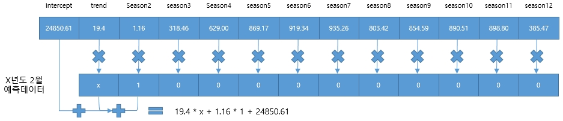
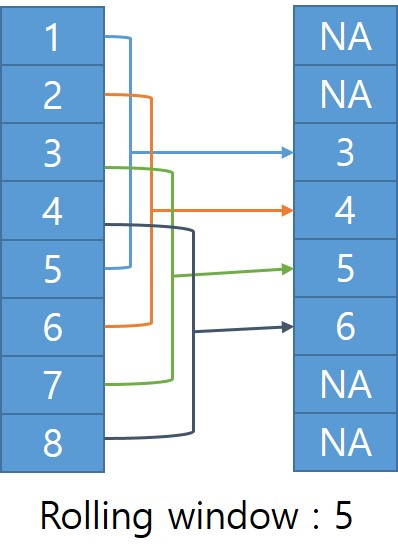

```{r message=FALSE, warning=FALSE, include=FALSE}
library(tidyverse)
library(dplyr)
library(xts)
library(tsibble)
library(readxl)
students.all <- read_excel("./students.xlsx", skip = 16, na = '-', sheet = 1, col_types = c('text', 'text', 'numeric', 'numeric', 'numeric', 'numeric', 'numeric', 'numeric', 'numeric', 'numeric', 'numeric', 'numeric', 'numeric', 'numeric', 'numeric', 'numeric', 'numeric', 'numeric'))
students <- students.all %>% 
  filter(지역규모 == '계') %>% select(-지역규모)
students$연도 <- as.Date(paste0(students$연도, '-01-01'))
students.ts <- ts(students, frequency = 1, start = 1999)
students.xts <- as.xts(students[,-1], order.by = students$연도)
students.tsibble <- as_tsibble(students, index = 연도)


employees <- read.csv('./산업별_취업자_20210206234505.csv', header = TRUE, na = '-', strip.white = TRUE, stringsAsFactors = TRUE)
colnames(employees) <- c('time', 'total', 'employees.edu')
employees$time <- as.Date(paste0(employees$time, '. 01'), format = '%Y. %m. %d')
employees.ts <- ts(employees, start = c(2013, 01), frequency = 12)
employees.xts <- xts(employees[,2:3], order.by = employees[,1])
employees.tsibble <- as_tsibble(employees, index = time)


covid19 <- read.csv('./covid19.csv', header = TRUE, na = '-', strip.white = TRUE, stringsAsFactors = TRUE)
colnames(covid19) <- c('category', 'status', 'date', 'value')
covid19 <- covid19[, c(3, 1, 2, 4)]
covid19$date <- as.Date(covid19$date, "%Y. %m. %d")
covid19 <- covid19 %>% 
  filter(grepl('세', category)) %>% 
  filter(category != '세종')
covid19$value <- ifelse(is.na(covid19$value), 0, covid19$value)
covid19 <- tidyr::spread(covid19, category, value)
covid19.ts <- ts(covid19[, 2:10], frequency = 365)
covid19.xts <- as.xts(covid19[, 3:10], order.by = covid19$date)
knitr::opts_chunk$set(class.source = "watch-out", comment='')
```

# 시계열 forecasting Part II - 시계열 예측 모델

**A future like the past:**

시계열 예측의 가장 기본적인 가정은 과거의 패턴은 미래에도 계속된다는 가정이다. 이 가정에 의해 단기 미래예측에서는 데이터가 발생되는 환경이 현재와 유사하기 때문에 불확실성이 작아 예측이 잘 맞을 수 있다. 하지만 장기 미래예측으로 갈수록 데이터가 발생되는 환경이 달라질 가능성이 높아지고 예측하지 못했던 상황들이 발생하며 오류들이 계속 쌓이면서 예측 데이터에 대한 불확실성이 높아질 수 밖에 없다.

이러한 이유때문에 시계열 예측은 외부 충격이나 원인 모를 이유에 의한 갑작스런 데이터 흐름 변화를 예측해낼 수 없다는 한계를 지닌다. 그런 지점을 전환점(Turning Point)라고 한다. 이 전환점은 시계열 분석에 있어 중요한 부분이지만 전환점을 예측하기 위해서는 전통적인 시계열 분석 기법보다는 다른 기법을 활용해야 할 수 있다.[^forecasting-ii-1]

[^forecasting-ii-1]: [*https://hbr.org/1971/07/how-to-choose-the-right-forecasting-technique*](https://hbr.org/1971/07/how-to-choose-the-right-forecasting-technique)

본 장에서는 시계열 예측에 많이 사용되는 모델들을 설명한다. 과거 오랫동안 사용되었던 전통적(Classical) 방법부터 최근에 개발되어 사용되는 최신 모델까지 각각의 모델의 특성과 구축 방법을 설명한다. 시계열 모델에 많이 사용되는 forecast 패키지를 위주로 설명할 것인데 forecast 패키지의 기본 데이터 클래스인 ts 객체를 위주로 설명하지만 timetk와 같은 최신 패키지에서는 데이터프레임 객체를 사용하기도 하기 때문에 경우에 따라 데이터프레임 객체를 대상으로 하는 방법도 설명하겠다.

이번 장의 앞에 소개하는 몇몇 알고리즘을 보면 '이게 무슨 예측이야?'라고 생각할 수도 있다. 하지만 우리는 실무에서도 3년치 평균, 6개월치 평균과 같이 단순한 모델을 사용해 비지니스의 의사결정을 하는 경우들이 있는 걸 보면 복잡한 모델이라고 꼭 좋은 것은 아닐 수 있다는 점을 간과하면 안된다 .

이번 장에서 설명하는 것은 일단 '이런 모델들이 있구나' 하는 모델의 이해 정도만 하고 넘어가도 좋다. 과거에는 forecast와 같은 패키지에서 제공하는 다양한 함수를 사용하여 여러가지 모델을 각각 생성하고 성능평가 지수를 사용해서 성능이 좋은 모델을 선택했다. 그러나 최근에는 여러가지 모델을 지원하는 하나의 프레임워크에서 동시에 생성하여 가장 좋은 모델을 선정하는 방법이 사용된다. 따라서 이 장에서는 모델을 전반적으로 이해하고 다음 장에서 시계열 평가, 예측 데이터 시각화를 위한 프레임워크를 소개하고자 한다.

## 평균 모델

평균 모델은 우리가 흔히 알고 있는 평균을 미래에 적용하는 방법이다. `forecast` 패키지에서는 `meanf()`를 통해 시계열 데이터의 평균을 활용해서 미래 예측값을 반환하는 함수를 제공한다.

`meanf()`는 시계열 데이터 전체에 대한 평균 모델로 정확한 평균값을 사용한 점 예측값(Point Forecast)뿐 아니라 예측구간 80%와 95% 구간값도 산출해 준다. 예측구간을 산출할 때 매개변수를 설정해서 Bootstrap 방법을 통해 산출할 수도 있다.

`meanf()`는 숫자 벡터나 ts 클래스 객체를 사용한다. `meanf()`의 결과를 plot하기 위해서는 `autoplot()`에 `meanf()`로 생성한 모델을 전달하여 plotting 할 수 있다.

```{r meanf, warning=FALSE, message=FALSE}
library(forecast)
# meanf()를 사용하여 ts 객체의 학생수계 열에 대한 평균모델을 생성하고 summary()로 상세내용을 출력
summary(meanf(students.ts[,2]))
# autoplot()을 사용하여 ts 객체의 학생수계 열에 대한 평균모델을 plotting
autoplot(meanf(students.ts[,2]), main = '학생수 평균모델 플롯', xlab = '연도', ylab = '학생수')
# autoplot()을 사용하여 ts 객체의 학생수계 열에 대한 평균모델(예측구간 산출에 boosted 방법을 사용)을 plotting
autoplot(meanf(students.ts[,2], bootstrap = TRUE), main = '학생수의 평균모델 플롯(부트스트랩)', xlab = '연도', ylab = '학생수')
# 전체 취업자수에 대한 평균모델 plotting
autoplot(meanf(employees.ts[,2]), main = '신규 취업자수 평균 모델 플롯', xlab = '연도', ylab = '취업자수')
# 코로나 19 확진자에 대한 평균모델(예측구간 산출에 boosted 방법을 사용) plotting
autoplot(meanf(covid19.ts[,2], bootstrap = TRUE), main = '코로나19 확진자(0-9세)의 평균 모델 플롯(부트스트랩)', xlab = '기간', ylab = '확진자수')
```

## 단순(Naïve) 모델

단순(Naïve) 모델은 시계열 데이터의 마지막 값이 미래에도 지속될 것이라는 가정하에 미래 데이터를 예측하는 모델이다. 이 모델은 경제 금융 시계열 모델에서 많이 사용된다. [^forecasting-ii-2] 앞선 평균 모델의 예측구간은 시간에 따라 일정한 반면 과 달리 Naïve 모델의 예측구간은 예측 시간이 늘어날수록 범위가 늘어난다. 아주 가까운 미래의 데이터는 지금 데이터에서 크게 벗어나지 않을 것이라는 가정이 깔려있지만 이 가정은 시간이 지날수록 확실치 않다는 모델이다. 일반적으로 다른 시계열 모델들의 예측구간도 단순(Naïve) 모델 과 같이 예측기간이 늘어날 수록 범위가 넓어지는 경향을 지닌다.

[^forecasting-ii-2]: <https://otexts.com/fpp2/simple-methods.html>

`forecast` 패키지에서는 Naïve 모델을 생성하는 함수로 `naive()`를 제공한다. `naive()`의 실행 결과는 `ts` 객체로 전달된 데이터에 대한 시차 10의 미래 데이터의 점 예측치와 80%, 95% 예측구간의 데이터를 산출해준다. 앞선 평균모델의 `meanf()`와 같이 `autoplot()`을 사용하여 plot을 만들 수 있다.

```{r naive}
# 학생수계 열에 대한 Naive 모델의 상세 정보와 plot
students.ts[, 2] %>% naive() %>% summary()
students.ts[, 2] %>% naive() %>% autoplot(main = '전체 학생수 단순 모델 플롯', xlab = '연도', ylab = '학생수')
# 취업자수 열에 대한 Naive 모델의 상세 정보와 plot
employees.ts[,2] %>% naive() %>% summary()
employees.ts[,2] %>% naive() %>% autoplot(main = '신규 취업자수 단순 모델 플롯', xlab = '연도', ylab = '취업자수')
# 0-9세 코로나 확진자수에 대한 Naive 모델의 상세 정보와 plot
covid19.ts[,2] %>% naive() %>% summary()
covid19.ts[,2] %>% naive() %>% autoplot(main = '코로나19 확진자(0-9세)의 단순 모델 플롯', xlab = '기간', ylab = '확진자수')
```

## 계절성 단순(Seasonal Naive) 모델

계절성 단순(Seasonal Naïve) 모델은 단순(Naïve) 모델에서 계절성을 추가한 모델이다. 1장에서 설명했듯이 계절성(Seasonal Pattern)과 주기성(Cyclic Pattern)은 일정한 주기를 갖는가에 따라 달라지는데 계절성 단순 모델에서 적용하는 것은 일정한 주기를 가지는 계절성에 한정된다. 아래의 예에서 보면 년별 데이터인 전체 학생수계는 계절성을 가지지 않기 때문에 앞선 Naïve 모델과 다르지 않다. 하지만 전체 취업자 수는 명확한 계절성을 지니기 때문에 Naïve 모델과는 달리 곡선 형태의 예측 결과를 나타내게 된다.

계절성 단순 모델을 생성하는 함수는 `forecast` 패키지의 snaive()를 아래와 같이 사용할 수 있다. `meanf()`, `naive()`와 `snaive()`가 다른 점은 `meanf()`, `naive()`는 기본적으로 10 lag 미래의 데이터를 산출해주지만 `snaive()`는 기본적으로 2 lag 미래 데이터를 산출해 주기 때문에 예측 산출 주기를 다시 설정해야 한다.

```{r snaive}
# 학생수계 열에 대한 계절성 Naive 모델의 상세 정보와 plot
students.ts[,2] %>% snaive(10) %>% summary()
students.ts[,2] %>% snaive(10) %>% autoplot(main = '전체 학생수 계절성 단순 모델 플롯', xlab = '연도', ylab = '학생수')
# 취업자수 열에 대한 계절성 Naive 모델의 상세 정보와 plot
employees.ts[,2] %>% snaive(10) %>% summary()
employees.ts[,2] %>% snaive(10) %>% autoplot(main = '신규 취업자수 계절성 단순 모델 플롯', xlab = '연도', ylab = '취업자수')
```

## Random Walk 모델

랜덤 워크는 미래 값은 현재 값에 랜덤 값의 영향을 받는다는 모델이다. 랜덤 워크라는 용어는 마치 술 취한 사람이 걷고 있는 모습과 비슷하다는 점에서 붙여진 용어이다. 앞선 Naïve 모델과 유사한 모델이지만 마지막 데이터에 예측이 어려운 랜덤 값의 변동이 추가된다는 점에서 차이가 있다. 주식의 예에서 보면 내일의 종가는 오늘의 종가에 오늘의 주가 변동이 반영된 값이다. 오늘의 주가 변동은 사전에 알기 어렵고 예측도 어렵기 때문에 랜덤 값으로 간주한다면 이 경우가 랜덤 워크 모델이다. 랜덤 워크에는 어제 값 이외에 의미 있는 정보가 없기 때문에 예측이 복잡하지 않다[^forecasting-ii-3].

[^forecasting-ii-3]: <https://robjhyndman.com/files/solutions.pdf>

랜덤 워크 모델은 매우 간단한 모델 같지만 이 모델은 주식 예측이나 금융권 미래 예측에 많이 활용되고 있고 과학 분야에서도 기체 분자 움직임의 모델링에도 사용하는 활용도가 높은 모델이다.

랜덤 워크 모델은 드리프트가 없는 모델과 드리프트가 존재하는 모델의 두가지 종류가 있다. 드리프트가 존재하는 모델은 랜덤워크 모델을 기반으로 하지만 예측값이 시간의 흐름에 따라 상수적으로 증가하거나 감소하는 모델이다.

랜덤 워크 모델은 `forecast` 패키지의 `rwf()`를 이용하여 생성할 수 있다. 앞서 설명한 드리프트의 유무는 `drift` 매개변수를 통해 설정할 수 있다.

```{r randomwalk}
# 학생수계 열에 대한 random walk 모델의 상세 정보와 plot
students.ts[,2] %>% rwf() %>% summary()
students.ts[,2] %>% rwf() %>% autoplot(main = '전체 학생수 랜덤워크 모델 플롯', xlab = '연도', ylab = '학생수')
# 학생수계 열에 대한 드리프르가 있는 random walk 모델의 상세 정보와 plot
students.ts[,2] %>% rwf(drift = T) %>% summary()
students.ts[,2] %>% rwf(drift = T) %>% autoplot(main = '드리프트가 있는 전체 학생수 랜덤워크 모델 플롯', xlab = '연도', ylab = '학생수')
# 취업자수 열에 대한 random walk 모델의 상세 정보와 plot
employees.ts[,2] %>% rwf() %>% summary()
employees.ts[,2] %>% rwf() %>% autoplot(main = '신규 취업자수 랜덤워크 모델 플롯', xlab = '연도', ylab = '취업자수')
# 취업자수 열에 대한 드리프르가 있는 random walk 모델의 상세 정보와 plot
employees.ts[,2] %>% rwf(drift = T) %>% summary()
employees.ts[,2] %>% rwf(drift = T) %>% autoplot(main = '드리프트가 있는 신규 취업자수 랜덤워크 모델 플롯', xlab = '연도', ylab = '취업자수')
# 0-9세 코로나 확진자수에 대한 계절성 Naive 모델의 상세 정보와 plot
covid19.ts[,2] %>% rwf(30) %>% summary()
covid19.ts[,2] %>% rwf(30) %>% autoplot(main = '코로나19 확진자(0-9세)의 랜덤워크 모델 플롯', xlab = '기간', ylab = '확진자수')
# 취업자수 열에 대한 드리프르가 있는 random walk 모델의 상세 정보와 plot
covid19.ts[,2] %>% rwf(30, drift = T) %>% summary()
covid19.ts[,2] %>% rwf(30, drift = T) %>% autoplot(main = '드리프트가 있는 코로나19 확진자(0-9세)의 랜덤워크 모델 플롯', xlab = '기간', ylab = '확진자수')
```

랜덤 워크는 시간적으로 하나 앞선 값(lag 1)과 원본 데이터를 뺀 1차 차분들이 백색잡음이 되어야 한다는 조건이 있다. 따라서 랜덤 워크 모델의 1차 차분은 하면 백색잡음이 되고, 백색잡음의 누적합계는 하면 랜덤 워크가 된다.

```{r randomwalk_noise}
set.seed(345)
#  white noise simulation 데이터 생성
whitenoise <- ts(rnorm(100), start = 1)  
ts.plot(whitenoise)
# white noise 데이터로 random walk 생성
whitenoise.to.randomwalk <- cumsum(whitenoise) 
ts.plot(whitenoise.to.randomwalk)
# random walk에서 white noise 생성
randomwalk.to.whitenoise <- diff(whitenoise.to.randomwalk) 
ts.plot(randomwalk.to.whitenoise)
```

위에서 설명한 평균, Naive, 계절성 Naive, 랜덤 워크 모델들을 하나의 plot으로 그려보면 모델 간의 차이를 살펴볼 수 있다.

```{r simple_total}
# 학생수계의 평균, Naive, 계절성 Naive, 랜덤워크 모델의 예측값 plot
autoplot(students.ts[,2]) +
autolayer(meanf(students.ts[,2], h = 10), PI = FALSE, series = '평균') + 
  autolayer(naive(students.ts[,2], h = 10), PI = FALSE, series = '단순') +
  autolayer(snaive(students.ts[,2], h = 10), PI = FALSE, series = '계절성 단순') +
  autolayer(rwf(students.ts[,2], h = 10), PI = FALSE, series = '랜덤워크') +
  autolayer(rwf(students.ts[,2], h = 10, drift = TRUE), PI = FALSE, series = '랜덤워크-드리프트') + 
  labs(title = '전체 학생수의 평균, 단순, 계절성 단순, 랜덤 워크 모델 예측값', x = '연도', y = '학생수')
# 취업자수의 평균, Naive, 계절성 Naive, 랜덤워크 모델의 예측값 plot
autoplot(employees.ts[,2]) + 
  autolayer(meanf(employees.ts[,2], h = 10), PI = FALSE, series = '평균') + 
  autolayer(naive(employees.ts[,2], h = 10), PI = FALSE, series = '단순') +
  autolayer(snaive(employees.ts[,2], h = 10), PI = FALSE, series = '계절성 단순') +
  autolayer(rwf(employees.ts[,2], h = 10), PI = FALSE, series = '랜덤워크') +
  autolayer(rwf(employees.ts[,2], h = 10, drift = TRUE), PI = FALSE, series = '랜덤워크-드리프트') + 
  labs(title = '신규 취업자수의 평균, 단순, 계절성 단순, 랜덤 워크 모델 예측값', x = '연도', y = '취업자수')
# 0-9세 코로나 확진자의 평균, Naive, 계절성 Naive, 랜덤워크 모델의 예측값 plot
autoplot(covid19.ts[,2]) +
  autolayer(meanf(covid19.ts[,2], h = 30), PI = FALSE, series = '평균') + 
  autolayer(naive(covid19.ts[,2], h = 30), PI = FALSE, series = '단순') +
  autolayer(snaive(covid19.ts[,2], h = 30), PI = FALSE, series = '계절성 단순') +
  autolayer(rwf(covid19.ts[,2], h = 30), PI = FALSE, series = '랜덤워크') +
  autolayer(rwf(covid19.ts[,2], h = 30, drift = TRUE), PI = FALSE, series = '랜덤워크-드리프트') + 
  labs(title = '코로나 확진자(0-9세)의 평균, 단순, 계절성 단순, 랜덤 워크 모델 예측값', x = '시간', y = '확진자수')
```

## 회귀(Regression) 모델

회귀 모델은 선형 회귀(Linear Regression), 비선형 회귀(Non-linear Regression), 로지스틱 회귀(Logistic Regression) 등의 방법이 있다. 회귀 모델은 종속변수와 독립변수와의 관계를 가장 잘 나타내는 회귀 방정식을 도출하여 미래 데이터에 대한 예측치를 생성하는 방법으로 아직도 머신러닝 알고리즘 중에 가장 많이 사용되는 알고리즘 중에 하나이다.[^forecasting-ii-4]

[^forecasting-ii-4]: 이기준 외, 인구지형변화에 따른 머신러닝 기반 고등교육 계열별 수요예측 모형 개발(2020), 한국교육개발원

시계열 데이터의 회귀 모델은 두가지로 구분할 수 있다. 첫번째는 두 가지 이상의 시계열 데이터(Multivariate) 간의 상관 관계를 회귀 모델로 추상화하는 것과 한가지 시계열 데이터(Univariate)의 시간에 따른 회귀모델이다. 사실 첫번째 모델의 경우는 일반적 회귀 모델과 큰 차이는 없지만 두번째 모델의 경우는 시계열 데이터의 특성인 추세(trend)와 계절성(season), 반복성(cycle)을 회귀에 반영한다는 점에서 일반적 회귀와는 차이가 있다.

시계열 선형 회귀 모델은 데이터간의 관계를 가장 잘 나타내는 직선(Linear)을 산출하여 미래 데이터를 예측하는 방법이다. 선형 회귀 모델은 선형 방정식으로 표현되는데 직선의 기울기(Slope)와 Y 축 절편(Intercept)의 계수(Coefficient)가 산출된다. 시계열 데이터의 선형 회귀를 위해서 `forecast` 패키지의 `tslm()`함수, `timetk` 패키지의 `plot_time_series_regression()` 함수(`stats::lm()` 함수를 사용하여 선형 회귀 결과를 plotting하는 함수) 등을 사용할 수 있다.

### forecast::tslm

`forecast` 패키지에서 제공하는 `tslm()`은 시계열 선형 회귀 모델을 위한 함수이다. `tslm()` 함수는 `lm()` 함수의 래퍼 함수(Wrapper)로 사용법은 비슷하다. 시간축이 독립 변수에 포함되지 않은 두개 혹은 두개 이상의 시계열 객체에 대한 선형 회귀는 `lm()` 함수의 결과와 같다. 즉 시계열 데이터이지만 독립변수 시간이 포함되지 않는다면 시계열 데이터로써 특성이 적용되지 않은 양 데이터간의 특성정보만으로 선형 회귀 방정식이 얻어진다. 예를 들자면 앞선 학생수 예제에서 유치원 학생수와 초등학교 학생수간의 선형 회귀분석을 실시하거나 하는 경우이다.

반면 독립 변수를 시간으로 선형 회귀 모형을 적용하기 위해서는 'trend', 'season' 키워드를 함수식의 \~ 오른쪽의 사용하여 시간에 대한 선형 회귀 방정식을 얻을 수 있다. 'trend'는 시계열적인 추세를 반영하여 선형 회귀 모델을 만들고 'season'은 시계열의 계절성을 반영하여 회귀 모델을 만들게 되는데 두가지를 모두 고려할 때는 '+' 기호로 연결하여 사용한다. 이 과정에서 추가적인 독립변수를 추가할 수도 있는데 독립변수를 추가할 때도 '+' 기호를 사용하여 회귀 모델을 만들 수 있다.

`tslm()`은 앞선 모델 생성 함수들과 달리 미래 예측치를 생성하지 않는다. 따라서 모델에 따른 미래 예측치를 산출하기 위해서는 `forecast` 패키지에서 제공하는 `forecast()`를 사용해야하고 이 결과값으로 plot을 생성해야 한다.

```{r tslm1}
# 전체 학생수 예측 모델을 추세를 반영하여 생성
student.ts.lm <- tslm(students.ts[,2] ~ trend, data = students.ts)
summary(student.ts.lm)
```

::: {.comment style="color: DarkBlue;"}
-   결과 설명

    -   Residuals : 모델을 적용한 잔차의 최소(Min), 25%(1Q), 중간(Median), 75%(3Q), 최대(Max)값을 산출

    -   Coefficients : y 절편(intercept)은 9,118,484이고 p value가 0.05보다 작으니 통계적으로 유의미하고, 선형 회귀 기울기(trend)는 -132164로 1년이 지날 수록 13만명정도가 계속 감소한다는 의미로 p value가 0.05보다 작으니 통계적으로 유의미

    -   이를 선형 방정식으로 표현하면 총학생수 = -132164\*년도 + 9118484 이다.

    -   R-squreed : 이 선형모델은 전체 데이터의 92.8%를 설명할 수 있음.
:::

```{r tslm2}
# 전체 학생수 예측 모델을 forecast()를 사용해 예측치를 산출하고 autoplot()으로 plot 생성
student.ts.lm %>% forecast() %>% autoplot() + labs(title = '전체 학생수에 대한 시계열 선형 회귀 예측 결과', x = '연도', y = '학생수')
```

아래의 모델은 초등학교 학생수 예측모델을 만드는데 트랜드와 유치원 학생수를 독립변수로 하는 모델을 만드는 예이다.

```{r tslm3}
# 초등학생 학생수의 예측모델을 생성하는데 유치원 학생수와 트랜드를 사용하는 선형 모델을 생성
student.ts.lm <- tslm(students.ts[,4] ~ students.ts[,3] + trend, data = students.ts) 
# forecast()로 생성된 모델에 대한 미래 예측 데이터를 만들고 autoplot()으로 plot 생성
student.ts.lm %>% forecast(h = 22) %>% autoplot(main = '유치원 학생수와 추세를 활용한 초등학생수 시계열 선형 회귀 예측 결과', xlab = '연도', ylab = '학생수')
```

위의 예제에서 사용한 데이터는 연도별 학생수의 합계이다. 이 데이터와 같은 연도별 데이터는 계절성이 존재하지 않기 때문에 season 키워드를 사용하면 아래와 같이 에러를 낸다.

```{r error=TRUE}
student.ts.lm <- tslm(students.ts[,2] ~ trend + season, data = students.ts)
```

전체 취업자수와 교육서비스업 취업자수에 대한 선형 회귀 분석 모델과 plot은 다음과 같다.

```{r tslm4}
# 전체 취업자수를 추세(trend)만으로 선형 회귀분석
employee.total.ts.lm <- tslm(employees.ts[,2] ~ trend, data = employees.ts)
# y절편이 25430, 기울기가 20.39인 선형 회귀모델 생성
summary(employee.total.ts.lm)
# 전체 취업자수에 대한 선형회귀 모델의 예측치에 대한 plot 생성
employee.total.ts.lm %>% forecast() %>% autoplot() + labs(title = '신규 취업자수에 대한 시계열 선형회귀 예측 결과', x = '시간', y = '취업자수')
```

아래의 예는 시계열 선형 회귀 모델에 추세와 계절성까지 반영한 모델을 사용한 경우이다. 계절성을 포함시키기 위해서는 `tslm()`의 \~의 오른쪽 수식에 season 키워드를 넣어줌으로써 계절성을 반영한 시계열 모델을 생성할 수 있다.

계절성 선형 모델을 `summary()`를 통해 상세 정보를 보면 앞서 봤던 추세만으로 생성한 모델과는 조금 다른 점이 있다. season2부터 season12까지의 변수가 추가되는데 이를 더미변수(dummy variable)이라고 한다. 2월부터 12월까지에 각각 대응되는 변수인데 이 변수는 1과 0의 값만 가질 수 있다. 예를 들어 2월의 데이터를 예측하기 위해서는 season2의 값만 1이고 나머지 season3부터 season12까지는 0으로 설정된다. 따라서 2월의 회귀계수만이 영향을 미치게 되므로 계수값은 많이 나오지만 각각의 예측치를 만들 때는 season2부터 season12중에 하나의 계수값만 더해지게 된다.



```{r tslm5}
# 전체 취업자수를 추세(trend)와 계절성(season)으로 선형 회귀분석
employee.total.ts.lm <- tslm(employees.ts[,2] ~ trend + season, data = employees.ts)
summary(employee.total.ts.lm)
employee.total.ts.lm %>% forecast() %>% autoplot() + labs(title = '신규 취업자수에 대한 시계열 계절성 선형회귀 예측 결과', x = '시간', y = '취업자수')
```

선형 회귀분석을 시행할 때 주의해야 할 점은 회귀 모델의 잔차가 백색 잡음이어야 한다는 점이다. 잔차가 백색 잡음이 아니라면 시계열적 특성을 여전히 지니고 있기 때문에 시계열적 특성을 더 모델링해서 이를 제거할 필요가 있다. 다만 이 예측은 '잘못된' 것은 아니나 예측구간이 커지기 때문에 비효율적 예측 모델이 된다.[^forecasting-ii-5]

[^forecasting-ii-5]: <https://otexts.com/fppkr/regression-evaluation.html>

아래의 예에서 보면 전체 학생수를 추세에 의해 선형 회귀분석을 시행한 모델의 잔차를 보여주고 있다. 이는 `forecast` 패키지의 `checkresiduals()` 함수를 사용한 결과인데 plot만 봐도 백색잡음이 아님을 확인할 수 있지만 백색잡음 테스트인 Breusch-Godfrey 테스트 결과(`checkresiduals()` 함수는 회귀모델에 대해서는 Breusch-Godfrey 테스트를, 나머지는 Ljung-Box 테스트를 시행한다.)의 p-value가 0.05보다 작기 때문에 자기상관성이 존재하여 백색잡음으로 볼 수 없다.

```{r tslm_resid}
checkresiduals(tslm(students.ts[,2] ~ trend, data = students.ts))
```

### timetk::plot_time_series_regression

`timetk` 패키지는 시계열 데이터를 처리하고 plotting 하는 데 주로 활용하는 패키지이다. 그래서 모델링을 위한 함수를 바로 제공하지는 않고 plotting 함수에서 회귀 모델을 호출하여 회귀 결과를 plotting 하는 함수를 제공한다. `plot_time_series_regression()` 함수에서 사용하는 선형 회귀 함수에서도 trend, season 을 적용할 수 없다. 다만 ts 객체가 아닌 데이터프레임 객체를 사용할 수 있다는 장점이 있다.

```{r lm_timetk, message=FALSE, warning=FALSE}
library(timetk)
library(lubridate)
plot_time_series_regression(.data = students, 
                            .date_var = 연도, 
                            .formula = 학생수계 ~ 연도, 
                            .interactive = FALSE, 
                            .show_summary = TRUE) +
  labs(title = 'timetk를 사용한 전체 학생수 시계열 회귀 모델', x = '연도', y = '학생수')

# 계절성 반영을 위해 
employees$date <- as.yearmon(employees$time, "%Y. %m")
# plot_time_series_regression에 trend만 반영시
plot_time_series_regression(.data = employees, 
                            .date_var = time, 
                            .formula = total ~ as.numeric(yearmonth(date)), 
                            .interactive = FALSE)  +
  labs(title = 'timetk를 사용한 신규 취업자수 시계열 회귀 모델', x = '연도', y = '취업자수')
# plot_time_series_regression에 trend, season(월)까지 반영시
plot_time_series_regression(.data = employees, 
                            .date_var = time, 
                            .formula = total ~ year(date) +
                             month(date, label = TRUE), 
                            .interactive = FALSE)   +
   labs(title = 'timetk를 사용한 신규 취업자수 계절성 시계열 회귀 모델', x = '연도', y = '취업자수')
```

## 지수 평활(Exponential Smoothing) 모델

지수 평활 모델은 1950년대에 제안된 모델로 랜덤 워크(Random Walk) 모델과 같이 시계열 데이터는 최근의 값이 현재의 값에 가장 큰 영향을 미친다는 점에 착안하여 나온 모델이다. 다만 랜덤 워크 모델과 같이 마지막 값에 모든 가중치를 둬서 일정하게 유지하는 것이 아닌 현재와 가까운 과거일수록 더 많은 가중치를 주는 방식으로 예측하는 방법이다. [^forecasting-ii-6]

[^forecasting-ii-6]: <https://otexts.com/fppkr/expsmooth.html>

최근의 데이터에 가중치를 높게 주기 때문에 추세, 계절성, 순환성이 심하지 않은 단기 데이터의 모델링에 적합한 방법이다. 추세나 계절성이 없는 데이터에 사용하는 '단순 지수평활 모델(Simple Exponential Smoothign), 추세가 있는 데이터에 사용하는 홀트(Holt) 모델, 추세와 계절성이 있는 데이터에 사용하는 홀트-윈터(Holt-Winter) 모델 등이 있다.

지수 평활 모델에서 핵심적인 변수는 평활 계수이다. 평활 계수는 가까운 과거에 할당하는 가중치를 의미한다. 평활 계수는 보통 0에서 1사이의 수인데 홀트 모델이나 홀트-윈터 모델에서는 추세를 나타내는 계수와 계절성을 나타내는 계수가 추가된다. 이 가중치를 어떻게 설정하는 가에 따라 예측 모델의 성능도 달라질 수 있다.

### 단순 지수 평활 모델(Simple Exponentail Smoothing Model)

단순 지수 평활 모델은 추세, 계절성 등의 시계열적 특성이 비교적 약한 데이터에 적합한 예측 모델이다. 단순 지수 평활 모델을 사용하기 위해서는 우선 평활 계수를 설정해야 한다.

평활 계수는 현재에 가장 가까운 첫번째 과거 데이터에 대한 가중치이다. 이후 과거 데이터로 갈수록 1에서 가중치를 뺀 값(1-평활 계수)을 계속 곱함으로써 (1-평활 계수)의 값이 지수적으로 반영된다. 아래의 표는 평활 계수를 0.8로 가정하고 학생수 예에 적용한 예를 보이고 있다. 과거로 갈수록 (1-평활 계수)가 지수 형태로 계산되기 때문에 가중치의 합은 1이 될 수 없다.

| 연도 | 가중치(평활계수 = 0.8)                              |
|:----:|-----------------------------------------------------|
| 2020 | 0.8                                                 |
| 2019 | 0.16 = 0.8 \* (1 - 0.8)                             |
| 2018 | 0.032 = 0.8 \* (1 - 0.8) \* (1 - 0.8)               |
| 2017 | 0.0064 = 0.8 \* (1 - 0.8) \* (1 - 0.8) \* (1 - 0.8) |
| ...  | ...                                                 |

단순 지수 평활 모델은 `forecast` 패키지의 `ses()`를 사용하여 모델을 만들 수 있다. `ses()`에서는 평활 계수를 alpha 매개변수를 통해 사용자가 직접 설정할 수도 있고 따로 설정하지 않으면 자동으로 계산하여 설정해준다. `ses()`에 beta와 gamma 매개변수를 설정해주면 설명할 홀트 모델, 홀트-윈터 모델도 만들 수 있다.

`ses()`를 통해 생성되는 모델은 몇가지 특성 값을 가지는데 앞에서 설명한 평활 계수인 alpha와  초기 레벨 상태인 l이 사용된다. 단순 지수 평활 모델은 한 단계씩 예측해 나가는 방법(One Step Forecast)이기 때문에 초기 레벨 값인 l값부터 시작하여 한단계 앞 값을 예측하고 또 다음 단계를 예측하는 방법으로 수행된다. l 값을 산출하는 방법은 Rob Hyndman의 저서에서 확인할 수 있다.[^forecasting-ii-7] 이는 `ses()`모델을 `summary()`를 통해 실행시키면 확인이 가능하다.

[^forecasting-ii-7]: <https://otexts.com/fpp2/ses.html>

아래의 총학생수에 대한 ses()의 alpha 계수는 0.999로 계산되었다. 이는 거의 1과 가깝기 때문에 바로 이전 데이터에 거의 모든 가중치를 다 준 것이고 이로 인해 결국 Naive 모델과 거의 같은 모델이 생성되었다. 만약 alpha값을 강제로 낮추어 준다면 어떻게 될까? 아래의 코드를 잘 살펴보길 바란다.

```{r ses0}
# 전체 학생수에 대한 Simple Exponential Smoothing
ses(students.ts[,2]) %>% summary()
```

::: {.comment style="color: DarkBlue;"}
-   결과 설명

    -   Smoothing parameters: 지수평활의 가중치로 사용할 alpha값이 0.9999

    -   Initial states : 지수평활의 시작점 위치
:::

```{r ses, message=FALSE, warning=FALSE}
autoplot(students.ts[,2]) + 
  autolayer(fitted(ses(students.ts[,2])), series = '적합값') +
  autolayer(ses(students.ts[,2]))  + 
  labs(title = '전체 학생수에 대한 단순 지수 평활 모델', x = '연도', y = '학생수')
autoplot(students.ts[,2]) + 
  autolayer(fitted(ses(students.ts[,2])), series = '적합값') +
  autolayer(ses(students.ts[,2]), PI = F, series = '0.99') + 
  autolayer(ses(students.ts[,2], alpha = 0.5), PI = F, series = '0.5') + 
  autolayer(ses(students.ts[,2], alpha = 0.3), PI = F, series = '0.3') + 
  labs(title = 'alpha값에 따른 단순 지수 평활 모델(전체 학생수)', x = '연도', y = '학생수', color = 'alpha')
```

```{r ses1}
# 전체  취업자수에 대한 Simple Exponential Smoothing
autoplot(employees.ts[,2]) + 
  autolayer(fitted(ses(employees.ts[,2])), series = '적합값') +
  autolayer(ses(employees.ts[,2]), series = 'auto', PI = F) + 
  autolayer(ses(employees.ts[,2], alpha = 0.3), series = '0.3', PI = F) + 
  autolayer(ses(employees.ts[,2], alpha = 0.5), series = '0.5', PI = F) + 
  autolayer(ses(employees.ts[,2], alpha = 0.7), series = '0.7', PI = F) + 
  labs(title = 'alpha값에 따른 단순 지수 평활 모델(신규 취업자수)', x = '연도', y = '취업자수', color = 'alpha')
# 코로나 신규확진자수(0-9세)에 대한 Simple Exponential Smoothing
autoplot(covid19.ts[,2]) + 
  autolayer(fitted(ses(covid19.ts[,2])), series = '적합값') +
  autolayer(ses(covid19.ts[,2], h = 30), series = 'auto', PI = F) + 
  autolayer(ses(covid19.ts[,2], alpha = 0.3, h = 30), series = '0.3', PI = F) + 
  autolayer(ses(covid19.ts[,2], alpha = 0.5, h = 30), series = '0.5', PI = F) + 
  autolayer(ses(covid19.ts[,2], alpha = 0.7, h = 30), series = '0.7', PI = F) + 
  labs(title = 'alpha값에 따른 단순 지수 평활 모델(신규 확진자수)', x = '연도', y = '확진자수', color = 'alpha')
```

평활 계수가 클수록 데이터 변화에 빠르게 반응하여 예측의 감응도가 높지만 평활계수가 작으면 데이터의 변화에 느리게 반응하여 예측의 안정성이 높아진다 [^forecasting-ii-8]

[^forecasting-ii-8]: <https://m.blog.naver.com/PostView.nhn?blogId=sigmagil&logNo=221502514892&proxyReferer=https:%2F%2Fwww.google.com%2F>

```{r ses_alpha, message=FALSE, warning=FALSE}
# 전체 학생수의 alpha 값에 따른 적합치와 예측치의 변화
autoplot(students.ts[,2], color = 'black') +
  autolayer(fitted(ses(students.ts[,2], alpha = 0.1)), series = '0.1') +
  autolayer(ses(students.ts[,2], alpha = 0.1, PI = FALSE), series = '0.1') +
  autolayer(fitted(ses(students.ts[,2], alpha = 0.2)), series = '0.2') + 
  autolayer(ses(students.ts[,2], alpha = 0.2, PI = FALSE), series = '0.2') +
  autolayer(fitted(ses(students.ts[,2], alpha = 0.3)), series = '0.3') +
  autolayer(ses(students.ts[,2], alpha = 0.3, PI = FALSE), series = '0.3') +
  autolayer(fitted(ses(students.ts[,2], alpha = 0.4)), series = '0.4') +
  autolayer(ses(students.ts[,2], alpha = 0.4, PI = FALSE), series = '0.4') +
  autolayer(fitted(ses(students.ts[,2], alpha = 0.5)), series = '0.5') +
  autolayer(ses(students.ts[,2], alpha = 0.5, PI = FALSE), series = '0.5') +
  autolayer(fitted(ses(students.ts[,2], alpha = 0.6)), series = '0.6') +
  autolayer(ses(students.ts[,2], alpha = 0.6, PI = FALSE), series = '0.6') +
  autolayer(fitted(ses(students.ts[,2], alpha = 0.7)), series = '0.7') +
  autolayer(ses(students.ts[,2], alpha = 0.7, PI = FALSE), series = '0.7') +
  autolayer(fitted(ses(students.ts[,2], alpha = 0.8)), series = '0.8') +
  autolayer(ses(students.ts[,2], alpha = 0.8, PI = FALSE), series = '0.8') +
  autolayer(fitted(ses(students.ts[,2], alpha = 0.9)), series = '0.9') +
  autolayer(ses(students.ts[,2], alpha = 0.9, PI = FALSE), series = '0.9') + 
  labs(title = 'alpha값에 따른 단순 지수 평활 모델 변화(전체 학생수)', x = '연도', y = '학생수', color = 'alpha')

```

### 홀트(Holt) 모델

홀트(holt) 모델은 지수 평활 모델을 확장하여 추세를 반영하는 모델이다. 홀트 모델은 추세 조정  지수 평활법이나 이중 지수 평활법으로 불리기도 한다. 추세를 반영하기 위해 평활 계수인 alpha와 추세 기울기 값 beta를 사용하여 모델을 세운다. 평활 계수 값과 마찬가지로 추세 기울기 값도 0과 1사이의 값을 지니고 이 값을 반영한 이동 평균을 통해 예측값을 산출한다.

홀트 모델은 앞선 단순 지수 평활 모델에 사용했던 `ses()` 함수에 추세 기울기 값인 beta 값을 추가하여 사용할 수도 있고 `forecast` 패키지에서 제공하는 `holt()` 함수를 사용하여 모델을 생성할 수도 있다. 다만 alpha, beta 등의 매개변수를 지정하지 않으면 자동 계산되어 적절한 값이 사용된다.

```{r holt0}
# 전체 학생수에 대한 Holt modeling
summary(holt(students.ts[,2]))
```

::: {.comment style="color: DarkBlue;"}
-   결과 설명

    -   Smoothing parameter : 예측 수준(level)을 결정하는 alpha 평활지수는 0.8654이고 추세를 나타내는 beta 평활지수는 0.8654로 계산됨

    -   Initial states : 예측수준(level)의 초기치는 8966192이고 추세의 초기치는 -36934로 계산됨
:::

```{r holt}
# 전체  학생수에 대한 Holt modeling
autoplot(students.ts[,2]) + 
  autolayer(fitted(holt(students.ts[,2])), series = '적합값') +
  autolayer(holt(students.ts[,2]), series = '예측값') + 
  labs(title = '전체 학생수에 대한 홀트 지수 평활 모델', x = '연도', y = '학생수')
# 전체  취업자수에 대한 Holt modeling
autoplot(employees.ts[,2]) + 
  autolayer(fitted(holt(employees.ts[,2])), series = '적합값') +
  autolayer(holt(employees.ts[,2]), series = '예측값') + 
  labs(title = '신규 취업자수에 대한 홀트 지수 평활 모델', x = '연도', y = '취업자수')
# 코로나 신규확진자수(0-9세)에 대한 Holt modeling
autoplot(covid19.ts[,2]) + 
  autolayer(fitted(holt(covid19.ts[,2])), series = '적합값') +
  autolayer(holt(covid19.ts[,2], h = 30), series = '예측값') + 
  labs(title = '코로나 확진자수(0-9세)에 대한 홀트 지수 평활 모델', x = '연도', y = '확진자수')
```

홀트 모델은 위와 같이 미래 예측값에 일정한 증가, 감소가 나타난다. 추세가 증가 추세이면 예측값이 계속 증가하게 되고 감소추세이면 계속 감소하게 된다. 특히 감소추세일때 계속 감소하면 어느 순간 음수값을 가질 수도 있다. 따라서 감소 추세가 있는 경우 어느 정도에서 감소추세를 지연시킬 필요가 있다. `holt()`에서는 damped 매개변수를 통해 증가나 감소추세를 지연시킬 수 있다.

```{r holt_damped}
# 전체 학생수에 대한 Holt modeling 비교
autoplot(students.ts[,2]) + 
  autolayer(fitted(holt(students.ts[,2])), series = '홀트 적합') +
  autolayer(fitted(holt(students.ts[,2], damped = TRUE)), series = '감쇄 적합') +
  autolayer(holt(students.ts[,2]), series = '홀트 예측', PI = FALSE) + 
  autolayer(holt(students.ts[,2], damped = TRUE), series = '감쇄 예측', PI = FALSE) + 
  labs(title = '전체 학생수에 대한 감쇄 홀트 지수 평활 모델', x = '연도', y = '학생수')
# 전체  취업자수에 대한 Holt modeling 비교
autoplot(employees.ts[,2]) + 
  autolayer(fitted(holt(employees.ts[,2])), series = '홀트 적합') +
  autolayer(fitted(holt(employees.ts[,2], damped = TRUE)), series = '감쇄 적합') +
  autolayer(holt(employees.ts[,2]), series = '홀트 예측', PI = FALSE) + 
  autolayer(holt(employees.ts[,2], damped = TRUE), series = '감쇄 예측', PI = FALSE) + 
  labs(title = '신규 취업자수 감쇄 홀트 지수 평활 모델', x = '연도', y = '취업자수')
# 코로나 신규확진자수(0-9세)에 대한 Holt modeling 비교
autoplot(covid19.ts[,2]) + 
  autolayer(fitted(holt(covid19.ts[,2])), series = '홀트 적합') +
  autolayer(fitted(holt(covid19.ts[,2], damped = TRUE)), series = '감쇄 적합') +
  autolayer(holt(covid19.ts[,2], h = 30), series = '홀트 예측', PI = FALSE) + 
  autolayer(holt(covid19.ts[,2], h = 30, damped = TRUE), series = '감쇄 예측', PI = FALSE) + 
  labs(title = '코로나 확진자수(0-9세) 감쇄 홀트 지수 평활 모델', x = '연도', y = '확진자수')
```

추세 기울기 값에 따른 변동은 아래 plot과 같이 나타난다. 사실상 추세 기울기 값은 결과값에 큰 차이를 나타내지 않는다.

```{r holt_beta, message=FALSE, warning=FALSE}
autoplot(students.ts[,2]) + 
  autolayer(fitted(holt(students.ts[,2], beta = 0.1)), series = '0.1') + 
  autolayer(holt(students.ts[,2], beta = 0.1, PI = F), series = '0.1') +
  autolayer(fitted(holt(students.ts[,2], beta = 0.2)), series = '0.2')+ 
  autolayer(holt(students.ts[,2], beta = 0.2, PI = F), series = '0.2') + 
  autolayer(fitted(holt(students.ts[,2], beta = 0.3)), series = '0.3')+ 
  autolayer(holt(students.ts[,2], beta = 0.3, PI = F), series = '0.3') +
  autolayer(fitted(holt(students.ts[,2], beta = 0.4)), series = '0.4')+ 
  autolayer(holt(students.ts[,2], beta = 0.4, PI = F), series = '0.4') +
  autolayer(fitted(holt(students.ts[,2], beta = 0.5)), series = '0.5')+ 
  autolayer(holt(students.ts[,2], beta = 0.5, PI = F), series = '0.5') +
  autolayer(fitted(holt(students.ts[,2], beta = 0.6)), series = '0.6')+ 
  autolayer(holt(students.ts[,2], beta = 0.6, PI = F), series = '0.6') +
  autolayer(fitted(holt(students.ts[,2], beta = 0.7)), series = '0.7')+ 
  autolayer(holt(students.ts[,2], beta = 0.7, PI = F), series = '0.7') +
  autolayer(fitted(holt(students.ts[,2], beta = 0.8)), series = '0.8')+ 
  autolayer(holt(students.ts[,2], beta = 0.8, PI = F), series = '0.8') +
  autolayer(fitted(holt(students.ts[,2], beta = 0.9)), series = '0.9')+ 
  autolayer(holt(students.ts[,2], beta = 0.9, PI = F), series = '0.9') + 
  labs(title = '추세 기울기(beta) 값에 따른 홀트 지수 평활 모델 변화', x = '연도', y = '학생수', color = 'beta')

```

### 홀트-윈터(Holt-Winter) 모델

홀트-윈터(Holt-Winter) 모델은 단순 지수 평활 모델을 확장하여 추세와 계절성을 반영하는 모델이다. 홀트-윈터 모델은 ses 모델의 alpha, 홀트 모델의 beta에 계절 매개변수인 gamma까지 포함하기 때문에 삼중 지수 평활법이나 계절 조정 지수 평활법이라고도 한다.

홀트-윈터 모델은 덧셈 방법(additive)와 곱셈 방법(multiplicative)의 두가지 방법이 있다.

시계열 분해에서 설명한 것과 같이 덧셈 방법은 계절성의 변화 비교적 일정하게 나타날 때 사용하는 방법이고 곱셈 방법은 계절성의 진폭이 추세에 비례하여 변동이 있을 때 사용하는 방법이다. 따라서 미래 예측치를 산출할 때도 덧셈 방법은 예측치가 크게 변동되지 않지만 곱셈 방법은 먼 미래일 수록 예측값이 커지게 된다.

홀트-윈터 모델을 생성하기 위해서는 `forecast` 패키지의 `hw()`를 사용한다. 홀트-윈터 모델도 앞선 홀트 모델과 같이 s`es()` 에 추세 기울기 값인 beta 값과 계절 변수인 gamma 값을 지정하여 사용할 수도 있고 hw()를 사용하여 모델을 생성할 수도 있다. 다만 alpha, beta, gamma 등의 매개변수를 지정하지 않으면 자동 계산되어 적절한 값이 사용된다.

덧셈 방법과 곱셈 방법을 사용하는 방법은 `hw()` 에서 seasonal 매개변수를 통해 설정할 수 있다. seasonal 매개변수를 'additive'로 설정하면 덧셈 방법,'multiplicative'를 설정하면 곱셈 방법을 사용하여 모델이 생성된다.

사실상 덧셈 방법과 곱셈 방법 중 어느 방법을 선택해야하는 지를 선택하는 방법은 시각적으로 확인하거나 다음 장에서 설명할 모델 성능 비교 방법을 통해 선택해야한다.

연간 데이터인 전체 학생수는 계절성을 찾을 수 없기 때문에 `hw()`를 적용하면 다음과 같은 오류를 발생시킨다.

```{r hw_error, error=TRUE}
hw(students.ts[,2])
```

아래는 총 취업자수에 대한 홀트-윈터 모델 plot이다. 덧셈 방법과 곱셈 방법의 두가지 plot을 보여주고 있다.

```{r hw, message=FALSE, warning=FALSE}
autoplot(employees.ts[,2]) + 
  autolayer(fitted(hw(employees.ts[,2])), series = '홀트 윈터 적합값') +
  autolayer(hw(employees.ts[,2], seasonal = 'additive'), PI = FALSE, series = '덧셈방법') + 
  autolayer(hw(employees.ts[,2], seasonal = 'multiplicative'), PI = FALSE, series = '곱셈방법') + 
  labs(title = '신규 취업자수에 대한 홀트 윈터 지수 평활 모델', x = '연도', y = '취업자수')
```

### ETS 모델

ETS 모델은 Error, Trend, Season의 앞글자만 따서 만들었다고도 하고 ExponenTial Smoothing의 약자라고도 한다. 앞에 설명한 지수 평활 모델을 잔차(실제값 - 적합값)로 보정한 모델이다.

ETS 모델은 모델을 구성하는 방법에 따라 여러가지 모델로 구분될 수 있다. 각 모델은 데이터의 측정식(measurement equation)과 측정식에서 추출된 추세, 계절성 등을 통해 추정되는 미래 예측값에 대한 상태식(state equation)에 따라 결정되는데 이를 상태공간모델(status space model)이라고 한다.[^forecasting-ii-9]

[^forecasting-ii-9]: <https://otexts.com/fppkr/ets.html>

상태공간모델에 의한 ETS 모델은 Error에 의한 덧셈 보정(A), 곱셈 보정(M), 추세에 따른 덧셈 방법(A), 감쇄 덧셈 방법(Ad), 추세 없음(N), 계절성에 따른 계절성 없음(N), 덧셈 계절성(A), 곱셈 계절성(M)으로 구분된다. 이 8가지 방법을 활용하여 최종 ETS 모델을 결정할 수 있는데 모든 조합이 모델이 되지는 않는다. 다음은 조합이 가능한 모든 상태공간모델이다. 이 중 일부는 덧셈 혹은 곱셈 보정에 따라 앞서 설명한 단순지수평활모델, 홀트모델, damped 홀트모델, 홀트윈터모델과 동일한 모델도 있다.

-   보정방법 : 덧셈 보정(A)

|                    | 덧셈 추세(A)              | 감쇄 덧셈 추세(Ad)          | 추세없음(N)          |
|--------------------|---------------------------|-----------------------------|----------------------|
| **덧셈 계절성(A)** | (A, A, A) = 덧셈 홀트윈터 | (A, Ad, A)                  | (A, N, A)            |
| **곱셈 계절성(M)** | (A, A, M) = 곱셈 홀트윈터 | (A, Ad, M) = 감쇄 홀트 윈터 | (A, N, M)            |
| **계절성 없음(N)** | (A, A, N) = 홀트 선형     | (A, Ad, N) = 감쇄 추세      | (A, N, N) = 단순평활 |

-   보정방법 : 곱셈 보정(M)

|                    | 덧셈 추세(A)              | 감쇄 덧셈 추세(Ad)          | 추세없음(N)          |
|--------------------|---------------------------|-----------------------------|----------------------|
| **덧셈 계절성(A)** | (M, A, A) = 덧셈 홀트윈터 | (M, Ad, A)                  | (M, N, A)            |
| **곱셈 계절성(M)** | (M, A, M)= 곱셈 홀트윈터  | (M, Ad, M) = 감쇄 홀트 윈터 | (M, N, M)            |
| **계절성 없음(N)** | (M, A, N)= 홀트 선형      | (M, Ad, N) = 감쇄 추세      | (M, N, N) = 단순평활 |

`forecast` 패키지의 `ets()` 함수에는 상태공간모델을 지정할 수 있지만 `ets()` 함수에서 자동적으로 선정해준다. ets 모델을 `autoplot()`에 적용시키면 각각의 성분별로 plot을 확인할 수 있다.

```{r ets1}
# 총학생수에 대한 ets 모델
ets(students.ts[,2]) %>% summary
```

::: {.comment style="color: DarkBlue;"}
-   결과 설명

    -   ETS(A, Ad N) : ETS모델로 덧셈 보정, 감쇄 추세, 계절성 없음 모델이 선정됨 - 덧셈 보정 감쇄 추세 모델

    -   Smooting parameters : 레벨 평활 계수는 0.8929, 추세 평활 계수는 0,8929, 감쇄(damped) 평활 계수는 0.9401로 설정

    -   Initial states : 레벨 초기 상태와 추세 초기상태 설정
:::

```{r ets2}
# 전체 학생수에 대한 ets 모델 ploting
ets(students.ts[,2]) %>% autoplot()
```

```{r ets3}
# 전체 학생수에 대한 예측치 ploting
ets(students.ts[,2]) %>% forecast() %>% 
  autoplot() + 
  labs(title = '전체 학생수에 대한 ets(A, Ad, N) 모델 예측 결과', x = '연도', y = '학생수')
```

```{r ets4}
# ETS(M,Ad,A)로 모델 선정
ets(employees.ts[,2])  
```

::: {.comment style="color: DarkBlue;"}
-   결과 설명

    -   ETS(M, Ad A) : ETS모델로 곱셈 보정, 감쇄 덧셈 추세, 덧셈 계절성 모델이 선정됨

    -   Smooting parameters : 레벨 평활 계수는 0.9989, 추세 평활 계수는 0.0001, 계절 평활계수는 0.0002, 감쇄(damped) 평활 계수는 0.9744로 설정

    -   Initial states : 레벨 초기 상태와 추세, 계절성 초기상태 설정
:::

```{r ets5}
ets(employees.ts[,2]) %>% autoplot()
```

```{r ets6}
ets(employees.ts[,2]) %>% forecast() %>% 
  autoplot() + 
  labs(title = '신규 취업자에 대한 ets(M, Ad, A) 예측 결과', x = '연도', y = '취업자수')
```

## ARIMA 모델

ARIMA 모델은 앞의 지수 평활 모델과 함께 시계열 예측 모델에서 가장 많이 사용되어온 모델이다. ARIMA는 AutoRegression Integrated Moving Average의 앞글자만 딴 이름이다. 지수 평활 모델은 주어진 데이터에서 추세와 계절성을 계량화한 모델이지만 ARIMA 모델은 이름에서도 나타나듯이 자기상관과 이동평균을 수식화한 모델이다.

ARIMA 모델은 ARMA(AutoRegression Moving Average)을 기반으로 한 모델이지만 ARMA 모델은 정상성 시계열에 한한 모델이기 때문에 비정상성 데이터를 정상화하는 단계를 포함하여 ARIMA 모델로 구현된다.[^forecasting-ii-10]

[^forecasting-ii-10]: <https://icim.nims.re.kr/post/easyMath/68>

ARIMA 모델은 arima(p, d, q)로 표현되는데 p는 AR모델의 차수, d는 비정상성 시계열을 정상성 시계열로 변환하기 위한 차분 차수, q는 이동평균 차수를 의미한다. 결국 ARIMA(p, d, q)모델은 데이터를 정상성 시계열로 만들기 위해 d번 차분한 데이터에 ARMA(p, q)모델을 적용하는 것과 동일하다.

### 자기회귀모델(AutoRegressive Model)

머신러닝을 공부할 때 대부분 선형 회귀 모델을 가장 먼저 배운다. 선형 회귀 모델은 독립변수와 종속변수를 선정하고 두 변수간의 상관관계를 분석하여 모델링을 한다. 앞선 장에서 시계열 선형 회귀 분석을 설명하였는데 \~를 사이에 두고 오른쪽의 독립변수는 시간이었고 왼쪽의 종속변수는 예측을 원하는 변수를 설정하였다.

그러나 AR모델은 독립변수와 종속변수를 모두 자기 자신 데이터를 사용한다는 점에서 일반 회귀 모델과 다르다. 과거의 자기 자신의 데이터와 현재의 자기 자신 데이터간의 상관관계를 분석하여 회귀 모델을 세우는 것이 AR 모델이다.

AR(p) 모델은 자기 상관관계가 lag p까지 영향을 미치는 모델이다. AR(1)은 자신의 데이터에 lag 1을 취한 데이터 간의 회귀분석 모델이고 AR(2)는 자신의 데이터에 lag 1과 lag 2 데이터 간의 다중 회귀분석 모델이다. 따라서 AR(1) 모델은 회귀계수가 하나이고 AR(2) 모델은 회귀계수가 2개이므로 AR(p) 모델은 회귀계수가 p개 존재하게 된다.

다음의 예는 자기회귀모델을 생성하고 plotting하는 예를 보이고 있다. `arima.sim()` 은 `tseries` 패키지에서 제공하는 함수로 ARIMA 모형에 따른 랜덤 데이터를 생성하는 함수이고 `auto.arima()`는 `forecast` 패키지에서 제공하는 함수로 ARIMA 모델을 자동으로 결정해 주는 함수이다.

```{r ARmodel1, warning=FALSE, message=FALSE}
library(tseries)
set.seed(345) 
arima100 <- arima.sim(model = list(order = c(1, 0, 0), ar = 0.9), n = 200)
arima100 %>% autoplot(main = 'AR(1) 모델')
urca::ur.kpss(arima100) %>% urca::summary()
ndiffs(arima100, test = 'kpss')
```

::: {.comment}
-   코드 설명

    -   항상 동일한 랜덤 변수가 나오도록 seed를 345로 설정(`set.seed(345)`)

    -   `arima.sim()`을 사용하여 1차 AR 회귀계수가 09(`ar = 0.9`)인 ARIMA(1, 0, 0) 모델(`order = c(1, 0, 0)`)에 적합한 데이터 200개(`n = 200`) 생성해서 arima100에 저장

    -   `autoplot()`을 사용하여 arima100을 plotting

    -   `kpss.test()`를 통해 정상성을 검사하는데 검정통계량이(0.2684)가 5% 임계치(0.463)보다 작으므로 이미 정상성을 만족

    -   `ndiffs()`를 사용하여 arima100에 필요한 차분수를 kpss 테스트를 기반으로 산출하는데 kpss 테스트에서 이미 정상성이라고 판단하였으므로 차분이 불필요하다는 0를 출력
:::

```{r ARmodel2}
set.seed(345)
arima110 <- arima.sim(model = list(order = c(1, 1, 0), ar = 0.9), n = 200) 
arima110 %>% autoplot(main = 'AR(1), 차분 1 모델')
urca::ur.kpss(arima110) %>% urca::summary()
ndiffs(arima110, test = 'kpss')
urca::ur.kpss(diff(arima110)) %>% urca::summary()
ndiffs(diff(arima110), test = 'kpss')
```

::: {.comment}
-   코드 설명

    -   항상 동일한 랜덤 변수가 나오도록 seed를 345로 설정(`set.seed(345)`)

    -   `arima.sim()`을 사용하여 1차 AR 회귀계수가 0.9(`ar = 0.9`)인 ARIMA(1, 1, 0) 모델(`order = c(1, 1, 0)`)에 적합한 데이터 200개(`n = 200`) 생성해서 arima110에 저장

    -   `autoplot()`을 사용하여 arima110을 plotting

    -   `ur.kpss()`를 통해 정상성을 검사하는데 검정통계량이(3.2912) 5% 임계치(0.463)보다 크므로 비정상성임

    -   `ndiffs()`를 사용하여 arima110에 필요한 차분수를 kpss 테스트를 기반으로 산출하는데 1를 출력하므로 1차 차분이 필요

    -   1차 차분 데이터를 ur.`kpss()`를 통해 정상성을 검사하는데 검정통계량이(0.2684) 5% 임계치(0.463)보다 작으므로 이미 정상성을 만족

    -   `ndiffs()`를 사용하여 arima110의 1차차분 데이터(`diff(arima110)`)에 필요한 차분수를 kpss 테스트를 기반으로 산출하는데 kpss 테스트에서 이미 정상성이라고 판단하였으므로 차분이 불필요하다는 0를 출력
:::

ARIMA(1, 0, 0)의 ACF, PACF plot은 다음과 같이 나타난다. acf plot을 보면 자기 상관성이 전반적으로 높고 천천히 감소하는 형태(Tail off)를 보인다. 그리고 pacf plot은 lag 1에서 매우 높지만 2에서부터는 끊어진다.(cut off) ARIMA(1, 1, 0)도 유사한 형태를 나타낸다.

```{r ARmodel_ACF}
arima100 %>% ggtsdisplay()
```

### 이동평균 모델(Moving Average Model)

보통 우리는 데이터의 전체 합을 데이터의 개수로 나눈 것을 평균이라 한다. 평균은 데이터 전체를 설명하는 가장 간편하고 널리 사용되는 모델이고 시계열데이터에서도 많이 사용된다.

그러나 평균은 데이터의 분포(분산)이 크고 이상치(Outlier)가 많을 때는 데이터를 제대로 설명해내지 못한다. 시계열에서도 비슷한 경향이 있는데 일반 데이터와 달리 시계열 데이터에서는 장기간의 시계열 데이터일수록 평균을 사용하여 데이터를 설명하기 힘들어진다.

예를 들어 우리나라의 1인당 GDP를 분석하고자 할 때 1960년대부터 2020년까지의 GDP를 평균을 낸다면 GDP가 낮았던 1970년대까지의 데이터로 인해 전체 평균이 최근의 GDP에 비해 낮게 나타날 것이다. 경우에 따라 이 데이터가 의미 있을 수도 있지만 최근의 경향에 맞지 않은 데이터로 간주될 것이다. 따라서 이런 경우는 시계열 데이터를 최근 3년, 5년 등으로 한정하여 평균을 내는 방법을 사용한다. 이렇게 시계열 데이터에 대한 전체 평균이 아닌 특정 기간 간의 평균을 지속적으로 내는 것을 이동평균이라고 한다.

이동 평균을 가장 많이 볼 수 있는 응용은 주식 plot이다. 주식 plot에서는 3일 이동평균, 5일 이동평균, 10일 이동평균등 다양한 이동평균을 통해 해당 주식 주가의 전반적인 흐름을 파악한다.



이동 평균 모델은 MA(q)로 표현하는데 q는 이동평균을 산출하는 차수를 의미한다. q가 1인 경우는 기준 시점값과 바로 이전값의 평균, 2인경우는 기준 시점값과 이전, 차이전 값과의 평균을 의미한다. 기준 시점값은 시계열 적으로 과거값으로 하나씩 이동할 수 있고 시계열 초기값까지 이동하면 이동평균 산출은 끝난다.

ARIMA모델에서도 이동평균을 사용한다. 앞에서 설명한 바와 같이 ARIMA(p, d, q)에서 q에 해당하는 값이 이동평균의 차수를 가리킨다.

ARIMA 모델에서이동평균을사용할때주의해야할점은이동평균모델의계수를적용하는독립변수는오차항이라는점이다. 앞선자기회귀모델에서는자기회귀계수를자기자신의 lag 데이터에적용하였지만이동평균모델은이동평균계수를오차항에적용시킨다. (이해가 어렵지만 원리를 알고싶다면 참고문헌[^forecasting-ii-11]을 참조하라)

[^forecasting-ii-11]: <https://otexts.com/fppkr/MA.html>

아래와 같이 MA(1)모델을 생성시켜 차이를 살펴보자.

```{r MAmodel}
set.seed(345) 
# ARIMA(1,0,0)에 AR(1)의 회귀계수가 0.9인 데이터 200개 생성
arima001 <- arima.sim(model = list(order = c(0, 0, 1), ma = 0.9), n = 200)   
arima001 %>% autoplot(main = 'MA(1) 모델')
# kpss 테스트를 통해 생성된 데이터가 정상성인지 테스트 - 0.05보다 크므로 정상성, 차분 불필요
urca::ur.kpss(arima001) %>% urca::summary()   
# 비정상 제거를 위한 차분수 - 0이 나오므로 차분 불필요
ndiffs(arima001, test = 'kpss') 
```

::: {.comment}
-   코드 설명

    -   항상 동일한 랜덤 변수가 나오도록 seed를 345로 설정(`set.seed(345)`)

    -   `arima.sim()`을 사용하여 1차 MA 회귀계수가 0.9(`ma = 0.9`)인 ARIMA(0, 0, 1) 모델(`order = c(0, 0, 1)`)에 적합한 데이터 200개(`n = 200`) 생성해서 arima001에 저장

    -   `autoplot()`을 사용하여 arima001을 plotting

    -   `ur.kpss()`를 통해 정상성을 검사하는데 검정통계량이(0.0906) 5% 임계치(0.463)보다 작으므로 정상성임

    -   `ndiffs()`를 사용하여 arima001에 필요한 차분수를 kpss 테스트를 기반으로 산출하는데 0를 출력하므로 1차 차분이 불필요
:::

```{r MAmodel1}
set.seed(345)
arima011 <- arima.sim(model = list(order = c(0, 1, 1), ma = 0.9), n = 200) 
arima011 %>% autoplot(main = 'MA(1), 차분 1 모델')
# kpss 테스트를 통해 생성된 데이터가 정상성인지 테스트 - 0.05보다 작으므로 정상성, 차분 필요
urca::ur.kpss(arima011) %>% urca::summary()   
# 비정상성을 제거하기 위해 필요한 차분수
ndiffs(arima011, test = 'kpss')   
urca::ur.kpss(diff(arima011)) %>% urca::summary()
ndiffs(diff(arima011), test = 'kpss')
```

::: {.comment}
-   코드 설명

    -   항상 동일한 랜덤 변수가 나오도록 seed를 345로 설정(`set.seed(345)`)

    -   `arima.sim()`을 사용하여 1차 MA 회귀계수가 0.9(`ma = 0.9`)인 ARIMA(0, 1, 1) 모델(`order = c(0, 1, 1)`)에 적합한 데이터 200개(`n = 200`) 생성해서 arima011에 저장

    -   `autoplot()`을 사용하여 arima011을 plotting

    -   `ur.kpss()`를 통해 정상성을 검사하는데 검정통계량이(3.5785) 5% 임계치(0.463)보다 크므로 비정상성임

    -   `ndiffs()`를 사용하여 arima011에 필요한 차분수를 kpss 테스트를 기반으로 산출하는데 1를 출력하므로 1차 차분이 필요

    -   1차 차분 데이터를 `ur.kpss()`를 통해 정상성을 검사하는데 검정통계량이(0.0906) 5% 임계치(0.463)보다 작으므로 이미 정상성을 만족

    -   `ndiffs()`를 사용하여 arima011의 1차차분 데이터(`diff(arima011)`)에 필요한 차분수를 kpss 테스트를 기반으로 산출하는데 kpss 테스트에서 이미 정상성이라고 판단하였으므로 차분이 불필요하다는 0를 출력
:::

ARIMA(0, 0, 1)의 ACF, PACF plot은 다음과 같이 나타난다. AR(1)모델의 acf는 점차 감소(tail off)하였고 pacf는 1에서 절단(cut off)되었지만 MA(1)모델에서는 acf plot이 1에서 절단(cut off)되고 pacf plot은 +와 -를 반복하지만 전반적으로 감소(tail off)하고 있다.

```{r MAmodel_ACF}
arima001 %>% ggtsdisplay()
```

### ARIMA 모델 결정

ARIMA 모델을 사용하기 위해서는 p, d, q의 차수를 결정하는 것이 매우 중요하다. 차수를 결정하는 방법은 앞서 설명한 acf, pacf를 보고 판단할 수 있는데 `forecast` 패키지의 `auto.arima()` 함수에서는 자동으로 p, d, q의 차수를 결정해 주기 때문에 편리하게 사용할 수 있다.

하지만 ARIMA 모델의 전반적인 동작을 이해하기 위해서는 acf와 pacf를 확인하여 모델을 결정하는 방법을 알아둘 필요가 있다. 우선 간략하게 ARIMA 모델을 결정하는 방법을 설명하자면 다음과 같다.

::: {.boxBorder}
1.  차분을 통한 정상화

    a.  `ur.kpss()`를 사용하여 검정통계량이 5% 임계치보다 크면 비정상으로 `ndiffs()` 를 사용하여 차분수를 구함

    b.  `ur.kpss()`의 검정통계량이 5% 임계치보다 작을때까지 a를 반복

2.  ACF, PACF를 확인

    a.  ACF가 점차 감소이고 PACF의 p차에서 절단값이 있다면 AR(p)

    b.  PACF가 점차 감소이고 ACF가 q차에서 절단값이 있다면 MA(q)

    c.  ACF와 PACF가 모두 점차감소라면 ARMA 모델(육안으로는 선택이 어려움)

3.  잔차를 확인

    a.  각 시차의 잔차 Ljung-box 테스트 값이 임계치 이상이어서 정상성을 만족하는지 확인
:::

#### 차분을 통한 정상화

앞에서 설명했다시피 ARIMA모델은 비정상 데이터를 정상화로 만들기 위해 d차 차분한 데이터에 ARMA(p, q)를 적용한 것과 같다. 따라서 ARIMA 모델을 만들기 위해서는 먼저 정상성 시계열 데이터인지 검사하고 비정상일 경우 차분을 통해 정상성 시계열 데이터로 만들어야 한다. 이 과정은 앞의 예제에서 `ur.kpss()`와 `ndiffs()`를 이용하는 방법을 설명했다.

#### ACF, PACF 확인

앞의 예제에서 AR(1)과 MA(1)의 ACF와 PACF plot을 보았는데 두 경우가 비슷하지만 다른 특성이 있다. AR(1) 모델의 경우는 ACF plot이 점차 감소(tail off)하고 PACF plot의 절단(cut off) 차수가 1이었다. 반면 MA(1)의 경우는 ACF plot의 절단(cut off) 차수가 1이었고 PACF plot이 점차 감소(tail off)하였다. 이를 정리하면 다음의 표와 같이 나타낼 수 있다.

|      | AR(p)                 | MA(q)                 | ARMA(p, q)          |
|------|-----------------------|-----------------------|---------------------|
| ACF  | 점차 감소(tail off)   | q차에서 절단(cut off) | 점차 감소(tail off) |
| PACF | p차에서 절단(cut off) | 점차 감소(tail off)   | 점차 감소(tail off) |

위의 표에서 보듯이 AR모델은 ACF plot이 점차 감소하며 PACF plot의 절단 차수가 p일때 AR(p)모델로 결정되고, MA 모델은 PACF plot이 점차 감소하며 ACF plot의 절단 차수가 q일때 MA(q)로 결정한다. 만약 AR과 MA가 동시에 나타나는 모델의 경우는 다음의 예에서 보듯이 ACF와 PACF가 모두 점차 감소하는 형태를 보인다.

```{r ARMAmodel}
set.seed(345)
# ARIMA(1,0,0)에 AR(1)의 회귀계수가 0.9인 데이터 200개 생성
arima101 <- arima.sim(model = list(order = c(1, 0, 1), ar = 0.9, ma = 0.9), n = 200)  
arima101 %>% autoplot(main = 'AR(1), MA(1) 모델')
arima101 %>% ggtsdisplay()
```

위의 예와 같이 p와 q가 모두 0보다 큰 경우는 ACF와 PACF plot으로 모델을 결정하는 것이 적절하지 않을 수 있다. [^forecasting-ii-12] 이 경우에는 여러가지 경우의 수를 설정하고 AIC, BIC, RMSE 등의 성능 분석 수치를 통해 가장 좋은 모델을 선정해야 한다. 이와 관련된 내용은 다음 장에서 다루겠다.

[^forecasting-ii-12]: <https://otexts.com/fpp2/non-seasonal-arima.html>

#### 잔차 확인

ARIMA 모형에 적용할 차수를 모두 결정한 후에는 결정한 모델을 통해 생성된 잔차가 백색잡음인지를 확인해야 한다.

백색잡음인지를 검사하는 방법으로 자기상관관계를 사용한 Ljung-box test와 단위근 검정을 통한 KPSS test를 소개하였다. ARIMA모델을 결정하기 위해 가장 먼저 했던 작업이 KPSS test를 통한 단위근 검정이었기 때문에 이미 단위근 검정은 시행했다. 따라서 모델이 생성한 잔차가 백색잡음인지를 검사하기 위해서는 자기 상관관계를 활용해 백색잡음 여부를 판단하는 Ljung-box test를 추가로 시행한다. ARIMA 모델의 잔차를 검사할 때는 `astsa` 패키지에서 제공하는 `sarima()`를 사용하면 편리하다.

```{r sarima, message=FALSE, warning=FALSE, results='hide'}
library(astsa)
sarima(arima101, p = 1, d = 0, q = 1)
```

위 plot의 가장 위의 표준화 잔차 plot(Standardized Residuals)은 잔차의 분포를 보여준다. 전반적으로 평균 0의 레벨에서 분산이 크게 벗어나고 있지 않음을 볼 수 있다.

두번째 열의 왼쪽 잔차의 ACF plot을 보면 잔차의 자기 상관이 거의 없음이 나타난다. 오른쪽의 Q-Q plot은 잔차가 정규분포를 하는지를 보여주는 plot인데 정규분포 데이터일수록 대각선에 포인트들이 몰려있게 된다. 양쪽 끝 단의 데이터는 큰 의미가 없다. Q-Q plot을 볼 때도 정규분포에서 크게 벗어나지 않는 것으로 보인다.

마지막으로 Ljung-Box의 p-value plot이 보이는데 모든 lag의 p-value가 95% 임계선위쪽에 나타나야 백색잡음으로 간주할 수 있는데 여기서는 모두 95% 임계선 위에 있으므로 모든 조건이 백색잡음을 만족한다.

#### ARIMA 모델 실습

ARIMA 모델을 학생수 시계열 데이터, 취업자수 시계열 데이터, 코로나 확진자 시계열 데이터에 적용해보면 다음과 같다. 여기서는 ARIMA모델을 자동으로 결정해주는 `forecast` 패키지의`auto.arima()`를 사용해보고 ACF와 PACF도 확인해보겠다.

학생수 데이터의 ACF와 PACF를 확인해보면 비교적 확실하게 확인이 가능한 모델을 선정할 수 있는데`auto.arima()`를 사용해 선정된 ARIMA 모델과 비교해 보자.

```{r ARIMA_students1}
students.ts[,2] %>% ggtsdisplay()
urca::ur.kpss(students.ts[,2]) %>% urca::summary()
ndiffs(students.ts[,2], test = 'kpss')
```

```{r ARIMA_students2, results='hide'}
sarima(students.ts[,2], p = 1, d = 2, q = 0)
```

```{r ARIMA_students3}
Arima(students.ts[,2], order = c(1, 2, 0))
Arima(students.ts[,2], order = c(1, 2, 0)) %>% forecast() %>% 
  autoplot() + 
  labs(title = '전체 학생수에 대한 ARIMA(1, 2, 0) 모델 예측 결과 - Arima() 사용', x = '연도', y = '학생수')
```

```{r ARIMA_students4, results='hide'}
sarima(students.ts[,2], p = 1, d = 2, q = 0)
```

```{r ARIMA_students5}
auto.arima(students.ts[,2])
auto.arima(students.ts[,2]) %>% forecast() %>% 
  autoplot() + 
  labs(title = '전체 학생수에 대한 ARIMA(1, 2, 0) 모델 예측 결과 - auto.arima() 사용', x = '연도', y = '학생수')
```

::: {.comment}
-   코드 설명

    -   ACF가 점차 감소(tail off)하고 PACF가 lag 1에서 절단(cut off)되었으므로 AR(1) 모델로 결정할 수 있음

    -   KPSS 테스트결과 검정통계량이 95% 임계치보다 크기 때문에 차분이 필요함.

    -   `ndiffs()`를 사용해 적정 차분수를 알아봄. 결과가 2로 나와 2차 차분이 필요

    -   sarima()로 확인한 잔차의 Ljung-box의 p-value는 모두 임계치보다 크므로 잔차는 백색잡음으로 볼 수 있음

    -   auto.arima()를 사용하여 결정된 ARIMA 모형도 ARIMA(1, 2, 0)이며 1차 AR계수는 0.3861로 계산됨

    -   auto.arima() 모델을 forecast()를 사용하여 예측치를 생성하고 autoplot()으로 plot 생성
:::

전체 취업자 수는 계절성을 지니기 때문에 계절성 ARIMA를 사용하여야 한다. 다음의 절에서 설명한다.

코로나 확진자 데이터의 자동 ARIMA 모형은 (2, 1, 1)로 나타난다. `ur.kpss()`와 `ndiffs()`를 통해 차분이 1인 경우 정상성이 되는 것을 확인할 수 있으나 p, q값이 모두 0보다 큰 수이기 때문에 ACF와 PACF plot으로 차수를 결정하는 것이 쉽지 않다. 또한 ARIMA(2, 1, 1)을 통한 잔차의 결과도 Ljung-box 결과가 모두 95% 임계치보다 큰 것이 아니기 때문에 백색잡음이라고 단정할 수 없다. 이럴 경우는 p값과 q값의 주위 값들에 대한 ARIMA모델들을 확인하여 결정하는 것이 좋다.

auto.arima()는 여러 모델들 중에 최적의 모델을 선정할 때 AIC값이 작은 값을 모델로 선택한다. AIC(Akaike's Information Criterion)는 모델의 품질을 결정할 때 참고하는 값이다. 일반적으로 과대적합(Overfitting) 또는 과소적합(Underfitting)되는 모델은 효율적이지 않다고 평가한다. 결국 AIC가 높을수록 모형의 적합도가 떨어진다는 것을 의미한다. 여기서 주의해야할 것은 AIC는 모델의 성능을 평가하는 지수가 아닌 모델의 적합도를 평가하는 지수라는 것이다.

```{r ARIMA_covid}
urca::ur.kpss(covid19.ts[,2]) %>% urca::summary()
# 비정상성을 제거하기 위해 필요한 차분수가 1
ndiffs(covid19.ts[,2], test = 'kpss')   
# ACF, PACF 모두 절단(Cut off)이므로 ARMA(p, q) 모델 
diff(covid19.ts[,2]) %>% ggtsdisplay()  
# 0-9세 코로나 확진자수의 ARIMA모형은 ARIMA(2, 1, 1)으로 선정됨
auto.arima(covid19.ts[,2]) 
```

```{r ARIMA_covid1, results='hide'}
sarima(covid19.ts[,2], 2, 1, 1)
```

### Seasonal ARIMA 모델

위에서 살펴본 모델은 비계절성 ARIMA 모델이었다. 계절성을 지니는 데이터는 ARIMA 모델로는 적절히 모델링이 어렵기 때문에 계절성 ARIMA 모델에 적합시켜야 한다. 계절성 ARIMA는 비계절성 ARIMA의 p, d, q 차수 외에 계절성 차수인 P, D, Q와 관측주기 m을 추가적으로 결정해야 하고 ARIMA(p, d, q)(P, D, Q)m으로 표기한다. 아래의 코드는 전체 취업자수 주기별 합계의 계절성 ARIMA 모델을 산출하는 코드이다. 계절성의 주기가 클수록 ACF와 PACF로 계절성 ARIMA차수를 찾아내는게 어려워지기 때문에 좀 간단한 예로 연습해보자.

```{r ARIMA_seasonal1}
# 전체 취업자수 데이터를 분기별 합계제이터로 변환
employees %>% mutate(year = lubridate::year(time), 
                     qtr = lubridate::quarter(time)) %>%
  group_by(year, qtr) %>%
  summarise(sum = sum(total)) %>% 
  ts(frequency = 4, start = c(2013,1)) -> qtr.employees.ts

# auto.arima로 일단 ARIMA모형을 검토 - ARIMA(0,1,0)(0,1,0)[4]로 제안됨
auto.arima(qtr.employees.ts[,3]) %>% summary()
# ggtsdisplay()로 ACF plot을 볼때 4주기마다 계절성이 있는듯 보임
qtr.employees.ts[,3] %>% tsdisplay()
# KPSS 검정결과 단위근이 존재하는 비정상성 데이터
qtr.employees.ts[,3] %>% urca::ur.kpss() %>% urca::summary()
# ndiffs()에 의하면 1차 차분 필요
qtr.employees.ts[,3] %>% ndiffs()
# 1차 차분 결과 plot()
qtr.employees.ts[,3] %>% diff() %>% tsdisplay(lag.max = 36)
```

1차 차분된 데이터의 ACF와 PACF를 확인해보면 비계절성 lag(1, 2, 3 등)는 대부분 임계치 아래로 내려가 있기 때문에 ARMA(0,0)으로 결정이 가능하다. 그런데 위의 ACF와 PACF는 앞에서 본 plot과는 좀 다른 점이 있는데 ACF의 선이 4주기별로 점차 감소하는 형태를 보이고 있다는 점이다. 이것을 보고 계절성 ARIMA모형을 결정할 수 있는데 위에서는 ACF에서 4주기별로 점차 감소하고 PACF에서는 lag 4에서 절단 되기때문에 ARMA(1, 0)[4]로 볼 수 있다. 따라서 ACF, PACF를 보고 결정할 수 있는 계절성 ARIMA 모형은 ARIMA(0,1,0)(1,1,0)[4]이다.

```{r ARIMA_seasonal2, results='hide'}
# 잔차의 분포, ACF, Q-Q plot, Ljung-box test 모두 백색잡음으로 나타남

sarima(qtr.employees.ts[,3], p = 0, d = 1, q = 0, P = 1, D = 1, Q = 0, S = 4)
sarima(qtr.employees.ts[,3], p = 0, d = 1, q = 0, P = 0, D = 1, Q = 0, S = 4)
```

위의 두개의 plot은 ACF, PACF를 통해 결정한 모델과 auto.arima()를 통해 결정된 모델의 잔차 정보 plot이다. 두 모델 모두 잔차를 백색잡음으로 볼 수 있을것으로 보인다. 아래는 위에서 선택한 모델을 Arima()를 사용해 생성하고 두 모델의 미래 예측치를 만들어 plotting하였다.

그럼 `auto.arima()`가 결정한 ARIMA(0,1,0)(0,1,0)[4]모델과 수작업으로 결정한 ARIMA(0,1,0)(1,1,0)을 비교해보자. 모델을 비교하는 데에는 몇가지 방법이 있고 다음장에서 비교하는 지수에 대해 자세히 설명하겠다.

`auto.arima()`에서는 모델을 선택하는데 사용하는 지수로 AIC를 사용한다고 하였다. ARIMA 모델 차수 간의 비교에는 AIC가 유용한 판단 지수이지만 다른 전혀 다른 모델과 비교할 때는 잔차에 관련된 성능지수를 사용하는 것이 일반적이다. 따라서 모델간의 성능 비교에서 많이 사용하는 RMSE 지수를 사용하여 비교해 보았다.(RMSE는 다음장에서 상세히 설명한다. 일단 낮은 값이 좋은 값이다.)

수작업으로 선택한 ARIMA(0,1,0)(1,1,0)[4] 모델의 RMSE는 441.4946이고 auto.arima()로 선택된 ARIMA(0,1,0)(0,1,0)[4] 모델의 RMSE는 450.3206으로 산출되었다. RMSE상으로는 수작업으로 선택한 모델이 `auto.arima()` 선택 모델보다 우수해보인다. 아래 plot으로 두 모델을 확인해보자. 이제 선택은 여러분의 몫이다.

```{r ARIMA_seasonal3}
# ARIMA(0,1,0)(0,1,1)[12] 모델 생성
arima010110 <- Arima(qtr.employees.ts[,3], order = c(0,1,0), seasonal = c(1,1,0))
arima010010 <- Arima(qtr.employees.ts[,3], order = c(0,1,0), seasonal = c(0,1,0))
# ARIMA(0,1,0)(0,1,0)[12]모델의 회귀계수 및 다양한 정보
summary(arima010110) 
summary(arima010010) 
# ARIMA(0,1,0)(0,1,1)[12] 모델의 예측치 산출
forecast010110 <- arima010110 %>% forecast()
forecast010010 <- arima010010 %>% forecast()
# ARIMA(0,1,0)(0,1,1)[12]의 plot
autoplot(qtr.employees.ts[,3]) + 
  autolayer(forecast010110, PI = F, series = '010110') +
  autolayer(forecast010010, PI = F, series = '010010') +
  labs(title = '분기별 취업자수에 대한 ARIMA(0,1,0)(0,1,0)[4]와 ARIMA(0,1,0)(1,1,0)[4] 예측 결과', x = '연도', y = '취업자수', color = '모델')

```

그러면 이제 좀 취업자수의 월별 데이터로 확인해보자.

```{r ARIMA_seasonal4}
# auto.arima()는 ARIMA(0,1,0)(0,1,1)[12] 모델 제안
employees.ts[,2] %>% auto.arima()
# ggtsdisplay()로 ACF plot을 볼때 12주기마다 계절성이 있는듯 보임
employees.ts[,2] %>% tsdisplay()
# KPSS 검정결과 단위근이 존재하는 비정상성 데이터
employees.ts[,2] %>% urca::ur.kpss() %>% urca::summary()
# ndiffs()에 의하면 1차 차분 필요
employees.ts[,2] %>% ndiffs()
# 1차 차분 결과 plot()
# ACF, PACF를 확인해서 비계절성 모델은 (0,1,1) 계절성 모델은 (1,1,0)으로 결정 
employees.ts[,2] %>% diff() %>% tsdisplay(lag.max = 36)
# ARIMA(0,1,1)(1,1,0)[12]모델 생성
arima011110 <- employees.ts[,2] %>% Arima(order = c(0,1,1), seasonal = c(1,1,0))
# auto.arima()가 제안한 ARIMA(0,1,0)(0,1,1)[12]모델 생성
arima010011 <- employees.ts[,2] %>% Arima(order = c(0,1,0), seasonal = c(0,1,1))
# 각 모델의 정보 확인
summary(arima011110) 
summary(arima010011) 
# 두 모델의 예측치 산출
forecast011110 <- arima011110 %>% forecast()
forecast010011 <- arima010011 %>% forecast()
# 두 모델의 plot
autoplot(employees.ts[,2]) + 
  autolayer(forecast011110, PI = F, series = '011110') +
  autolayer(forecast010011, PI = F, series = '010011') +
  labs(title = '월별 취업자수에 대한 ARIMA(0,1,1)(1,1,0)[12]와 ARIMA(0,1,0)(0,1,1)[12] 예측 결과', x = '연도', y = '취업자수', color = '모델')
```

위의 `auto.arima()`가 결정한 ARIMA(0,1,0)(0,1,1)[12]모델과 수작업으로 결정한 ARIMA(0,1,1)(1,1,0)을 비교해보자. `auto.plot()`의 ARIMA(0,1,0)(0,1,1)[12]모델의 RMSE값은 114.39이고 수작업으로 결정한 ARIMA(0,1,1)(1,1,0)의 RMSE값은 114.97이다. 일반적으로 RMSE값이 작은 모델이 성능이 좋은 모델인데 이 두 모델의 중에 성능이 좋은 모델은 `auto.arima()`의 ARIMA(0,1,0)(0,1,1)[12]모델이다. 또 아래의 표는 ARIMA(0,1,0)(0,1,1)모델 부근의 모델들의 RMSE값이다.

| 모델차수            | RMSE       |
|---------------------|------------|
| ARIMA(0,1,0)(0,1,1) | 114.39     |
| ARIMA(0,1,0)(0,1,0) | 120.51     |
| ARIMA(0,1,0)(1,1,1) | 120.41     |
| ARIMA(0,1,0)(0,1,0) | 120.51     |
| ARIMA(1,1,0)(0,1,1) | **114.35** |
| ARIMA(1,1,0)(0,1,0) | 120.51     |
| ARIMA(1,1,0)(1,1,0) | 114.97     |
| ARIMA(1,1,0)(0,1,0) | 120.51     |
| ARIMA(0,1,1)(0,1,1) | **114.32** |
| ARIMA(0,1,1)(0,1,0) | 120.51     |
| ARIMA(0,1,1)(1,1,1) | 114.32     |
| ARIMA(0,1,1)(0,1,0) | 120.51     |
| ARIMA(1,1,1)(0,1,1) | **113.23** |
| ARIMA(1,1,1)(0,1,0) | 117.42     |
| ARIMA(1,1,1)(1,1,1) | **113.23** |
| ARIMA(1,1,1)(0,1,0) | 117.42     |

`auto.arima()`와 수동으로 선택한 모델인 ARIMA(0,1,0)(0,1,1)[12]의 RMSE보다 낮은 RMSE값을 갖는 모델이 눈에 보인다. 그렇다면 이 모델이 더 좋은 모델인가? ARIMA(0,1,1)(1,1,1)모델은 잔차의 Ljung-Box 테스트에서 lag 1의 p-value가 임계치보다 낮아 잔차의 정상성을 확보하지 못한다. 다음의 plot은 `auto.arima()`가 선택한 RMSE보다 낮은 모델의 예측치 plot이다.

```{r ARIMA_seasonal5, echo=FALSE}
autoplot(employees.ts[, 2]) + 
  autolayer(forecast010011, PI = F, series = '010011') + 
  autolayer(forecast(Arima(employees.ts[, 2], order = c(1,1,0), seasonal = c(0,1,1))), PI = F, series = '110011') + 
  autolayer(forecast(Arima(employees.ts[, 2], order = c(0,1,1), seasonal = c(0,1,1))), PI = F, series = '011011') + 
  autolayer(forecast(Arima(employees.ts[, 2], order = c(1,1,1), seasonal = c(0,1,1))), PI = F, series = '111011') + 
  autolayer(forecast(Arima(employees.ts[, 2], order = c(1,1,1), seasonal = c(1,1,1))), PI = F, series = '111111') + 
  labs(title = '월별 신규 취업자에 대한 ARIMA 모델 비교', x = '연도', y = '취업자수')
  
```

위의 plot을 보면 예측치가 미세하게 차이난다. 어떻게 보면 큰 차이가 아닐수도 있고 어찌보면 `auto.plot()`의 예측력이 떨어진다고 볼수도 있다. 따라서 육안으로 확인하거나 auto.arima 모델의 p, q값의 주위 모델을 반드시 확인하여 성능 수치가 더 우수한 모델을 찾는 과정을 거쳐야 한다.

## TBATS 모델

앞선 ETS 모델과 ARIMA 모델은 계절성을 처리할 수 있는 방법을 제공하지만 문제는 다중 계절성을 지는 경우이다. 예를 들어 시간별 데이터는 하루내에서도 계절성을 가질 수 있고 주간적으로도 계절성을 가질 수 있으며 월간적으로, 연간적으로도 계절성을 가질 수 있다. ETS 모델과 ARIMA 모델은 연간(frequency = 1), 분기간(frequency = 4), 월간(frequency = 12) 까지의 계절성을 지원하고 주간(frequency = 52) 이상의 계절성을 지원하지 못한다.

또한 계절성이 동적으로 변동되는 경우는 ETS, ARIMA 모델이 지원하지 못한다. 따라서 이렇게 긴 주기의 계절성을 찾아내는 모델이나 변동성을 지니는 계절성 데이터에 대한 모델을 구축해야 할 때 사용하는 모델이 TBATS모델이다. TBATS 모델은 계절성의 삼각함수(**T**rigonometric), **B**ox-Cox 변환[^forecasting-ii-13], **A**RMA 에러, 추세(**T**rend)와 계절성 컴포넌트(**S**easonal Components)의 다섯가지 요소를 사용한 지수평활 상태공간 모델이다.[^forecasting-ii-14]

[^forecasting-ii-13]: <https://otexts.com/fpp3/ftransformations.html>

[^forecasting-ii-14]: <https://pkg.robjhyndman.com/forecast/reference/tbats.html>

코로나 확진자 데이터의 경우 2020년 9월 경 한차례 증가가 있었다가 2020년 12월 또 한차례 증가가 발생했다. 이것을 이중 계절성으로 파악한다면 ETS나 ARIMA모형으로는 모델링이 불가하다. 하지만 TBATS 모델은 다음과 같이 모델이 가능하다.

TBATS모델은 `forecast()` 패키지의 `tbats()`를 통해 생성할 수 있다. 생성된 모델은 `forecast()`를 통해 예측치를 산출할 수 있다.

```{r TBATS}
# 코로나 확진자 데이터에 대한 tBats 모델
covid19.ts[,2] %>% tbats() %>% forecast() %>% autoplot() + labs(title = '코로나 확진자(0-9세)에 대한 TBATS 모델 예측', x = '시간', y = '확진자수')   
```

## prophet 모델

Prophet 모델은 페이스북에서 자사 데이터를 기반으로 개발한 시계열 모델로 `prophet` 패키지를 통해 R과 Python에서 사용할 수 있다. 이 모델은 연도별, 주별, 일별 계절성 및 휴일 효과에 적합한 비선형 추세에 알맞은 가법 모델을 통해 시계열 데이터를 예측한다. (무슨 말인지 몰라도 상관없다)

페이스북에서는 prophet 모델이 '빠르고 정확하다', '완전 자동화되어 있다', '예측을 조절할수 있다', 'R과 Python에서 사용할 수 있다'고 홍보하고 있다.[^forecasting-ii-15] 하지만 예측 방법론을 페이스북에서 공개하지 않는 블랙박스 모델이다. 이 부분은 시계열 분석 방법론을 연구하는 연구자들에게는 단점이지만 시계열 분석을 실무에서 사용하는 사람들은 오히려 장점이 될 수 있다.(머리아프게 공부하지 않고 그냥 쓰면 되니까)

[^forecasting-ii-15]: <https://facebook.github.io/prophet/>

`prophet` 모델은 시계열 데이터를 추세(t), 계절성(s), 휴일(h), 오차의 특성(feature)로 분리한다. 추세(t)는 반복이 되지 않는 추세, 계절성(s)은 계절성과 같은 반복적인 변화, 휴일(h)은 공휴일과 같이 달력상에서의 불규칙한 특성(feature)을 말한다. 여기에 오차가 더해지는데 이 오차는 특정 모델로 적용이 어려운 정규분포를 따르는 오차라고 가정한다.[^forecasting-ii-16]

[^forecasting-ii-16]: <https://peerj.com/preprints/3190.pdf>

prophet 모델은 ARIMA 모델 같이 시계열 데이터의 구조를 통해 관계를 분석하는 모델과 달리 데이터 구조가 어떻던 데이터에 적합한 커브를 그리는데 목표를 두고 있다. 이렇게 함으로써 여러 주기를 가지는 계절성에 쉽게 사용할 수 있고, ARIMA 모델과 같이 일정한 데이터 주기를 맞추기 위해 데이터를 채워넣는 작업을 피할수 있고, 매우 빠르게 다양한 모델 스펙을 경험할 수 있고, 에 적합시킬 수 있으며, 회귀에 경험이 많은 분석가들의 개념에 쉽게 이해될 수 있는 형태의 매개변수들을 사용한다는 장점이 있다고 한다.

`prophet` 모델을 적용하기 위해서는 `prophet()`를 사용한다. `prophet()`은 data.frame 객체를 대상으로 사용되는데 data.frame에는 컬럼 이름이 'ds'와 'y'으로 설정된 두개의 데이터 필드가 필요하다. ds 컬럼은 `date` 데이터 타입이어야 하며 y 컬럼은 수치 컬럼이어야 한다.

```{r prophet_students1, message=FALSE, warning=FALSE}
library(prophet)
students.prophet <- data.frame(ds = students$연도, y = students$학생수계) 
model.prophet.students <- prophet(students.prophet)
future.students <- make_future_dataframe(model.prophet.students, periods = 10, freq = 'year')
forecast.students <- predict(model.prophet.students, newdata = future.students)
plot(model.prophet.students, forecast.students) + 
  ggrepel::geom_text_repel(aes(label = scales::number(y, big.mark = ',', accuracy = 1)), vjust = 1, size = 3) +
  labs(title = 'prophet model', x = '연도', y = '학생수') + 
  scale_y_continuous(labels = scales::number_format(big.mark = ','))
prophet_plot_components(model.prophet.students, forecast.students)
```

::: {.comment}
-   코드 설명

    -   ds컬럼(students의 연도컬럼(date 클래스로 변환), students의 학생수계)과 y컬럼을 가지는 데이프레임을 생성

    -   prophet()을 사용하여 prophet 모델을 생성

    -   make_future_dataframe()을 사용하여 미래예측 데이터를 담을 빈데이터 프레임(시간 컬럼만 있는) 생성

    -   predict()로 미래예측 데이터를 생성하는데 모델로 prophet모델, 예측에 사용될 신규 데이터로는 make_future_dataframe()으로 만들어놓은 미래예측 데이터 프레임을 사용

    -   plot()을 사용하여 미래 예측 데이터의 plot을 생성, prophet모델이 사용하는 plot()은 ggplot()를 기반으로 작성된 plot()의 랩핑함수이므로 ggplot()의 기능을 이용하여 plot을 변경할 수 있음.

    -   prophet_plot_components()로 prophet 예측에 사용된 컴포넌트들을 plot
:::

```{r prophet, message=FALSE, warning=FALSE}
employees.prophet <- data.frame(ds = employees[,1], y = employees[,2])
model.prophet.employees <- prophet(employees.prophet)
future.employees <- make_future_dataframe(model.prophet.employees, periods = 10, freq = 'month')
forecast.employees <- predict(model.prophet.employees, future.employees)
plot(model.prophet.employees, forecast.employees) +
  labs(title = '월별 전체 취업자수 추세(prophet model)', x = '연월', y = '취업자수') + 
  scale_y_continuous(labels = scales::number_format(big.mark = ','))
prophet_plot_components(model.prophet.employees, forecast.employees)
covid.prophet <- data.frame(ds = covid19$date, y = covid19$`0-9세`)
model.prophet.covid <- prophet(covid.prophet, yearly.seasonality=TRUE, daily.seasonality=TRUE, weekly.seasonality=TRUE)
future.covid <- make_future_dataframe(model.prophet.covid, periods = 100, freq = 'day')
forecast.covid <- predict(model.prophet.covid, future.covid)
prophet_plot_components(model.prophet.covid, forecast.covid)

```

## 신경망(Neural Network) 모델

최근 우리는 딥러닝이라는 인공지능 알고리즘을 흔히 듣고 산다. 사실 딥러닝은 다양한 머신러닝 알고리즘 중에 하나로 이번 절에서 설명하려는 신경망(Neural Network) 모델에서 파생된 모델이다. 여기서는 신경망에 대해 깊게 설명하지는 않겠지만 신경망의 기본은 인간의 뇌세포 구조를 본따서 입력 레이어, 히든 레이어, 출력 레이어를 비용함수들로 연결하는 모델인데 히든레이어가 3개 이상 되는 신경망 모델을 딥러닝 모델이라 부른다.

시계열 데이터에 대한 신경망 모델은 `forecast` 패키지에서 제공하는 `nnetar()` 함수를 사용하여 구축할 수 있다. `nnetar()`로 구축되는 모델은 싱글 히든 레이어을 사용한 신경망 모델이다. 따라서 딥러닝이라고까지는 언급할 수 없으나 시계열 데이터를 신경망 이론에 적합하여 만들수 있는 모델이라는데 의미가 있다.

`nnetar()` 함수에 구축된 모델은 계절성이 없는 경우는 NNAR(p, k)이며 계절성이 없는 경우는 NNAR(p, P, k)[m]으로 표현된다. p값은 히든 레이어에서 예측값을 산출하기 위해 사용하는 과거 데이터의 갯수이고 k값은 히든 레이어에 존재하는 신경세포의 갯수이다. P는 계절성에 대한 lag 값이다. `nnetar()` 함수는 p와 P 값을 자동으로 산정하고 k 값은 (p + P +1)/2 값으로 설정한다.[^forecasting-ii-17]

[^forecasting-ii-17]: <https://otexts.com/fpp3/nnetar.html>

NNAR모델의 단점중에 하나는 예측구간의 계산이 원활하지 못하다는 점이다. `forecast(`) 함수에서 'PI = TRUE' 매개변수를 설정하면 예측구간이 계산되지만 계산량이 많아 시간이 걸린다.

```{r nnetar}
# 학생수에 대한 NNAR 모델은 NNAR(1, 1)모델
students.ts[,2] %>% nnetar() %>% forecast(PI = TRUE) %>% autoplot() + labs(title = '전체 학생수에 대한 신경망 모델 예측 결과', x = '연도', y = '학생수')
# 전체 취업자수에 대한 모델은 NNAR(1, 1, 2)[12] 모델
employees.ts[, 2] %>% nnetar() %>% forecast(PI = TRUE) %>% autoplot()+ labs(title = '신규 취업자수에 대한 신경망 모델 예측 결과', x = '연도', y = '취업자수')
# 코로나 확진자수에 대한 모델은 NNAR(22, 12) 모델(예측값을 위해 22개의 과거 데이터를 활용했고 히든레이어에 12개의 신경세포를 생성 )
covid19.ts[,2] %>% nnetar() %>% forecast(h = 100, PI = TRUE) %>% autoplot() + labs(title = '코로나 확진자(0-9세)에 대한 신경망 모델 예측 결과', x = '연도', y = '확진자수')
```
