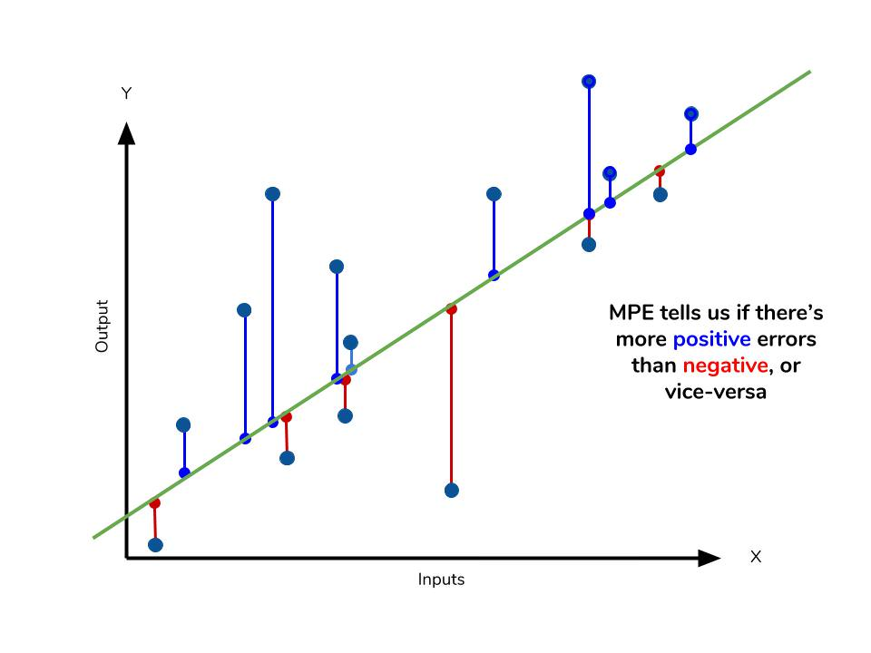

```{r message=FALSE, warning=FALSE, include=FALSE}
library(tidyverse)
library(xts)
library(timetk)
library(forecast)

library(dplyr)
library(tsibble)
students <- read.csv('./students.csv', skip = 16, header = TRUE, na = '-', strip.white = TRUE, stringsAsFactors = TRUE)
students[, 3:18] <- apply(students[, 3:18], 2, function(y) as.numeric(gsub(",", "", y)))
students.total <- students %>% filter(지역규모 == '계')
students.total.xts <- students %>% filter(지역규모 == '계') %>% select(-지역규모)
students.total.xts <- as.xts(students.total.xts, order.by = as.Date(paste0(students.total.xts[,1], '-01-01'), format = '%Y-%m-%d'))
library(timetk)
students.total.ts <- students %>% 
  filter(지역규모 == '계') %>% 
  select(3:18) %>%
  ts(start = c(1999), frequency = 1)
students.tsibble <- as_tsibble(students, key = 지역규모, index = 연도)

employees <- read.csv('./산업별_취업자_20210206234505.csv', header = TRUE, na = '-', strip.white = TRUE, stringsAsFactors = TRUE)
colnames(employees) <- c('time', 'total', 'employees.edu')
employees$time <- as.Date(paste0(employees$time, '. 01'), format = '%Y. %m. %d')
employees.ts <- ts(employees, start = c(2013, 01), frequency = 12)
employees.xts <- xts(employees[,2:3], order.by = employees[,1])
employees$yearmonth <- yearmonth(employees$time)
employees.tsibble <- as_tsibble(employees, index = yearmonth)

covid19 <- read.csv('./covid19.csv', header = TRUE, na = '-', strip.white = TRUE, stringsAsFactors = TRUE)
colnames(covid19) <- c('category', 'status', 'date', 'value')
covid19 <- covid19[, c(3, 1, 2, 4)]
covid19$date <- as.Date(covid19$date, "%Y. %m. %d")
covid19.by.age <- covid19 %>% 
  filter(grepl('세', category)) %>% 
  filter(category != '세종')
covid19.by.age$value <- ifelse(is.na(covid19.by.age$value), 0, covid19.by.age$value)
wide.covid19.by.age <- tidyr::spread(covid19.by.age, category, value)

wide.covid19.by.age.ts = ts(wide.covid19.by.age[, 2:10], frequency = 365)
wide.covid19.by.age.xts <- as.xts(wide.covid19.by.age[, 3:10], order.by = wide.covid19.by.age$date)
wide.covid19.by.age.tsibble <- as_tsibble(wide.covid19.by.age, index = date)

```

# 시계열 forecasting Part III - 시계열 분석 Framework

얼마전까지만 해도 시계열 분석을 위해서 다수의 모델을 비교하기 위해서는 각각의 모델을 따로 구축한 후 성능분석 지수들을 비교하여 가장 좋은 모델을 선택하는 것이 일반적이었다. 다행히 forecast 패키지에서 시계열 분석을 위한 많은 모델을 지원하지만 모델을 생성하기 위한 사용법이 다 달라서 모델을 하나하나 만들고 분석해야한다.

하지만 최근의 머신러닝 모델 선택의 추세는 머신러닝 프레임워크 위에서 동일한 인터페이스로 여러 모델을 동시에 만들고 이에 대한 성능분석 테이블을 만들어서 제공하는 방법을 사용한다.

최근의 시계열 모델링에서도 이러한 흐름이 적용되는데 시계열 분석 전용 프레임워크들이 속속 소개되고 있다. 이번 장에서는 시계열 분석 전용 프레임워크인 fable과 modeltime으로 여러 시계열 모델을 생성하고 분석하는 방법을 소개하고자 한다.

## 성능분석 지수

시계열 분석 모델간의 성능을 분석하기 위해서는 예측 정확도 평가 판단용 지수들을 사용하여야 한다. 대부분의 예측 정확도 평가 지수는 시계열 모델을 통해 생성된 모델의 적합값과 실제값의 차이인 오차항을 평가하여 산출된다. forecast 패키지에서 제공하는 accuracy() 함수를 사용하면 간단히 여러 성능지수를 간단히 구할 수 있다.

### RMSE(Root Means Squaread Error)

RMSE는 성능평가에 대표적으로 쓰이는 지수이다. 오차항(Error)을 제곱(Squared)한 값들의 평균(Mean)을 제곱근(Root)한 값이다. 오차항을 제곱하기 때문에 큰 오차는 더욱 크게 계산되는 패널티가 존재한다. 산출 방법은 RMSE의 뒤에서부터 차근히 계산해 나가면 구할 수 있다. 오차항을 대상으로 산출한 지수이기 때문에 이 수치가 작을수록 더 좋은 모델로 볼 수 있다.

```{r RMSE}
ets <- ets(students.total.ts[,1])
arima <- auto.arima(students.total.ts[,1])
(students.total.ts[,1] - fitted(ets))^2 %>% mean() %>% sqrt()
forecast::accuracy(ets)
(students.total.ts[,1] - fitted(arima))^2 %>% mean() %>% sqrt()
forecast::accuracy(arima)
```

### MAE

MAE는 오차항(Error)의 절대값(Absolute)들의 평균(Mean)값이다. 오차항들은 양수 또는 음수로 나타나기 때문에 부호를 뗀 절대값의 평균으로 실제값과 모델에 의해 산출된 값의 평균으로 이해하면 쉽게 이해된다. 오차항을 대상으로 산출한 지수이기 때문에 작을수록 더 좋은 모델로 볼 수 있다

```{r MAE}
(students.total.ts[,1] - fitted(ets)) %>% abs() %>% mean()
(students.total.ts[,1] - fitted(arima)) %>% abs() %>% mean()
```

### MPE

MPE는 오차항(Error)의 백분률(Precentage)의 평균(Mean)을 의미한다. 오차항의 백분률은 실제값에서 적합값을 뺀 오차항을 실제값으로 나눈 값이다. 실제값이 101이고 적합값이 100이라면 101-100 = 1이 오차항이고 이 오차항 1을 실제값 101로 나눈 값(1/101)이 오차항의 백분률이다. 이들 값의 평균이 MPE값이다.

백분률의 평균값이기 때문에 1보다 작은 값이며 제곱이나 절대값이 취해지지 않았기 때문에 값의 크기로 우수 모델을 나눌 수 없다. 다만 이 지수는 모델에 비해 실제값이 위쪽방향(overestimate)에 위치하는지, 아래쪽 방향(underestimate)에 위치하는지에 대한 판단에 주로 사용된다. [^forecasting-iii-1]

[^forecasting-iii-1]: <https://www.dataquest.io/blog/understanding-regression-error-metrics/>



```{r MPE}
((students.total.ts[,1] - fitted(ets)) / students.total.ts[,1] * 100) %>% mean()
((students.total.ts[,1] - fitted(arima)) / students.total.ts[,1] * 100) %>% mean()
```

### MAPE

MAPE는 오차항(Error)의 백분률(Precentage)의 절대값의 평균(Mean)을 의미한다. 앞의 MPE값과 유사하게 산출되는 값이지만 이 값은 MAE값과 더 관계가 있다. MAE 값은 오차항의 절대값 평균이지만 MAPE는 오차항 백분률의 절대값 평균이기 때문이다. 예를 들자면 두개의 오차항이 모두 1이라하더라도 실제값이 10일때 오차항 1과 실제값이 100일때 오차항 1은 다르기 때문이다. MAE를 구할때는 실제값에 관련없이 1이라는 값은 동일하게 계산되지만 MAPE에서는 동일한 1값이라도 실제값에 따라 다르게 계산된다.

이 값은 앞의 RMSE와 MAE와 가장 다른 점은 백분율을 사용하기 때문에 결과값들이 Y축 값에 의존적이지 않다는 점이다. 실제값과 적합값이 같으면(정확하게 예측하면) 분자가 0이 되기 때문에 MPE값은 0이다. 결국 0과 가까운 값일 수록 예측 성능이 우수하다고 평가할 수 있다.

다만 MPE나 MAPE 모두 치명적인 약점을 지니는데 실제값이 0인 경우 산출이 어렵다는 점(오차항을 실제값으로 나눠야하는데 분모가 0이 되면 값을 구할수 없으니까)과 실제값이 매우 작은 경우에는 MAPE값이 매우 커질 수 있다는 점이다.

```{r MAPE}
((students.total.ts[,1] - fitted(ets)) / students.total.ts[,1] * 100) %>% abs() %>% mean()
((students.total.ts[,1] - fitted(arima)) / students.total.ts[,1] * 100) %>% abs() %>% mean()
```

## fable

-   **fable** is designed for `tsibble` objects, **forecast** is designed for `ts` objects.

-   **fable** handles many time series at a time, **forecast** handles one time series at a time.

-   **fable** can fit multiple models at once, **forecast** fits one model at a time.

-   **forecast** produces point forecasts and prediction intervals. **fable** produces point forecasts and distribution forecasts. In **fable**, you can get prediction intervals from the forecast object using `hilo()` and in plots using `autoplot()`.

-   **fable** handles ensemble forecasting easily whereas **forecast** has no facilities for ensembles.

-   **fable** has a more consistent interface with every model specified as a formula.

-   Automated modelling in **fable** is obtained by simply not specifying the right hand side of the formula. This was shown in the `ARIMA()` and `ETS()` functions here.

```{r fable}
library(fable)
model.fable.employees <- employees.tsibble %>%
  model(
    ets = ETS(total), 
    arima = ARIMA(total), 
    snaive = SNAIVE(total), 
    tslm = TSLM(total), 
    rw = RW(total)
  )
employees.tsibble %>% model(ETS(total)) %>% report()

forecast.fable.employees <- model.fable.employees %>% fable::forecast(h = '2 years')

forecast.fable.employees %>% autoplot(level = NULL, data = employees.tsibble)

accuracy(model.fable.employees)
```

## modeltime

### linear_reg 함수(tidymodels, parsnip, modeltime 패키지)

본 절에서 parship 패키지와 modeltime 패키지를 사용하여 선형 회귀 모델을 생성하는 방법을 소개한다. parsnip 패키지는 머신러닝 패키지인 'caret' 패키지를 개발한 Max Kuhn이 개발한 패키지이다. 이 패키지는 R, Spark, Stan 등의 엔진에서 사용하는 함수들이 함수마다 다른 인수를 사용하기 때문에 사용자들이 사용하기 힘들다는 점에 착안하여 인수 이름을 표준화하여 사용할 수 있는 인터페이스를 제공한다.[^forecasting-iii-2]

[^forecasting-iii-2]: <https://cran.r-project.org/web/packages/parsnip/index.html>

parsnip은 R의 여러 패키지에서 유사한 기능으로 제공하는 함수들을 사용하는 표준화된 접근 방법을 제공하는데 이 패키지를 사용하여 전체적인 머신러닝 모델을 생성하기 위해서는 몇가지 더 필요한 패키지를 사용해야한다. tidymodels(tidy 타입의 모델생성), skim(데이터 탐색), rsample(훈련용, 테스트용 데이터 분리), reciepes(데이터 전처리), yardstick(성능 분석)등의 패키지를 사용하는 방법이 많이 사용되고 있다. 그러나 시계열 모델에서는 tidymodels, modeltime 패키지를 사용할 수 있다.

modeltime은 tidymodels 환경에서 시계열 데이터의 예측 프레임워크로 forecast 패키지에서 제공하는 대부분의 예측 방법을 제공하며 facebook에서 개발된 prophet 알고리즘까지 제공한다. [^forecasting-iii-3]

[^forecasting-iii-3]: <https://cran.r-project.org/web/packages/modeltime/index.html>

tidymodels, parsnip, modeltime 패키지를 사용하여 시계열 데이터 선형 회귀 모델은 다음의 순서와 같이 만들 수 있다.

1.  트레이닝 셋과 테스트 셋을 나눈다. (권장되지만 필수는 아니다.)

2.  linear_reg(), set_engine(), fit() 함수를 사용하여 선형 회귀모델을 생성한다. 먼저 linear_reg()함수를 통해 선형 회귀분석을 선언한다. 이 후 set_engine() 함수를 사용하여 선형 회귀 모델을 선정하는 계산방법을 지정한다. 아래의 예제에서는 'lm' 방법을 지정함으로써 최소제곱법을 사용하여 선형 회귀 모델을 선정하게 된다. 마지막으로 모델링을 위한 포뮬라와 데이터를 fit() 함수를 통해 전달함으로서 최종 모델이 생성된다.[^forecasting-iii-4]

3.  생성된 모델을 modeltime_table() 함수에 적용하여 모델 테이블을 생성한다. 향후 설명하겠지만 모델 테이블에 여러 모델을 전달할 수 있는데 모델 테이블에 전달된 각각의 모델은 추후 성능비교 테이블이 제공되기 때문에 여러 모델의 성능을 비교하는데 편리하게 사용될 수 있다 .

4.  modeltime_calibrate() 함수를 사용하여 테스트 데이터를 사용하여 모델을 교정한다. 앞서 테스트 셋을 나누지 않은 경우는 전체 데이터 셋을 사용할 수 있다.

5.  modeltime_forecast() 함수를 사용하여 미래 데이터를 생성한다. 이후 plot_modeltime_forecast() 함수를 사용하여 plotting을 생성한다.

[^forecasting-iii-4]: <https://www.tidymodels.org/start/models/>

```{r linear_reg, message=FALSE, warning=FALSE}
###  parsnip과 modeltime을 전체 취업자수에 적용한 linear modeling(tredn + seasonality)
library(modeltime)
library(parsnip)
library(tidymodels)
### 트레이닝 셋과 테스트 셋을 나눈다
splits <- initial_time_split(employees, prop = 0.9)
###  trend와 season을 반영하여 linear model을 생성
model_fit_lm <- linear_reg() %>%
  set_engine("lm") %>%
  fit(total ~ as.numeric(time) + factor(lubridate::month(time, label = TRUE), ordered = FALSE),
      data = training(splits))
###  모델 테이블 생성
model_tbl <- modeltime_table(model_fit_lm)
###  테스팅 셋으로 모델 교정
calibration_tbl <- model_tbl %>% modeltime_calibrate(new_data = testing(splits))
###  3년 예측치 생성후 plotting
calibration_tbl %>%
  modeltime_forecast(
    h = '3 years',
    actual_data = employees, 
    conf_interval = 0.95
  ) %>%
  plot_modeltime_forecast(
    .interactive      = TRUE
  )
```

```{r covid_linear_reg}
###  parsnip과 modeltime을 일별 코로나 발생 데이터(0-9세)에 적용한 linear modeling(tredn + seasonality)
covid19.by.age$value1 <- ifelse(is.na(covid19.by.age$value), 0, covid19.by.age$value)
### 트레이닝 셋과 테스트 셋을 나눈다
splits <- initial_time_split(covid19.by.age %>% filter(category == '0-9세'), prop = 0.9)
###  trend와 season을 반영하여 linear model을 생성
model_fit_lm <- linear_reg() %>%
  set_engine("lm") %>%
  fit(value ~ as.numeric(date),
      data = training(splits))
###  모델 테이블 생성
model_tbl <- modeltime_table(model_fit_lm)
###  테스팅 셋으로 모델 교정
calibration_tbl <- model_tbl %>% modeltime_calibrate(new_data = testing(splits))
###  3년 예측치 생성후 plotting
calibration_tbl %>%
  modeltime_forecast(
#    .newdata = testing(splits),
    h = '100 days',
    actual_data = covid19.by.age %>% filter(category == '0-9세')
    ) %>%
  plot_modeltime_forecast(
    .interactive      = TRUE
  )
```
