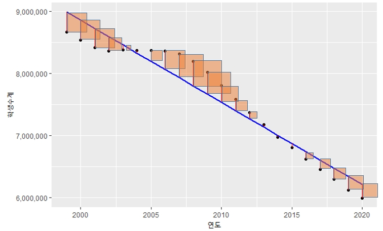
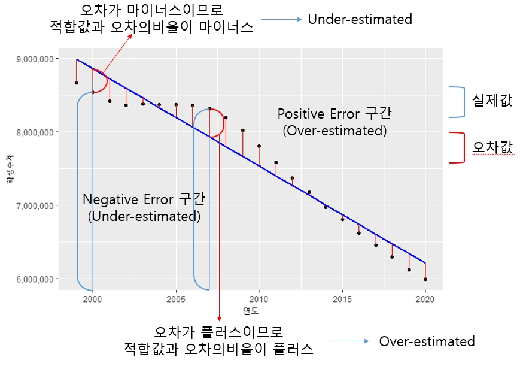
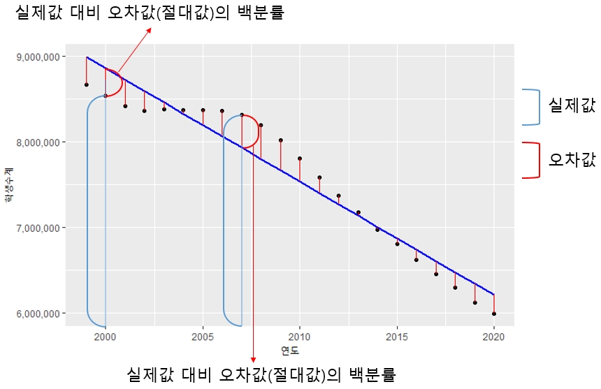
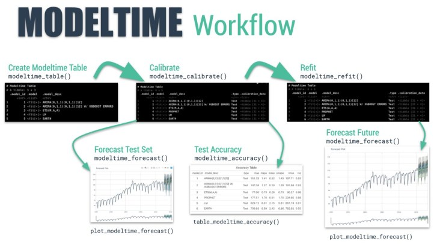

```{r message=FALSE, warning=FALSE, include=FALSE}
library(dplyr)
library(xts)
library(tsibble)
library(readxl)
students.all <- read_excel("./students.xlsx", skip = 16, na = '-', sheet = 1, col_types = c('text', 'text', 'numeric', 'numeric', 'numeric', 'numeric', 'numeric', 'numeric', 'numeric', 'numeric', 'numeric', 'numeric', 'numeric', 'numeric', 'numeric', 'numeric', 'numeric', 'numeric'))
students <- students.all %>% 
  filter(지역규모 == '계') %>% select(-지역규모)
students$연도 <- as.Date(paste0(students$연도, '-01-01'))
students.ts <- ts(students, frequency = 1, start = 1999)
students.xts <- as.xts(students[,-1], order.by = students$연도)
students.tsibble <- students %>% 
  mutate(연도 = yearmonth(paste0(students$연도, '-01-01')))
students.tsibble <- as_tsibble(students.tsibble, index = 연도)


employees <- read.csv('./산업별_취업자_20210206234505.csv', header = TRUE, na = '-', strip.white = TRUE, stringsAsFactors = TRUE)
colnames(employees) <- c('time', 'total', 'employees.edu')
employees$time <- as.Date(paste0(employees$time, '. 01'), format = '%Y. %m. %d')
employees.ts <- ts(employees, start = c(2013, 01), frequency = 12)
employees.xts <- xts(employees[,2:3], order.by = employees[,1])
employees.tsibble <- as_tsibble(employees, index = time)


covid19 <- read.csv('./covid19.csv', header = TRUE, na = '-', strip.white = TRUE, stringsAsFactors = TRUE)
colnames(covid19) <- c('category', 'status', 'date', 'value')
covid19 <- covid19[, c(3, 1, 2, 4)]
covid19$date <- as.Date(covid19$date, "%Y. %m. %d")
covid19 <- covid19 %>% 
  filter(grepl('세', category)) %>% 
  filter(category != '세종')
covid19$value <- ifelse(is.na(covid19$value), 0, covid19$value)
covid19 <- tidyr::spread(covid19, category, value)
covid19.ts <- ts(covid19[, 2:10], frequency = 365)
covid19.xts <- as.xts(covid19[, 3:10], order.by = covid19$date)
covid19.tsibble <- as_tsibble(covid19, index = date)
knitr::opts_chunk$set(class.source = "watch-out", comment='')
```

# 시계열 forecasting Part III - 시계열 분석 Framework

얼마전 까지만 해도 시계열 분석을 위해서 다수의 모델을 비교하기 위해서는 각각의 모델을 따로 구축한 후 성능분석 지수들을 비교하여 가장 좋은 모델을 선택하는 것이 일반적이었다. 다행히 `forecast` 패키지에서 시계열 분석을 위한 많은 모델을 지원하지만 모델을 생성하기 위한 사용법이 다 달라서 모델을 하나하나 만들고 분석해야 했다.

하지만 최근의 머신러닝 모델 선택의 추세는 머신러닝 프레임워크 위에서 동일한 인터페이스로 여러 모델을 동시에 만들고 이에 대한 성능분석 테이블을 만들어서 제공하는 방법을 사용한다.

이러한 흐름은 시계열 모델링에서도 해당되는데 시계열 분석 전용 프레임워크들이 속속 소개되고 있다. 이번 장에서는 시계열 분석 전용 프레임워크인 `fable`과 `modeltime`으로 여러 시계열 모델을 생성하고 분석하는 방법을 소개하고자 한다.

## 성능분석 지수

시계열 분석 모델간의 성능을 분석하기 위해서는 예측 정확도를 평가해야 할 근거가 필요하다. 이를 위해 다양한 지수들이 사용되는데 대부분의 지수는 시계열 모델을 통해 생성된 모델의 적합값과 실제값의 차이인 오차항을 평가하여 산출된다. `forecast` 패키지에서 제공하는 `accuracy()` 함수를 사용하면 간단히 여러 성능 지수를 포함한 성능 지표를 간단히 구할 수 있다.

### MAE(Means Absolute Error)

MAE는 가장 계산이 편리한 성능 평가 지수이다. 실제값에서 적합값을 뺀 오차는 플러스 값일 수 도 있고 마이너스 값일 수도 있다. 이를 단순히 더하면 오차들이 서로 상쇄되어 0에 가까울 수 있지만 이것이 모델의 성능이 우수해서 0에 가까운 값이 나온 건지 오차들이 상쇄되어 0에 가까운 값이 나온 것인지 알 수가 없다. 이런 경우를 방지하기 위해 각각 오차의 절대값 평균으로 모델의 성능을 평가하기도 한다.

아래의 그림은 앞서 적합값과 잔차를 설명할 때 참조했던 그림이다. 아래의 그림에서 빨간색 선의 길이 평균값이 MAE값이 된다.

오차들의 평균값이기 때문에 MAE값이 작을수록 좋은 모델로 평가된다.

```{r MAE, echo=FALSE, warning=FALSE, message=FALSE}
library(ggplot2)
### 학생수계 열의 선형회귀모형을 생성
student.ts.lm <- forecast::tslm(students.ts[,2] ~ trend, data = students.ts)                   
### 선형회귀모형에 의한 잔차를 res에 저장
res <- as.vector(residuals(student.ts.lm))
### 선형회귀모형에 의한 적합값을 fit에 저장
fit <- as.vector(fitted(student.ts.lm))
ggplot(students, aes(x = 연도, y = 학생수계)) + 
  geom_point() + 
  geom_line(aes(y = fit, group = 1), color = 'blue', size = 1) +
  geom_segment(aes(xend = 연도, yend = fit), color = 'red') + 
  scale_color_continuous(low = "black", high = "red") +
  scale_y_continuous(labels = scales::number_format(big.mark = ','))
```

### RMSE(Root Means Squaread Error)

RMSE는 성능 평가에 대표적으로 쓰이는 지수이다. 오차(Error)를 제곱(Squared)한 값들의 평균(Mean)을 제곱근(Root)한 값이다. RMSE를 시각적으로 표현하면 아래의 그림과 같이 표현된다. 앞선 MAE는 단순히 길이의 평균이지만 RMSE는 길이를 제곱한 것이기 때문에 아래의 그림과 같이 한 변이 오차의 길이인 정사각형의 넓이가 된다. 결국 RMSE는 이 넓이들의 평균값에 다시 루트를 씌워 넓이를 다시 길이로 변환한 값이다.



오차를 제곱하기 때문에 큰 오차는 더욱 크게 계산되는 패널티가 존재한다. 산출 방법은 RMSE의 뒤에서부터 차근히 계산해 나가면 구할 수 있다. 오차를 대상으로 산출한 지수이기 때문에 이 수치가 작을수록 더 좋은 모델로 평가된다.

### MPE(Mean Percentage Error)

MPE는 오차(Error)의 백분률(Precentage)의 평균(Mean)을 의미한다. 오차의 백분률은 실제값에서 적합값을 뺀 오차를 실제값으로 나눈 값이다. 실제값이 101이고 적합값이 100이라면 101-100 = 1이 오차이고 이 오차 1을 실제값 101로 나눈 값(1/101)이 오차항의 백분율이고 이들 값의 평균이 MPE값이다.

백분률의 평균값이고 제곱이나 절대값이 취해지지 않았기 때문에 값의 크기로 우수 모델을 나누기 보다는 오차의 편향을 살펴보는데 더 많이 활용된다. 모델에 비해 실제값이 위쪽방향(overestimate)에 위치하는지, 아래쪽 방향(underestimate)에 위치하는지에 대한 판단에 주로 사용된다. [^forecasting-iii-1]

[^forecasting-iii-1]: <https://www.dataquest.io/blog/understanding-regression-error-metrics/>



### MAPE

MAPE는 오차(Error)의 백분률(Precentage)의 절대값(Absolute)의 평균(Mean)을 의미한다. 앞의 MPE값과 유사하게 산출되는 값이지만 이 값은 MAE값을 백분률로 산출한 값이다. 같은 오차이더라도 실제 값의 크기에 따라 오차의 크기가 다르기 때문에 이를 반영하는 지수이다. 예를 들자면 두 값의 오차가 모두 1이라하더라도 실제값이 10일때 오차 1과 실제값이 100일때 오차 1은 다르기 때문이다. MAE를 구할때는 실제값에 관련없이 1이라는 값은 동일하게 계산되지만 MAPE에서는 동일한 1값이라도 실제값에 따라 다르게 계산된다.

이 값이 RMSE와 MAE와 가장 다른 점은 백분율을 사용하기 때문에 결과값들이 Y축 의 실제값과 큰 관계가 없다는 것이다. 실제값과 적합값이 같으면(정확하게 예측하면) 분자로 작용하는 오차가 0이 되기 때문에 MPE값은 0이다. 결국 0과 가까운 값일 수록 예측 성능이 우수하다고 평가할 수 있다.

다만 MPE나 MAPE 모두 치명적인 약점을 지니는데 실제값이 0인 경우 산출이 어렵다는 점(분모가 0)과 실제값이 매우 작은 경우(분모가 매우 작은 값)에는 MAPE값이 매우 커질 수 있다는 점이다.



## fable framework

fable 프레임워크는 패키지로 제공되는데, 시계열 데이터 분석을 위한 프레임워크로 평균모델, 랜덤워크 모델 등 심플한 모델부터 지수 평활 모델, 자기 회귀 모델과 같이 전통적으로 오랫동안 사용되어 온 모델, 신경망 모델, prophet 모델 등 최근에 개발된 모델까지 같은 인터페이스를 사용하여 모델의 생성, 예측 데이터 생성, 모델 성능 지표 산출, 모델 시각화 등을 통해 최적의 모델을 선택할 수 있는 종합적인 방법을 제공한다.

fable 프레임워크는 지수 평활 모델, 자기 회귀 모델 등을 생성할 때 선택해야 하는 모델 계수들을 자동적으로 선택해주고 일변량과 다변량을 모두 지원하기 때문에 사용하기 쉽다.

이 프레임워크는 `fabletools`패키지를 기반으로 작동하고 `tidyverse` 생태계(echosystem)에서 사용하는 워크플로우(work flow)를 준용하여 모델을 평가, 시각화 및 결합하는 도구를 제공한다.

`fable` 프레임워크는 `forecast` 패키지를 tidy 한 데이터[^forecasting-iii-2]를 사용하는 방법을 활용하여 모델링하고 사용할 수 있는 다양한 함수들을 제공한다.

[^forecasting-iii-2]: tidy 데이터의 특징과 활용방법은 [[https://statkclee.github.io/data-science/data-handling-tidyr.html](https://statkclee.github.io/data-science/data-handling-tidyr.htmldmf)](https://statkclee.github.io/data-science/data-handling-tidyr.html)을 참조하라

`forecast` 패키지는 `ts` 객체를 활용하기 때문에 `tidy` 생태계를 사용하는데 한계가 있었다. `fable`은 이를 극복하기 위해 tidy 생태계의 기본 데이터 객체인 `tibble` 객체를 기반으로 한 `tsibble`을 사용한다.

`forecast`와 `fable`의 차이는 다음과 같다.

|                  |                                 fable                                  |         forecast         |
|:----------------:|:----------------------------------------------------------------------:|:------------------------:|
|       객체       |                                tsibble                                 |            ts            |
| 단일/다중 시계열 |                            다중 시계열 가능                            |    단일 시계열만 가능    |
|    모델 적용     |                         동시에 여러 모델 적용                          |   동시에 한 모델 적용    |
|     예측결과     | 점 예측과 분포 제공(`hilo()` 함수를 통해 `autoplot()`으로 플로팅 가능) | 점 예측과 예측 범위 제공 |
| 앙상블 모델예측  |                                  가능                                  |           불가           |

`fable`을 활용해 시계열 모델을 세우고 plotting, 예측치 생성은 다음의 순서를 통해 구현할 수 있다.

::: {.boxBorder}
1.  분석 대상 시계열 데이터를 트레이닝 셋과 테스트 셋으로 분리한다.
2.  `fable` 패키지의 `model()`을 사용하여 동시에 실행되어야 할 모델들의 생성 함수를 넣어준다.

| 모델          | 함수명                                         | 예                     |
|---------------|------------------------------------------------|------------------------|
| 선형회귀      | TSLM()                                         | TSLM(학생수 + trend()) |
| 평균모델      | MEAN()                                         | MEAN(학생수)           |
| naive         | NAIVE()                                        | NAIVE(학생수)          |
| 랜덤워크      | RW()                                           | RW(학생수)             |
| 지수평활(ets) | ETS                                            | ETS(학생수)            |
| arima         | ARIMA                                          | ARIMA(학생수)          |
| 신경망        | NNETAR                                         | NNETAR(학생수)         |
| prophet       | prophet(`fable.prophet` 패키지가 필요, 소문자) | PROPHET(학생수)        |

3.  생성된 모델을 forecast() 함수를 사용하여 원하는 미래만큼(매개변수 `h`를 사용)의 예측값을 산출한다.
4.  `autoplot()`을 사용하여 plotting 한다. 원본 데이터와 같이 plotting 하려면 원본데이터를 매개변수로 넣어주고 예측 레벨을 plotting하지 않으려면 `level` 매개변수를 `NULL`로 세팅한다.
5.  여러 모델들의 성능측정 지수를 확인하려면 forecast 결과 객체 테스트 데이터셋을 accuracy() 함수의 매개변수로 전달한다.
6.  여러 성능측정 지수를 확인하여 가장 성능이 좋은 모델을 선정하고(필자는 RMSE가 가장 낮은 모델을 주로 사용한다.) 모델객체에 select() 함수에 해당 모델 컬럼명을 넣어준다.
7.  선정된 모델을 사용하여 다시 `forecast()`로 미래값을 예측하고 `autoplot()` 함수로 plot을 생성한다.
:::

### 미래 학생수 예측

`fable` 프레임워크로 미래 학생수를 예측해 보자.

먼저 트레이닝 셋과 테스트셋을 나눈다. 트레이닝 데이터 셋과 테스트 데이터 셋은 80:20으로 나눈다.

```{r fable_students, message=FALSE, warning=FALSE}
split <- floor(nrow(students.tsibble) * 0.8)
students.tsibble.tr <- students.tsibble[1:split, ]  
students.tsibble.test <- students.tsibble[(split+1):nrow(students.tsibble), ]  
```

::: {.comment}
-   코드설명

    -   students.tsibble의 행갯수(`nrow`)의 0.8을 곱한 값의 내림값(`floor`)을 구해 80:20으로 나눌 위치를 split에 저장

    -   students.tsibble의 1열부터 split열까지를 studets.tsibble.tr로 저장

    -   students.tsibble의 split+1열부터 마지막 열까지를 studets.tsibble.test로 저장
:::

`model()`에 트레이닝 데이터 셋과 만들고 싶은 모델 함수를 사용하여 모델 데이터프레임을 만든다. 아래에서는 ets, arima, naive, tslm, rw, mean, nnetar, prophet의 8가지 모델을 만들었다.[^forecasting-iii-3]

[^forecasting-iii-3]: 예제 실행 시 `prophet()`에서 해당 컬럼을 찾을 수 없다는 오류가 나는 경우가 있음.  `fable.prophet` 패키지의 `prophet()`과 `prophet` 패키지의 `prophet()`이 같은 함수명이기 때문에 발생하는 오류임. 따라서 정확한 패키지 명을 같이 호출해주거나 패키지 로딩 순서를 바꿔주며 해결됨

```{r fable_students1, message=FALSE, warning=FALSE}
 library(fable)  
 library(fable.prophet)  
model.fable.students <- model(students.tsibble.tr,    
        ets = ETS(학생수계),
        arima = ARIMA(학생수계),
        naive = NAIVE(학생수계),
        tslm = TSLM(학생수계 ~ trend()),
        rw = RW(학생수계),
        mean = MEAN(학생수계),
        nnetar = NNETAR(학생수계),
        prophet = fable.prophet::prophet(학생수계)
         )
```

::: {.comment}
-   코드설명

    -   `fable`과 `fable.prophet` 패키지를 로딩 code 3 : `model()`함수에 총 8개의 모델이 담긴 데이터프레임을 만듬.
    -   컬럼명은 ets, arima, naive, tslm, rw, mean, nnetar, prophet으로 설정하여 model.fable.students 객체 생성. TSLM 모델에는 추세를 반영해 줌
:::

위에서 생성한 model.fable.students 객체를 `forecast()`에 전달하여 예측 결과를 생성한다. `h` 매개변수로 예측 기간을 설정한다.

```{r fable_students2, message=FALSE, warning=FALSE}
forecast.fable.students <- forecast(model.fable.students, h = 10)
```

::: {.comment}
-   코드설명

    -   `forecast()` 함수에 예측에 사용할 모델 데이터프레임(model.fable.students)과 예측기간을 10년(`h = 10`)으로 설정하여 결과를 forecast.fable.students에 저장
:::

`autoplot()`에 `forecast()` 결과, 원본 데이터, 레벨 매개변수를 사용하여 plot을 생성한다.

```{r fable_students3, message=FALSE, warning=FALSE}
autoplot(forecast.fable.students, students.tsibble, level = NULL)
```

::: {.comment}
-   코드설명

    -   `autoplot()` 함수에 plot을 생성할 forecast 결과, 원본데이터, 레벨 생략(level = NULL)을 전달하여 plot을 생성
:::

생성한 모델들의 성능 측정 지표를 확인하기 위해 `forecast()` 결과를 `accuracy()` 매개변수로 전달한다. 성능 측정에 사용하기 위해 생성해 놓았던 전체 데이터의 20% 테스트 데이터 셋을 사용하여 성능 측정 지표를 산출한다.

```{r fable_students4, message=FALSE, warning=FALSE}
accuracy(forecast.fable.students, students.tsibble.test) %>%
 arrange(RMSE)
```

::: {.comment}
-   코드설명

    -   `accuracy()` 함수에 forecast 결과, 테스트 데이터 셋인 students.tsibble.test를 사용하여 성능측정 지수 데이터프레임을 생성하고 RMSE(`arrange(RMSE)`)를 기준으로 정렬
:::

성능 측정 지수를 확인하여 가장 성능이 좋은 모델 2개를 선택하여 저장한 데이터프레임을 생성한다.

```{r fable_students5, message=FALSE, warning=FALSE}
best.model.fable.students <- model.fable.students %>%
 select(ets, prophet)
```

::: {.comment}
-   코드설명

    -   RMSE 값이 가장 작은 2개의 모델인 ets, prophet모델을 `select()`를 사용해 best.model.fable.students에 저장한다.
:::

가장 좋은 모델로 평가된 모델의 예측치를 다시 산출하고 이 결과를 사용하여 plot을 생성한다. 생성할 때는 원본 데이터를 같이 넣어주어야 데이터의 흐름을 파악하기 쉽고 모델에 의해 생성되는 적합값을 같이 plotting해주면 전반적인 모델의 예측력을 눈으로 확인할 수 있다. plot을 보다 보기 편하게 하기 위해 plot 제목과 축 제목들을 설정해 주는 것이 좋겠다. `autoplot()`는 `ggplot2`를 기반으로 생성된 plot이기 때문에 `ggplot2`의 plot 생성 방법을 사용하면 plot을 원하는 대로 꾸밀 수 있다.

```{r fable_students6, message=FALSE, warning=FALSE}
best.model.fable.students %>% forecast(h = 10) %>%
  autoplot(students.tsibble, alpha = 0.6) +
  autolayer(fitted(best.model.fable.students))
```

::: {.comment}
-   코드설명

    -   `forecast()`를 사용하여 RMSE가 가장 작은 ets, prophet모델이 저장된 best.model.fable.students를 사용하여 10년치 데이터를 예측(`h = 10`)

    -   `autoplot()`를 사용하여 원본 데이터와 예측치 데이터의 plot을 만들고 best.model.fable.students에 저장된 ets, prophet 모델의 적합치를 같이 plotting함.

    -   `geom_point`를 사용하여 원본데이터에 point를 찍어줌.
:::

### 미래 취업자수 예측

fable 프레임워크를 사용하여 전체 취업자 수를 예측해보자.

```{r fable_employees, message=FALSE, warning=FALSE}
employees$yearmonth <- yearmonth(employees$time)
employees.tsibble <- as_tsibble(employees, index = yearmonth)
```

순서에 따라 먼저 트레이닝 데이터 셋과 테스트 데이터 셋을 나눈다. 나누는 비율은 90:10의 비율로 나누었다.

```{r fable_employees0, message=FALSE, warning=FALSE}
split <- floor(nrow(employees.tsibble) * 0.9)
n <- nrow(employees.tsibble)
employees.tsibble.tr <- employees.tsibble[1:split, ]
employees.tsibble.test <- employees.tsibble[(split+1):n, ]
```

::: {.comment}
-   코드설명

    -   `floor`, `nrow`를 사용하여 employees.tsibble 행갯수(`nrow`)의 0.8을 곱한 값의 내림값(`floor`)을 구해 90:10으로 나눌 위치를 split에 저장

    -   `nrow`를 사용하여 employees.tsibble의 1열부터 split열까지를 employees.tsibble.tr로 저장

    -   employees.tsibble의 split+1열부터 마지막 열까지를 employees.tsibble.test로 저장
:::

`model()`로 앞에서 생성한 트레이닝 데이터 셋과 만들고 싶은 모델 함수를 사용하여 모델 데이터프레임를 만든다. 아래에서는 ets, arima, naive, tslm, rw, mean, nnetar, prophet의 8가지 모델을 만들었는데 `tidy` 데이터 객체의 특성을 활용하기 위해 파이프라인(`%>%`)을 사용하였다. 그리고 취업자 데이터는 계절성이 존재하기 때문에 선형 모델에 추세와 계절성을 추가하였다.

```{r fable_employees1, message=FALSE, warning=FALSE}
 model.fable.employees <- employees.tsibble.tr %>% 
   model(ets = ETS(total),
         arima = ARIMA(total),
         naive = NAIVE(total),
         tslm = TSLM(total~trend() + season(12)),
         rw = RW(total),
         mean = MEAN(total),
         nnetar = NNETAR(total),
         prophet = prophet(total)
         )
```

::: {.comment}
-   코드설명

    -   `model()`을 사용해 8가지 모델을 생성. m`odel()`의 호출은 employees.tsibble.tr 데이터를 첫번째 매개변수로 사용하기 위해 `%>%`을 사용하여 전달.
    -   실행 결과는 model.fable.employees에 저장.
:::

앞에서 생성한 model.fable.employees을 `forecast()`를 사용하여 24개월 미래 데이터를 예측한다.

```{r fable_employees2, message=FALSE, warning=FALSE}
forecast.fable.employees <- model.fable.employees %>% forecast(h = 24)
```

::: {.comment}
-   코드설명

    -   model.fable.employees를 `%>%`을 이용하여 `forecast()`의 첫번째 매개변수로 전달. `forecast()`의 예측기간을 설정하기 위해 `h = 24`를 설정.
    -   실행 결과는 forecast.fable.employees에 저장.
:::

예측된 데이터를 사용하여 plot을 만들고 각각의 모델에서 산출한 미래 예측치를 살펴본다.

```{r fable_employees3, message=FALSE, warning=FALSE}
forecast.fable.employees %>% 
  autoplot(employees.tsibble, level = NULL) +
  labs(title = 'fable로 생성한 8가지 모델 예측 plot', x = '년월', y = '취업자수')
```

::: {.comment}
-   코드설명

    -   `forecast()`로 예측한 24개월이후 결과가 저장된 forecast.fable.employees를 `%>%`로 `autoplot()`으로 전달해서 plot을 생성.
:::

육안으로는 어느 모델이 우수한지 알아보기가 힘들다. 따라서 성능 측정 지표를 확인해서 가장 성능이 좋은 모델을 선택한다

```{r fable_employees4, message=FALSE, warning=FALSE}
forecast.fable.employees %>% accuracy(employees.tsibble.test) %>% arrange(RMSE)
```

::: {.comment}
-   코드설명

    -   `forecast()`로 예측한 24개월이후 결과가 저장된 forecast.fable.employees를 `%>%`로 `accuracy()`로 전달해서 성능측정 지수를 산출.
    -   성능측정 지수를 산출하는 데이터는 테스트 데이터 셋을 사용하고 결과를 RMSE로 정렬한 결과를 출력.
:::

화면에 출력된 성능측정 지수를 확인하여 가장 좋은 모델 2가지를 가지는 데이터프레임을 만들어준다.

```{r fable_employees5, message=FALSE, warning=FALSE}
best.model.fable.employees <- model.fable.employees %>%
  select(naive, rw)
```

::: {.comment}
-   코드설명

    -   여러가지 모델을 만들어 담아놓은 model.fable.employees 데이터프레임에서 RMSE가 가장 작은 두 모델인 naive와 rw모델을 `select()`를 사용하여 best.model.fable.employees에 저장.
:::

가장 좋은 모델로 평가된 모델의 예측치를 다시 산출하고 이 결과를 사용하여 plot을 생성한다. 앞에서 설명한 바와 같이 plot 생성시에는 원본 데이터와 모델의 적합값을 같이 넣어주는 게 좋고 plot을 보다 보기 편하게 하기 위해 plot 제목과 축 제목들을 설정해 주는 것이 좋다.

```{r fable_employees6, message=FALSE, warning=FALSE}
best.model.fable.employees %>%
  forecast(h = 12) %>%
  autoplot(employees.tsibble, level = NULL, lwd = 1) +
  autolayer(fitted(best.model.fable.employees), lwd = 1) +
  geom_point(aes(x = yearmonth, y = total)) +
  labs(title = '전체 취업자수 예측 모델', x = '년월', y = '취업자수')
```

::: {.comment}
-   코드설명

    -   가장 RMSE가 낮은 두 모델이 담긴 best.model.fable.employees을 `%>%`을 사용하여 `forecast()`에 전달.
    -   `forecast()` 결과를 %\>%를 사용하여 `autoplot()`에 전달하는데 원본데이터를 같이 plot하기 위해 원본데이터인 employees.tsibble을 넣어주고 여러 모델 plot이 겹치기 때문에 `level = NULL`로 설정, 예측치 라인을 좀 두껍게 해주기 위해 `lwd = 1`로 설정.
    -   `autolayer()`를 사용하여 두가지 모델의 적합값(`fitted(best.model.fable.employees)`)을 그려주고 예측라인의 두께를 설정(`lwd = 1`).
    -   `geom_point()`로 원본데이터들의 정확한 지점을 표기. `labs()`를 사용하여 plot 제목과 축제목을 설정.
:::

### 미래 코로나 확진자수 예측

0\~9세의 코로나 확진자수를 사용하여 미래 코로나 확진자수를 예측해본다. 앞의 두 예제와 달리 코로나 확진자수는 일별 데이터인데 중간중간 데이터가 빠진 날이 있다. 예측을 위해서는 빠진 날짜의 데이터를 채워 주어야 하는데 `fill_gaps()`를 사용하여 빠진 날짜의 데이터를 0으로 채워 넣었다.

```{r fable_covid1, message=FALSE, warning=FALSE}
fill.covid19.tsibble <- fill_gaps(covid19.tsibble, `0-9세` = 0)
```

::: {.comment}
-   코드설명

    -   `fill_gaps()`는 결측치를 채워주는 함수로 여기서는 wide.covid19.by.age.tsibble의 0-9세 컬럼의 결측치를 0으로 채움.
    -   결과를 fill.covid19.by.age.tsibble에 저장
:::

fill.covid19.by.age.tsibble을 트레이닝 셋과 테스트 셋으로 분리한다. 분리 비율은 90:10으로 설정하였다. 분리 비율은 정해진 값은 없기 때문에 분석자가 데이터를 분석하기 위한 적절한 비율을 선택한다.

```{r fable_covid2, message=FALSE, warning=FALSE}
split <- floor(nrow(fill.covid19.tsibble) * 0.9)
n <- nrow(fill.covid19.tsibble)
fill.covid19.tsibble.tr <- fill.covid19.tsibble[1:split, ]
fill.covid19.tsibble.test <- fill.covid19.tsibble[(split+1):n, ]
```

앞선 예제들과 같이 8개의 모델을 생성한다.

```{r fable_covid3, message=FALSE, warning=FALSE}
model.covid19.tsibble <- fill.covid19.tsibble.tr %>%
  model(ets = ETS(`0-9세`),
        arima = ARIMA(`0-9세`),
        naive = NAIVE(`0-9세`),
        tslm = TSLM(`0-9세`),
        rw = RW(`0-9세`),
        mean = MEAN(`0-9세`),
        nnetar = NNETAR(`0-9세`),
        prophet = prophet(`0-9세`)
)
```

::: {.comment}
-   코드설명

    -   각각의 모델 생성 함수에 예측하기를 원하는 컬럼인 '0-9세'컬럼을 설정. 생성된 결과는 model.covid19.by.age.tsibble에 저장
:::

생성된 모델에 기반한 예측 결과를 `forecast()`를 사용하여 산출한다.

```{r fable_covid4, message=FALSE, warning=FALSE}
forecast.covid19.tsibble <- model.covid19.tsibble %>%
  forecast(h = 120)
```

::: {.comment}
-   코드설명

    -   model.covid19.by.age.tsibble를 `%>%`을 사용하여 `forecast()`에 전달하는데 120일 이후 데이터를 예측하기 위해 `h = 120`을 설정.
    -   결과는 forecast.covid19.by.age.tsibble에 저장
:::

예측 결과를 확인하기 위해 plot을 생성한다. 여러 plot이 겹치기 때문에 다소 보기는 힘들다.

```{r fable_covid5, message=FALSE, warning=FALSE}
forecast.covid19.tsibble %>% autoplot(fill.covid19.tsibble, level = NULL)
```

::: {.comment}
-   코드설명

    -   forecast() 결과를 %\>%을 사용하여 autoplot()에 전달.
    -   autoplot()는 원본데이터를 같이 plot하고 예측 범위를 제거
:::

육안으로는 가장 좋은 모델 선정이 어렵기 때문에 성능 측정 지표를 확인한다.

```{r fable_covid6, message=FALSE, warning=FALSE}
forecast.covid19.tsibble %>% accuracy(fill.covid19.tsibble.test) %>% arrange(RMSE)
```

::: {.comment}
-   코드설명

    -   `forecast()`로 예측한 120일이후 결과가 저장된 forecast.covid19.by.age.tsibble를 `%>%`로 `accuracy()`로 전달해서 성능측정 지수를 산출.
    -   성능측정 지수를 산출하는 데이터는 테스트 데이터 셋을 사용하고 결과를 RMSE로 정렬한 결과를 출력.
:::

성능 측정 지수가 가장 좋은 모델을 선택한다.

```{r fable_covid7, message=FALSE, warning=FALSE}
best.model.covid19.tsibble <- model.covid19.tsibble %>% select(prophet)
```

::: {.comment}
-   코드설명

    -   8가지 모델이 저장되어 있는 model.covid19.by.age.tsibble에서 가장 좋은 성능(RMSE값이 가장 작은)인 prophet모델을 선택하여 best.model.covid19.by.age.tsibble에 저장
:::

선정된 베스트 모델의 예측 plot을 생성하여 전체 데이터와 예측데이터를 살펴본다.

```{r fable_covid8, message=FALSE, warning=FALSE}
best.model.covid19.tsibble %>%
  forecast(h = 120) %>%
  autoplot(fill.covid19.tsibble, lwd = 1, alpha = 0.6) +
  autolayer(fitted(best.model.covid19.tsibble), lwd = 1) +
  geom_point(aes(x = date, y = `0-9세`)) +
  labs(title = '코로나 확진자수 예측', x = '년월일', y = '확진자수')
```

::: {.comment}
-   코드설명

    -   가장 RMSE가 낮은 두 모델이 담긴 best.model.covid19.by.age.tsibble `%>%`을 사용하여 `forecast()`에 전달.
    -   `forecast()` 결과를 `%>%`를 사용하여 `autoplot()`에 전달하는데 원본데이터를 같이 plot하기 위해 원본데이터인 fill.covid19.by.age.tsibble 넣어주고 예측 범위를 투명하게 설정하기 위해 `alpha = 0.6`로 설정, 예측치 라인을 좀 두껍게 해주기 위해 `lwd = 1`로 설정.
    -   `autolayer()`를 사용하여 두가지 모델의 적합값(`fitted(best.model.covid19.by.age.tsibble)`)을 그려주고 예측라인의 두께를 설정(`lwd = 1`).
    -   `geom_point()`로 원본데이터들의 정확한 지점을 표기.
    -   `labs()`를 사용하여 plot 제목과 축제목을 설정.
:::

## modeltime framework

`modeltime`은 머신러닝에서 주로 사용하는 모델과 전통적인 시계열 모델을 통합하여 시계열 모델을 빠르게 개발하고 테스트하기 위해 설계된 새로운 프레임워크이다.

`modeltime` 프레임워크는 미국의 Business Science에서 개발한 시계열 전용 분석 프레임워크로 `tidymodel` 생태계를 기본으로 제작되었다. tidymodel 프레임워크를 활용하기 때문에 `tidymodel`에서 포함하고 있는 `tidymodel`, `parship`, `rsample` 등의 패키지의 기능을 사용한다.

modeltime은 다음같은 장점이 있다.[^forecasting-iii-4]

[^forecasting-iii-4]: <https://www.r-bloggers.com/2020/06/introducing-modeltime-tidy-time-series-forecasting-using-tidymodels/>

1.  시계열 예측을 위한 시스템화된 워크플로우를 제공한다. `modeltime` 에서 제공하는 `modeltime_table()`, `modeltime_calibrate()`, `modeltime_refit()` 등의 함수들을 차례대로 실행하면 예측 모델을 쉽게 구현할 수 있다.

2.  시계열 모델에서 예측을 위해 활용되지 못했던 머신러닝 모델을 사용하기 위해 `Tidymodel`을 확장한다. `tidymodel`에 포함된 `parship` 모델에서 제공하는 `boost_tree ()` (XGBoost, C5.0), `linear_reg()` (GLMnet, Stan, Linear Regression), `rand_forest()` (Random Forest) 등을 사용할 수 있다.

3.  `XGBoost` 모델을 오류에 적용하여 정확도를 향상시킬 수있는 Boosted ARIMA (`arima_boost ()`) 및 Boosted Prophet (`prophet_boost()`)을 포함한 새로운 시계열 부스트 모델을 제공한다.

`modeltime`을 사용하여 예측 모델과 예측 결과를 만드는 것은 아래의 그림과 같은`modeltime` 워크플로우를 따라가면서 만들 수 있다.



`modeltime`의 워크플로우를 정리하면 다음과 같다.

::: {.boxBorder}
1.  분석할 시계열 데이터를 트레이닝 셋과 테스트 셋으로 분리한다.

2.  생성하고자 하는 모델을 생성한다. 이 부분은 tidymodel의 예측모델 생성방식을 사용하는데 parsnip 패키지에서 제공하는 함수들을 재활용한다. 모델을 생성하기 위해서는 다음의 3단계를 거친다.

    i.  예측모형을 설정한다. 생성하기를 원하는 예측모형을 생성하는 함수를 호출하여 설정하는데 시계열 모델에 해당하는 예측모형 설정함수는 다음과 같다.
    ii. `set_engine()`을 사용하여설정된 예측모형을 생성하기 위해 사용할 엔진을 설정한다. 일반적인 머신러닝 모형의 경우 모형을 생성하기 위한 엔진이 여러개 있는 경우들이 있는데 이런 경우에 적합하다.[^forecasting-iii-5] 하지만 시계열 모델에는 엔진이 많지 않아 적합치는 않지만 tidymodel의 호환성을 위해 사용하는 것으로 보인다.
    iii. `fit()`을 사용하여 생성한 모델에 트레이닝 데이터를 피팅한다.

```{=html}
<!-- -->
```
3.  생성된 여러 모델을 model table에 저장한다. `modeltime`에서는 모델을 생성하여 model table에 저장하는 모델을 생성하는 함수로 `modeltime_table()`를 제공한다.
4.  `modeltime_calibrate()`에 테스트 셋을 사용하여 model table의 모델들을 조정(calibration)한다.
5.  `modeltime_forecast()`와 `modeltime_accuracy()`를 사용하여 미래 예측치를 산출하고 미래 예측치에 대한 정확성을 측정한다.
6.  정확성 측정에 의해 선정된 모델에 대해 `modeltime_refit()`에 전체 데이터셋을 사용해 모델을 다시 피팅하고 예측치를 산출한다.
:::

[^forecasting-iii-5]: 예를 들어 회귀에서 많이 사용되는 logistic 모델을 위한 엔진은 glm, glmnet, stan 등 여러가지가 있다.

modeltime의 fit()에서 모델을 생성할 때 사용하는 함수들은 다음의 표와 같다.

| 모델명                   | 함수명          |
|--------------------------|-----------------|
| 선형회귀                 | linear_reg()    |
| prophet                  | prophet_reg()   |
| boosted prophet          | prophet_boost() |
| arima                    | arima_reg()     |
| boosted arima            | arima_boost()   |
| 지수평활                 | exp_smoothing() |
| 계절성 회귀(tbats, stlm) | seasonal_reg()  |
| 신경망                   | nnetar_reg()    |

### 미래 학생수 예측

`modeltime` 프레임워크를 사용하여 미래 학생수를 예측해 보자.

앞에서 설명한 것과 같이 `modeltime`프레임워크는 `tidymodels`생태계를 확장했기 때문에 `tidymodels`패키지와 `modeltime` 패키지가 모두 필요하다.

```{r modeltime_library, message=FALSE, warning=FALSE}
library(modeltime)
library(tidymodels)
```

이제 분석할 데이터를 트레이닝 셋과 테스트 셋으로 분리한다. 앞의 fable에서는 열번호를 사용하여 나누었지만 `modeltime`에서는 `tidymodels` 생태계의 `rsample`패키지에서 제공하는 `initial_time_split()`을 사용한다.

```{r message=FALSE, warning=FALSE}
splits.students <- initial_time_split(students, prop = 0.8)
```

::: {.comment}
-   코드설명

    -   `initial_time_split()`로 데이터를 80:20으로 분리
:::

이제 트레이닝 셋을 사용하여 몇가지 모델을 생성해본다. 먼저 ARIMA 모델은 다음과 같이 생성할 수 있다. 아래의 예제에서도 보면 모델 생성 엔진을 'auto-arima'로 설정했기 때문에 ARIMA 모델의 p, d q 차수를 자동으로 결정해준다.

```{r message=FALSE, warning=FALSE}
model_fit_arima <- arima_reg() %>%
    set_engine(engine = "auto_arima") %>%
    fit(학생수계 ~ 연도, data = training(splits.students))
```

::: {.comment}
-   코드설명

    -   arima 모델을 생성할 것이라는 것을 `arima_reg()`를 통해 선언
    -   `set_engine()`을 사용하여 arima 모델을 만드는 엔진으로 'auto-arima'를 설정
    -   `fit()`을 사용하여 예측을 원하는 변수(종속변수)와 예측에 사용할 시간 변수(독립변수)를 \~기호를 사용한 식(foumula)으로 전달하고 사용할 데이터로 트레이닝 셋(`trainint(split.student)`을 전달)
    -   만약 `%>%`을 사용하고 싶지 않다면 `fit(set_engine(arima_reg(), engine = 'auto_arima'), 학생수계 ~ 연월일, data = training(splits.students))`
:::

다음으로 지수 평활 모델을 만든다. 지수 평활 모델도 상태 공간 모델의 선택을 엔진에서 자동적으로 선택해준다.

```{r message=FALSE, warning=FALSE}
model_fit_ets <- exp_smoothing() %>%
    set_engine(engine = "ets") %>%
    fit(학생수계 ~ 연도, data = training(splits.students))
```

::: {.comment}
-   코드설명

    -   지수평활 모델을 생성할 것이라는 것을 `exp_smoothing()`를 통해 선언
    -   `set_engine()`을 사용하여 모델을 만드는 엔진으로 'ets'를 설정
    -   `fit()`을 사용하여 예측을 원하는 변수(종속변수)와 예측에 사용할 시간 변수(독립변수)를 \~기호를 사용한 식(foumula)으로 전달하고 사용할 데이터로 트레이닝 셋(`trainint(split.student)`을 전달)
:::

다음으로 prophet 모델을 생성한다.

```{r message=FALSE, warning=FALSE}
model_fit_prophet <- prophet_reg() %>%
    set_engine(engine = "prophet") %>%
    fit(학생수계 ~ 연도, data = training(splits.students))
```

::: {.comment}
-   코드설명

    -   prophet 모델을 생성할 것이라는 것을 `prophet_reg()`를 통해 선언
    -   `set_engine()`을 사용하여 모델을 만드는 엔진으로 'prophet' 설정
    -   `fit()`을 사용하여 예측을 원하는 변수(종속변수)와 예측에 사용할 시간 변수(독립변수)를 \~기호를 사용한 식(foumula)으로 전달하고 사용할 데이터로 트레이닝 셋(`trainint(split.student)`을 전달)
:::

다음으로 선형 회귀 모델을 생성한다.

```{r message=FALSE, warning=FALSE}
model_fit_lm <- linear_reg() %>%
    set_engine("lm") %>%
    fit(학생수계 ~ 연도,
        data = training(splits.students))
```

::: {.comment}
-   코드설명

    -   선형회귀 모델을 생성할 것이라는 것을 `linear_reg()`를 통해 선언
    -   `set_engine()`을 사용하여 모델을 만드는 엔진으로 'lm' 설정
    -   `fit()`을 사용하여 예측을 원하는 변수(종속변수)와 예측에 사용할 시간 변수(독립변수)를 \~기호를 사용한 식(foumula)으로 전달하고 사용할 데이터로 트레이닝 셋(`trainint(split.student)`을 전달)
:::

다음으로 신경망 모델을 생성한다.

```{r message=FALSE, warning=FALSE}
model_fit_nnetar <- nnetar_reg() %>%
    set_engine("nnetar") %>%
    fit(학생수계 ~ 연도, data = training(splits.students))
```

::: {.comment}
-   코드설명

    -   신경망 모델을 생성할 것이라는 것을 `nnetar_reg()`를 통해 선언
    -   `set_engine()`을 사용하여 모델을 만드는 엔진으로 'nnetar' 설정
    -   `fit()`을 사용하여 예측을 원하는 변수(종속변수)와 예측에 사용할 시간 변수(독립변수)를 \~기호를 사용한 식(foumula)으로 전달하고 사용할 데이터로 트레이닝 셋(`trainint(split.student)`을 전달)
:::

다음은 계절성 회귀모델인 TBATS 모델을 생성한다.

```{r message=FALSE, warning=FALSE}
model_fit_tbats <- seasonal_reg() %>%
    set_engine("tbats") %>%
    fit(학생수계 ~ 연도, data = training(splits.students))
```

::: {.comment}
-   코드설명

    -   신경망 모델을 생성할 것이라는 것을 `seasonal_reg()`를 통해 선언
    -   `set_engine()`을 사용하여 모델을 만드는 엔진으로 'tbats' 설정
    -   `fit()`을 사용하여 예측을 원하는 변수(종속변수)와 예측에 사용할 시간 변수(독립변수)를 \~기호를 사용한 식(foumula)으로 전달하고 사용할 데이터로 트레이닝 셋(`trainint(split.student)`을 전달)
:::

모델 생성이 완료되면 model table을 생성한다. model table은 `modeltime_table()`을 사용해서 만들수 있다.

```{r message=FALSE, warning=FALSE}
(models_tbl <- modeltime_table(
    model_fit_arima,
    model_fit_ets,
    model_fit_prophet,
    model_fit_lm, 
    model_fit_nnetar, 
    model_fit_tbats))
```

::: {.comment}
-   코드설명

    -   modeltime_table()을 사용하여 model table을 생성
    -   modeltime_table()의 매개변수로 미리 만들어놓은 모델을 넣어줌
    -   model table은 models_tbl에 저장
:::

생성된 model table에 저장된 모델들에 대한 조정을 실시한다. `modeltime_calibrate()`을 사용하며 조정하기 위해 사용하는 데이터는 테스트 셋을 사용한다.

```{r message=FALSE, warning=FALSE}
(calibration_tbl <- models_tbl %>%
    modeltime_calibrate(new_data = testing(splits.students)))
```

::: {.comment}
-   코드설명

    -   `%>%`을 이용하여 `modeltime_calibrate()`에 model table인 models_tbs을 전달
    -   조정할 데이터는 테스트 셋을 설정(`new_data = testing(splits.students)`)
    -   조정된 모델들은 calibration_tbl에 저장
:::

테스트 셋을 사용하여 세부 조정된 모델 테이블과 `modeltime_forecast()`을 사용하여 미래 예측값을 산출한다. 다음으로 `modeltime_forecast()` 통해 산출된 미래 예측 결과를 `plot_modeltime_forecast()`를 사용하여 plot 생성한다. 아래의 코드에서 예측에 사용되는 새로운 데이터를 테스트셋으로 설정한 이유는 실제 테스트 데이터 셋의 값과 모델의 예측을 통해 생성되는 값들을 비교해보기 위해 설정하였다.

```{r message=FALSE, warning=FALSE}
calibration_tbl %>%
    modeltime_forecast(
        new_data    = testing(splits.students),
        actual_data = students
    ) %>%
    plot_modeltime_forecast(
      .interactive      = FALSE, 
      .conf_interval_show = FALSE
    )
```

::: {.comment}
-   코드설명

    -   `%>%`을 이용하여 `modeltime_forecast()`에 조정된 모델 테이블인 calibration_tbs을 전달
    -   model_forecast()는 예측을 위해 사용할 새로운 데이터 셋으로 테스트 데이터셋을 설정하였고(`new_data    = testing(splits.students)`) 원본데이터와 같이 보기 위해 원본데이터를 설정(`actual_data = students`)
    -   `modeltime_forecast()`을 통해 생성된 예측값은 `plot_modeltime_forecast`을 사용하여 plot 생성. 대화형 기능을 제거(`.interactive      = FALSE`)하고 예측구간을 제거(.conf_interval_show = FALSE)
:::

육안으로는 어느 모델이 더 우수한지 알아보기가 어렵다. accuracy()를 사용하여 조정된 모델들의 성능측정 지표를 비교해본다.

```{r message=FALSE, warning=FALSE}
calibration_tbl %>%
    modeltime_accuracy() %>%
  arrange(rmse)
```

::: {.comment}
-   코드설명

    -   `%>%`을 이용하여 `accuracy()`에 조정된 모델 테이블인 calibration_tbs을 전달
    -   arrange(rmse)를 이용하여 RMSE값으로 정렬하여 어느 모델이 우수한지 평가
:::

성능측정 지수를 사용하여 우수한 모델 2개를 선택하고 이번에는 트레이닝 셋이 아닌 전체 데이터 셋을 사용하여 모델을 생성한다.

```{r message=FALSE, warning=FALSE}
model_fit_ets <- exp_smoothing() %>%
    set_engine(engine = "ets") %>%
    fit(학생수계 ~ 연도, data = students)

model_fit_tbats <- seasonal_reg() %>%
    set_engine("tbats") %>%
    fit(학생수계 ~ 연도, data = students)

(models_tbl <- modeltime_table(
    model_fit_ets,
    model_fit_tbats))

models_tbl %>%
    modeltime_forecast(
        h    = '10 years',
        actual_data = students
    ) %>%
    plot_modeltime_forecast(
      .interactive      = FALSE
    )
```

::: {.comment}
-   코드설명

    -   전체 데이터 셋을 사용하여 ets 모델과 tbats모델을 생성
    -   두개의 모델을 사용하여 모델 테이들을 생성
    -   전체 데이터로 생성한 모델 테이블을 modeltime_forecast()에 %\>%로 전달하여 예측치 산출. 단 이번에는 테스트셋이 없기 때문에 예측 기간을 지정(h = '10 years')하고 원본 데이터와 같이 예측 데이터를 생성
    -   plot_modeltime_forecast()를 사용하여 두 모델의 10년치 예측 데이터 plot을 생성
:::

### 미래 취업자수 예측

이번에는 전체 취업자 수를 사용하여 미래 취업자수를 예측해본다. 방법은 학생수 예측과 거의 동일하다.

먼저 트레이닝 셋과 테스트 셋을 분리한다.

```{r message=FALSE, warning=FALSE}
splits.employees <- initial_time_split(employees, prop = 0.9)
```

첫번째 모델은 ARIMA 모델로 auto_arima엔진을 설정하고 트레이닝 데이터 셋을 사용하여 모델을 피팅한다. 종속변수는 전체 취업자수(total)이며 독립변수는 time(시간)으로 식을 설정하였다.

```{r message=FALSE, warning=FALSE}
model_fit_arima <- arima_reg() %>%
    set_engine(engine = "auto_arima") %>%
    fit(total ~ time, data = training(splits.employees))
```

두번째 모델은 ets모델을 생성하였다.

```{r message=FALSE, warning=FALSE}
model_fit_ets <- exp_smoothing() %>%
    set_engine(engine = "ets") %>%
    fit(total ~ time, data = training(splits.employees))
```

세번째 모델은 prophet모델을 생성하였다.

```{r message=FALSE, warning=FALSE}
model_fit_prophet <- prophet_reg() %>%
    set_engine(engine = "prophet") %>%
    fit(total ~ time, data = training(splits.employees))
```

네번째 모델은 선형 회귀 모델이다. 선형 회귀 모델에서 하나 다른 점은 계절성을 추가하기 위해 월을 추가하였다.

```{r message=FALSE, warning=FALSE}
model_fit_lm <- linear_reg() %>%
    set_engine("lm") %>%
    fit(total ~ time + factor(lubridate::month(time, label = TRUE), ordered = FALSE),
        data = training(splits.employees))
```

::: {.comment}
-   코드설명

    -   계절성을 추가하기 위해 시간컬럼에서 월을 추출(`month(time, label = TRUE)`)
    -   추출된 월을 factor로 설정하는데 순서는 유지하지않도록 설정(`ordered = FALSE`)
:::

다섯번째 모델은 신경망 모델을 생성한다.

```{r message=FALSE, warning=FALSE}
model_fit_nnetar <- nnetar_reg() %>%
    set_engine("nnetar") %>%
    fit(total ~ time, data = training(splits.employees))
```

여섯번째 모델은 tbats모델이다.

```{r message=FALSE, warning=FALSE}
model_fit_tbats <- seasonal_reg() %>%
    set_engine("tbats") %>%
    fit(total ~ time, data = training(splits.employees))
```

위에서 생성한 여섯가지 모델을 사용하여 모델 테이블인 models_tbs을 생성한다.

```{r message=FALSE, warning=FALSE}
(models_tbl <- modeltime_table(
    model_fit_arima,
    model_fit_ets,
    model_fit_prophet,
    model_fit_lm, 
    model_fit_nnetar, 
    model_fit_tbats))
```

테스트 데이터 셋을 사용하여 모델들을 조정한다.

```{r message=FALSE, warning=FALSE}
(calibration_tbl <- models_tbl %>%
    modeltime_calibrate(new_data = testing(splits.employees)))
```

조정된 모델테이블을 사용하여 미래 예측치를 산출한다. 테스트 셋과의 차이를 살펴보기 위해 새로운 데이터 셋으로 테스트 데이터 셋을 사용하고 원본 데이터와 같이 plotting 하기 위해 설정해준다. 이 예측 데이터를 `plot_modeltime_forecast()`를 사용해 plot을 생성해준다. (plot을 보면 실제 데이터와 다소 차이를 보이는데 트레이닝 셋에는 코로나 발생이전까지의 데이터이고 테스트 데이터는 코로나 발생이후 데이터이기 때문에 모델들이 이를 예측하지 못한것이다.)

```{r message=FALSE, warning=FALSE}
calibration_tbl %>%
    modeltime_forecast(
        new_data    = testing(splits.employees),
        actual_data = employees
    ) %>%
    plot_modeltime_forecast(
      .interactive      = FALSE,
      .conf_interval_show = FALSE
    )
```

육안으로 성능을 판단하기 힘드니 성능측정 지표를 확인한다.

```{r message=FALSE, warning=FALSE}
calibration_tbl %>%
    modeltime_accuracy() %>%
  arrange(rmse)
```

성능 측정 지수를 확인한 결과 신경망 모델과 선형 회귀 모델이 적합한 것으로 보인다. 이에 대한 모델을 다시 생성하는데 이번에는 트레이닝 데이터 셋이 아닌 전체 데이터 셋을 사용한다.(전체 데이터 셋을 사용하니 신경망 모델은 코로나로 인한 취업자 수 감소를 다소 반영한 것으로 보인다.)

```{r message=FALSE, warning=FALSE}
model_fit_lm <- linear_reg() %>%
    set_engine("lm") %>%
    fit(total ~ time + factor(lubridate::month(time, label = TRUE), ordered = FALSE),
        data = employees)

model_fit_nnetar <- nnetar_reg() %>%
    set_engine("nnetar") %>%
    fit(total ~ time, data = employees)

(models_tbl <- modeltime_table(
    model_fit_lm,
    model_fit_nnetar))

models_tbl %>%
    modeltime_forecast(
        h    = '3 years',
        actual_data = employees
    ) %>%
    plot_modeltime_forecast(
      .interactive      = FALSE
    )
```

### 미래 코로나 확진자수 예측

이번 절에서는 0-9세 코로나 확진자수를 사용하여 코로나 확진자를 예측해본다.

먼저 전체 데이터 셋을 트레이닝 셋과 테스트 셋으로 나눈다. 나누는 비율은 90:10으로 설정하였다.

```{r message=FALSE, warning=FALSE}
splits.covid19 <- initial_time_split(covid19, prop = 0.9)
```

트레이닝 셋을 사용해 ARIMA 모델을 생성한다.

```{r message=FALSE, warning=FALSE}
model_fit_arima <- arima_reg() %>%
    set_engine(engine = "auto_arima") %>%
    fit(`0-9세` ~ date, data = training(splits.covid19))
```

두번째 모델로 지수평활 모델을 생성한다.

```{r message=FALSE, warning=FALSE}
model_fit_ets <- exp_smoothing() %>%
    set_engine(engine = "ets") %>%
    fit(`0-9세` ~ date, data = training(splits.covid19))
```

세번째 모델로 prophet모델을 생성한다.

```{r message=FALSE, warning=FALSE}
model_fit_prophet <- prophet_reg() %>%
    set_engine(engine = "prophet") %>%
    fit(`0-9세` ~ date, data = training(splits.covid19))
```

네번째 모델로 선형 회귀 모델을 생성한다.

```{r message=FALSE, warning=FALSE}
model_fit_lm <- linear_reg() %>%
    set_engine("lm") %>%
    fit(`0-9세` ~ date,
        data = training(splits.covid19))
```

다섯번째로 신경망 모델을 생성한다.

```{r message=FALSE, warning=FALSE}
model_fit_nnetar <- nnetar_reg() %>%
    set_engine("nnetar") %>%
    fit(`0-9세` ~ date, data = training(splits.covid19))
```

여섯번째 모델로 tbats 모델을 생성한다.

```{r message=FALSE, warning=FALSE}
model_fit_tbats <- seasonal_reg() %>%
    set_engine("tbats") %>%
    fit(`0-9세` ~ date, data = training(splits.covid19))
```

생성한 여섯가지 모델을 사용하여 모델 테이블인 models_tbl을 생성한다.

```{r message=FALSE, warning=FALSE}
(models_tbl <- modeltime_table(
    model_fit_arima,
    model_fit_ets,
    model_fit_prophet,
    model_fit_lm, 
    model_fit_nnetar, 
    model_fit_tbats))
```

`modeltime_calibrate()`에 테스트 데이터를 사용하여 모델을 조정한다.

```{r message=FALSE, warning=FALSE}
(calibration_tbl <- models_tbl %>%
    modeltime_calibrate(new_data = testing(splits.covid19)))
```

조정된 모델이 저장된 모델 테이블을 `modeltime_forecast()`에 전달하고 테스트 데이터 셋을 사용하여 예측 데이터를 생성한다. 이 결과를 `plot_modeltime_forecast()`을 사용하여 plot을 생성한다.

```{r message=FALSE, warning=FALSE}
calibration_tbl %>%
    modeltime_forecast(
        new_data    = testing(splits.covid19),
        actual_data = covid19
    ) %>%
    plot_modeltime_forecast(
      .interactive      = FALSE, 
      .conf_interval_show = FALSE
    )
```

성능측정 지수를 사용하여 모델 중에 가장 오류가 적은 모델이 어떤것인지 확인해본다.

```{r  message=FALSE, warning=FALSE, error = FALSE}
calibration_tbl %>%
    modeltime_accuracy() %>%
  arrange(rmse)
```

오류가 가장 적은 모델인 선형 회귀 모델과 ets모델을 전체 데이터 셋을 사용하여 다시 구축한다. 모델 테이블을 만들고 3개월치 데이터를 예측한 후 plot을 생성한다.

```{r message=FALSE, warning=FALSE}
model_fit_lm <- linear_reg() %>%
    set_engine("lm") %>%
    fit(`0-9세` ~ date,
        data = covid19)

model_fit_ets <- exp_smoothing() %>%
    set_engine(engine = "ets") %>%
    fit(`0-9세` ~ date, data = covid19)

(models_tbl <- modeltime_table(
    model_fit_lm,
    model_fit_ets))

models_tbl %>%
    modeltime_forecast(
        h    = '3 months',
        actual_data = covid19
    ) %>%
    plot_modeltime_forecast(
      .interactive      = FALSE
    )
```
