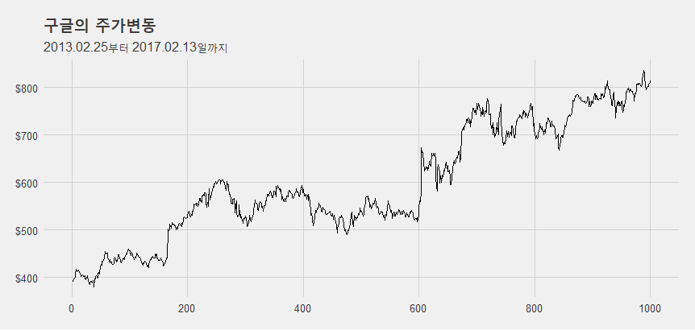
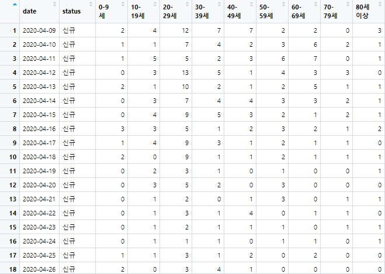
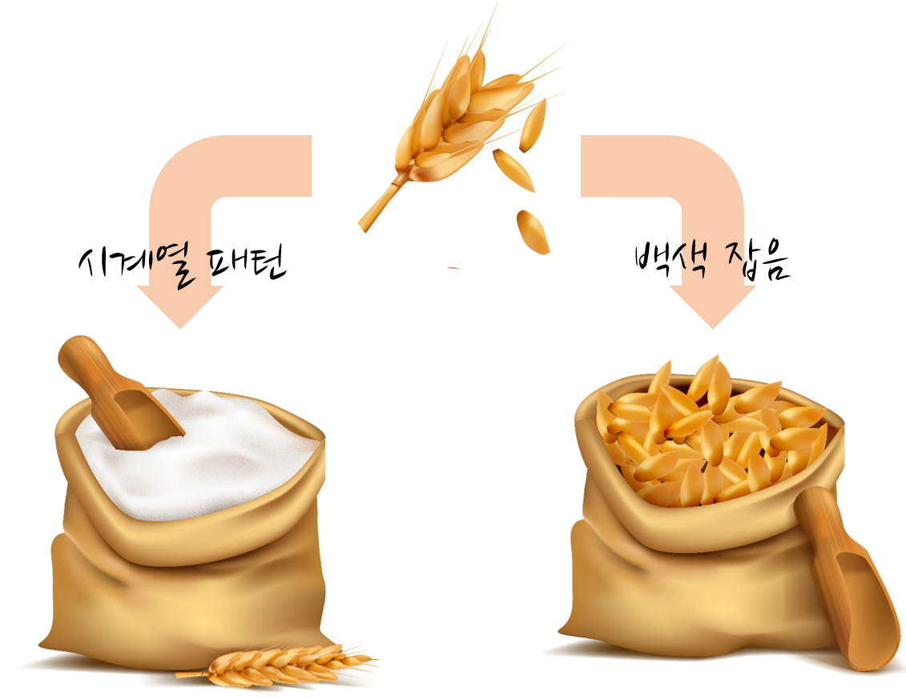
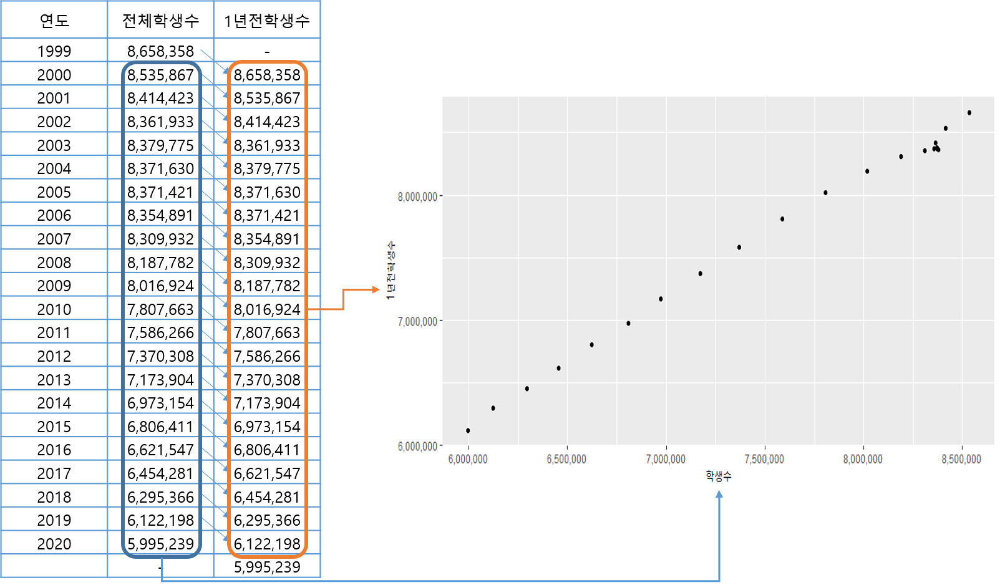
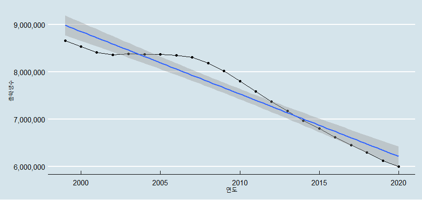
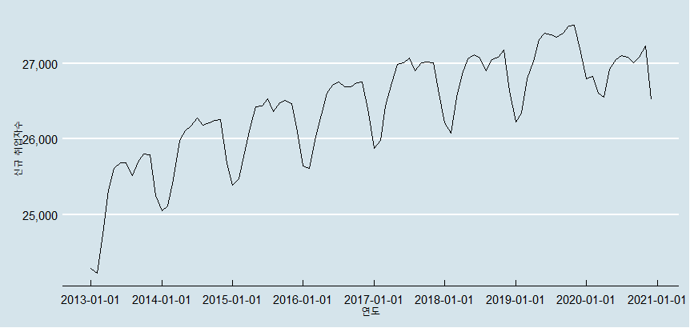

# 시계열 데이터

우리는 연도별 학생수, 날짜별 기온 변화 등과 같이 시간의 흐름에 따라 수집된 데이터를 흔히 볼 수 있다. 특히 가장 흔하게 볼 수 있는 시계열 데이터는 주식시장에서 볼 수 있는데 주식에 관련된 대부분의 데이터가 시계열 데이터이다.

시계열 데이터는 과거 시간의 흐름에 따라 데이터를 확인하고 앞으로 데이터가 어떻게 흘러갈껀가를 예측하기 위해 사용된다. 지금까지의 시계열 데이터를 활용하는 사례중에 우리 곁에 가장 가까이서 많이 쓰는 사례는 뭐니뭐니해도 우리나라의 계절 절기가 아닐까 한다. 우리나라 달력에는 입동, 우수, 초복 등 날씨가 변경되는 각종 절기가 표현되는데 우리 조상들은 오랜 시간동안 1년 중 시간의 변화에 따라 기후의 변화를 파악했다. 이를 절기로 기록했고 이를 통해 기후의 변화를 예측했다.

지금도 이런 시간적 변화에 따라 발생하는 데이터의 변화량을 파악하는 응용이 많이 있는데, 특히 경제지표 예측, 상품 수요 예측, 관광객 수요 예측, 전기 수요 예측 등과 같이 경제, 경영 분야뿐만 아니라 많은 산업에서 많이 사용되고 있다.

이와 같이 시계열 데이터는 과거의 데이터 패턴을 분석하여 유사한 데이터 흐름이 지속된다는 가정하에 미래 특정한 기간동안의 데이터 흐름을 분석하기 위해 사용되고 있다. 특히 시간적 변화에 따라 앞으로의 결과를 예측하는 것은 정부의 정책을 수립하는데, 기업에서 비지니스 전략을 수립하는 과정에서 많이 사용되고 있기 때문에 시계열 데이터에 대한 중요성이 매우 높다.

최근 머신러닝이 발달함에 따라 데이터를 기반으로 예측하는 알고리즘들이 많이 소개되고 사용되고 있다. 그 알고리즘들은 지도학습(Supervised Learning), 비지도학습(Unsupervised Learning), 강화학습(Reinforcement learning) 등으로 분류한다. 이런 알고리즘을 사용하여 모델을 생성하고 새로운 데이터가 주어졌을때 해당 모델을 통해 예측 값을 산출해내는 작업을 수행한다. 그러나 시계열 데이터를 위한 모델은 지도학습, 비지도학습, 강화학습의 범주에 포함시키지 않는다. 하지만 Azure, AWS, H2O와 같은 머신러닝 플랫폼에서는 대부분 시계열 분석을 위한 알고리즘을 포함하고 있고 맥킨지에 의하면 시계열 데이터의 가치는 텍스트나 오디오, 비디오보다 높다고 평가하고 있다.[^index-1]

[^index-1]: <https://www.mckinsey.com/~/media/mckinsey/featured%20insights/artificial%20intelligence/notes%20from%20the%20ai%20frontier%20applications%20and%20value%20of%20deep%20learning/notes-from-the-ai-frontier-insights-from-hundreds-of-use-cases-discussion-paper.ashx>

이와 같이 중요한 시계열 데이터의 모델링과 예측방법은 최근 머신러닝 알고리즘을 시계열 데이터에 적용하여 미래 예측을 하는 방법들이 속속 소개되고 있고 Facebook에서는 자사에서 개발한 시계열 데이터 분석 알고리즘(Prophet)을 소개하는 등 시계열 데이터에 대한 예측 알고리즘도 발전하고 있다.

이제 당신은 시계열 데이터를 저장하고, 시각화하고, 핸들링하고, 모델링하고, 예측하는 여정을 시작하게 된다.

## 시계열 데이터란?

시계열(Time Series) 데이터는 일정한 시간에 따른 순차적 정보량을 기록한 데이터이다 .

기록되는 순차적 정보량은 여러 측정치가 가능한데 대부분의 경우 가격, 온도, 인구수 등 수치적 측정치나 특성(Feature) 등이 기록되지만 이들을 핸들링하는 인덱스는 시간형 타입으로 설정되거나 시간을 나타낼 수 있는 타입으로 설정되어야 한다.

사실 시계열 데이터이든 관찰치 데이터이든 데이터를 예측한다는 것은 데이터간의 특정한 패턴을 찾아내고 이 패턴이 반복될 경우 패턴의 결과를 미리 산출하는 과정이다. 빅데이터의 사례를 얘기할 때 빠지지 않고 얘기나오는 미국의 'Target'의 미성년 고객에게 보낸 임신용품 쿠폰 사례를 봐도 그렇다. 타겟에서 무향티수, 마그네슘 보충재를 사는 고객들은 임신중일 확률이 높다는 구매 패턴을 가지고 있었기 때문이다. 이렇게 데이터간의 패턴을 어떻게 뽑아낼 것이냐가 예측 성능을 좌우한다.

그렇다면 시계열 데이터는 어떤 특성을 가지고 패턴을 어떻게 뽑아내야 할까? 시계열 데이터는 데이터에서 예측가능한 특성을 뽑아내고 예측 불가능한 특성을 제거하는 과정을 거쳐서 예측 모델을 생성한다. 이는 마치 껍질을 벗겨내고 알맹이를 취하는 탈곡과정과 유사하다. 향후 미래 예측에 사용되는 패턴이 담겨있는 알맹이를 뽑아내고 예측이 불가능한 찌꺼기인 백색잡음을 제거하는 형태로 예측은 진행된다.

따라서 시계열 데이터는 다른 데이터 셋과 달리 시간이 하나의 특성이기 때문에 다른 데이터에서 보이지 않는 다음과 같은 몇가지 특성을 지닌다.

## 시계열 데이터의 특성

### 고정된 시간 독립변수

일반적으로 데이터 분석시에는 독립변수와 종속변수간의 관계를 분석하는 것이 목적인 경우가 많다.

종속변수의 행동을 예측하기 위해서는 하나 혹은 여러개의 독립변수가 필요하고 이들간의 관계성을 도출함으로서 향후 독립변수에 따라 종속변수의 예측값을 도출한다. 예를 들어 자동차의 속도가 빠를수록 제동거리는 길수밖에 없다. 이를 그래프 상으로 보면 양의 상관관계를 보이는데 이 경우는 제동거리를 종속변수로, 자동차 속도를 독립변수로 분석할 수 있다.

그러나 **시계열 데이터는 독립변수가 시간으로 고정된다.** 따라서 시계열 데이터는 타 변수와의 상관관계 없이 분석이 된다는 점에서 다른 데이터와의 차이가 있다.

시계열 데이터를 구축하는데 중요한 요소는 시간 간격이 동일해야 한다는 점이다. 예를 들어 매월마다 측정된 어떤 물품의 판매량이 있다면 데이터 전체적으로 매월 데이터가 기록되어야 하지만 특정 기간동안 주간 데이터로 기록된다던지 분기데이터로 기록되면 올바른 시계열 데이터로 볼 수 없다. 매시간, 매일, 매월, 매분기, 매년 등 데이터가 기록된 간격이 일정해야 시계열 데이터를 다루기 위한 다양한 함수들에 적용이 가능함.

이것은 간격이 일정하더라도 결측치에 의해 모든 간격의 데이터가 기록되지 않은 것과는 다르다. 결측치가 있는 데이터는 시계열 데이터의 plot을 만들고 EDA(Exploratory Data Analysis)를 수행할 수는 있으나 모델링을 하고 예측에 적용하기 위해서는 결측치를 적절히 처리하는 것이 중요하다.

### 자기 상관관계

최근 우리나라는 저출산 고령화 사회에 접어들었다고 한다. 우리나라의 출생아수는 지속적으로 줄고 있는 추세가 몇년째 계속되고 있다고 뉴스에서 보도되고 있다. 작년에 비해 올해가 줄었고 재작년에 비해 작년이 줄었다. 우리나라에 특별한 사건이나 이슈가 발생하지 않는 이상 이러한 추세는 반복될 것이다. 이와 같이 과거의 데이터가 현재의 데이터에 영향을 주는 경향을 자기상관이라고 한다.

시계열 데이터는 일련의 시간간의 흐름에 따라 기록되는 데이터들의 집합이기 때문에 인접한 시간의 데이터간의 상관관계가 존재하는 경우가 많다.

일반적으로 상관관계는 서로 다른 두개의 변수간의 영향성을 살펴본다. 기온과 아이스크림 판매량, 자동차 속도와 제동거리 등과 같이 한 변수가 움직일때 다른 변수가 어떻게 움직이는지를 살펴보는 것이 상관관계이고 이를 수치화하는 것이 상관계수이다. 하지만 자기 상관관계는 자기 자신의 n번째 과거 데이터(n차 지연(lag) 데이터)와 현재 데이터간의 상관관계를 의미한다. 상관관계가 존재한다는 것은 n차 지연데이터와 현재 데이터간의 상관계수가 높다는 점을 의미한다.

아래 그림의 왼쪽 표는 1999년부터 2020년까지의 우리나라 유,초,중,고등학교의 전체 학생수를 나타내고 있다. 1년전 전체 학생수와 전체 학생수에 대한 plot은 오른쪽의 plot이다. 이 plot을 보면 1년전 학생수가 증가하면 전체 학생수가 증가하는 매우 관계성이 높은 plot이 나타난다. 이는 전체 학생수는 자기 자신의 데이터와의 상관성, 즉 자기 상관성이 매우 높다고 말할 수 있다.

### 추세 경향성(Trend)

시계열 데이터는 장기적으로 점차 증가하거나 점차 감소하는 추세에 대한 경향성을 보이는 경우가 있다. 사실 시계열 데이터 분석에서 우리가 가장 원하는 것이 데이터가 그동안 어떤 추세를 보였고 이 추세가 유지된다면 앞으로 어떻게 미래를 대응해야 할지를 결정하기 위한 정보이다. 따라서 이 추세 경향성을 어떻게 찾아낼 것인가가 시계열 분석에서 중요한 부분이다.

아래의 그림은 위에서 살펴본 우리나라 총학생수의 plot이다. plot에서도 보다시피 우리나라의 총 학생수는 전반적으로 감소하는 추세에 있다. 2003년에서부터 2007년까지는 추세가 유지되었지만 이후 급격히 감소하는 추세가 있음을 눈으로 쉽게 확인할 수 있다.

추세 경향성은 시간의 흐름에 따라 나타나는 인구, 경기, 기술, 환경 등의 변화에 따라 영향을 받는 데이터의 중장기적인 지속적 데이터의 변동을 말하는데 시간축에 따라 발생하는 데이터 변동에 대한 그래프에서 확인이 가능하다.

이 추세변동성을 해석할때는 변동성을 단순한 선형회귀로 단정하여 예측하지 않도록 주의해야 한다. 추세 경향성을 선형회귀로 분석할 때는 앞서 언급한 자기 상관관계가 있는지를 먼저 확인한 후에 적용해야 한다. 자기 상관관계가 있는 경우에는 선형회귀외에 다른 시계열 분석방법을 함께 고려하고 성능을 분석하여 더 좋은 모델을 사용하도록 해야한다.

### 계절성(Seasonality), 순환성(Cyclic)

시계열 데이터는 중장기적인 추세경향성외에 데이터가 달력(Calender)상의 날짜나 기간에 따라 주기적으로 변화하거나 장기적인 시간의 흐름에 따라 오르거나 내리는 추세가 반복되는 변동성을 가지는 경우가 있다.

달력 상의 날짜나 기간에 따라 데이터가 변동되는 경우의 대표적인 예가 아이스크림 판매량, 익사자자의 수, 발렌타인데이의 초콜렛 판매량, 크리스마스 기간의 소매 판매량, 설, 추석의 고속도로 이용자수 등이다.

이는 앞으로 사용할 우리나라 월별 전체 취업자수 plot에서도 명확하게 나타난다. 아래의 그림은 2013년부터 2020년까지의 우리나라의 월별 신규 취업자수 plot이다. plot을 보면 매년 겨울에는 신규 취업자수는 전반적으로 줄어들고 봄부터 증가하고 여름에 잠시 줄어들며 가을에 다소 회복했다가 다시 겨울이 시작하면서 줄어드는 계절성을 보인다.

이와 같이 계절성은 봄, 여름, 가을, 겨울과 같은 계절, 일, 주, 월, 분기와 같은 기간의 변화에 따라 주기적으로 변동하는 시계열 성질을 말한다. 이에 비해 순환성은 일정한 기간의 특징없이 데이터의 변동성이 반복되거나 1년을 넘겨 주기적으로 발생하는 데이터의 반복성을 말한다.

계절성과 순환성은 혼동되는 경우가 많다. 계절성은 주기가 고정된 기간에 대한 순환성이고 순환성은 변동적 기간에 대한 순환성이고 일반적으로 순환성의 주기가 계절성 주기보다 길기 때문에 계절성은 언제쯤 데이터 피크(Peak)가 나타날지 예측이 가능하나 순환성은 데이터 피크에 대한 예측이 어려운 성질이 있다.

### 불확실성(Uncertainty)

우리는 아침마다 일기예보를 확인 한다. 일기예보는 오늘 비가 올 확률을 알려준다 .일기예보를 확인한 사람들은 비 올 확률을 보고 우산을 가져갈지 안가져갈지에 대한 판단을 한다. 기상청에서는 우리에게 주는 정보는 결국 불확실성인 것이다.

아래의 그림은 기상청에서 제공하는 태풍의 경로[^index-2]이다. 태풍이 앞으로 어떻게 이동할지를 시간대별로 예측한 그림으로 현재 서귀포 부근에 상륙한 태풍은 부산, 독도를 지나 일본 삿포로로 빠져나갈 것이라고 예측하고 있다. 하지만 그 태풍의 경로를 둘러싸고 있는 범위를 보면 태풍위치 70% 확률 반경의 범위가 보인다. 결국 태풍의 경로는 70%의 확률로 그 범위안에 있을것이라는 것이다. 여기서 하나 주의해아할 것은 태풍의 경로가 70% 범위라는 것은 태풍이 그 경로를 지나갈 확률이 70%라는 것이 아니고 수많은 예측을 수행했을 때 태풍의 경로 예측치의 70%가 해당 범위내에 있다는 것이다. 좀 이해하기 어렵고 말장난 같을 수 있을 것이다. 하지만 두가지 모두에서 중요한 것은 **'미래 예측치는 현재로써는 정확히 모른다'**는 것이다.

[^index-2]: <https://www.weather.go.kr/HELP/html/help_tpi001.jsp>

따라서 시계열 모델의 해석에는 반드시 불확실성에 대한 고려가 반드시 수반되어야 한다. 시계열 분석을 통해 예측된 미래 데이터는 사용된 모델에 적합한 확률 분포 모델(Probability Distribution)을 통한 신뢰구간이 같이 제공되어 평가되어야 한다.

일반적으로 미래 예측을 말할 때에는 앞서 말한 예측분포(forecast distribution)의 평균을 말하는 경우가 많다 이를 나타낼 때는 "모자 기호(hat)"을 붙여서 $\hat{x}$ 로 표현하는 경우가 많다. 하지만 예측분포의 중앙값을 사용하는 경우도 있다.

대부분의 시계열 모델은 불확실성을 표현하기 위한 신뢰구간을 제공한다. 시계열 예측의 신뢰구간의 이해에서 가장 먼저 생각해야하는 것은 시계열 예측은 예측 기간이 길수록 예측의 신뢰구간이 점점 넓어진다는 것이다. 결국 먼 미래의 예측이 더 힘들고 어렵다는 의미이다.
